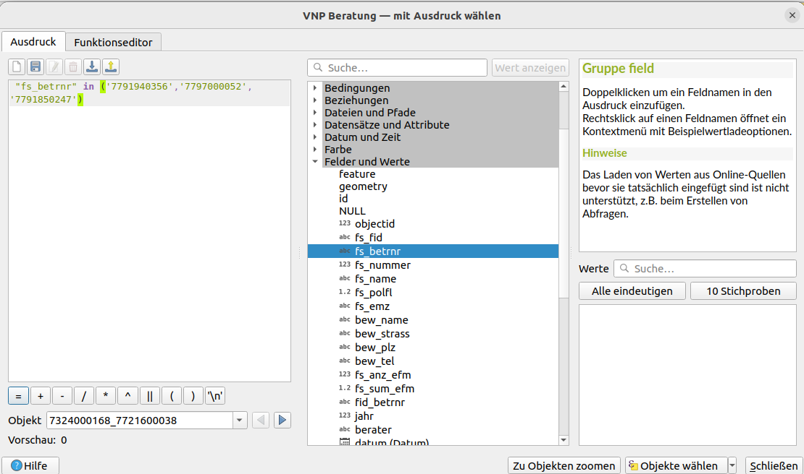
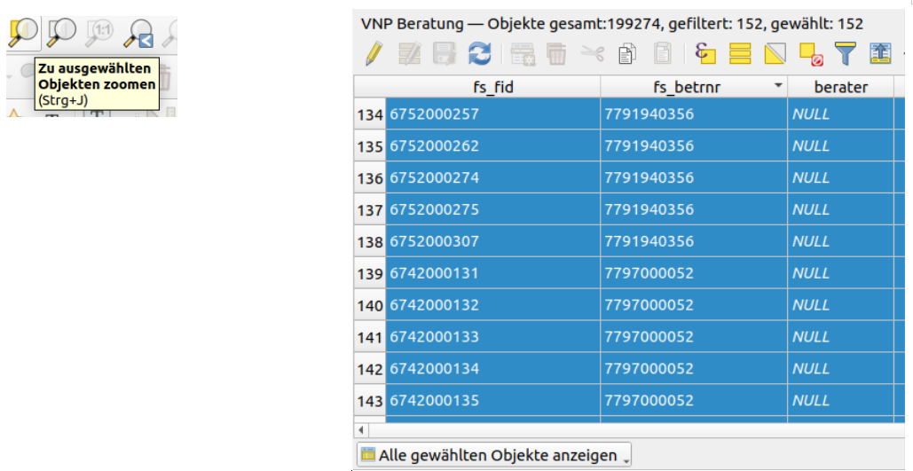
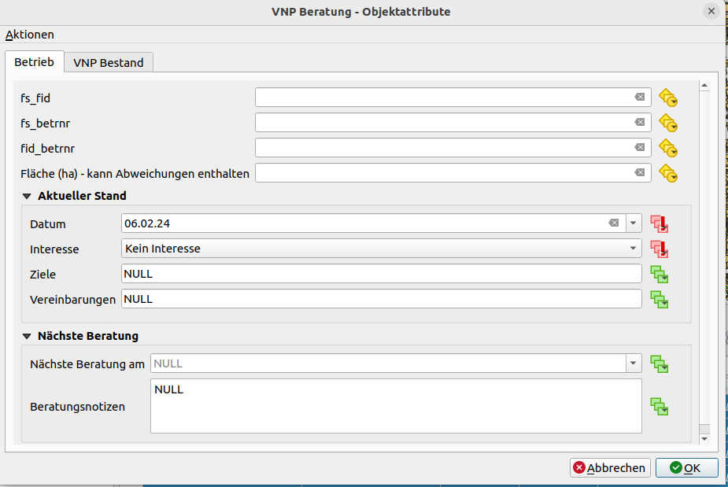
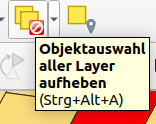
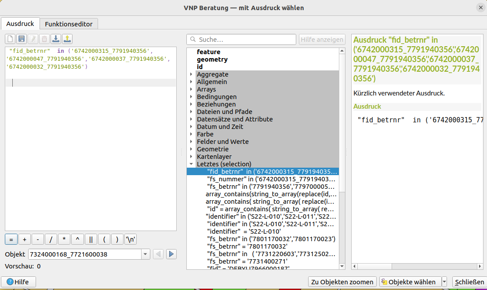
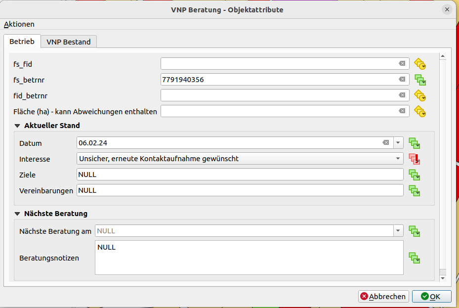

<!-- the Menu -->

<link rel="stylesheet" media="all" href="./styles.css" />

<a href="https://csgis.de">© CSGIS 2024</a>

# Daten von mehreren Betrieben gleichzeitig ändern

Wir können Informationen von mehreren Betrieben gleichzeitig editieren. Zuerst ist es immer notwendig, dass wir die Betriebe selektieren. Danach prüfen wir in der Attributtabelle, dass die selektierten Datensätze die sind, die wir editieren wollen. Nach der Prüfung können wir mit dem Tool [Attribute von allen gewählten Objekten gleichzeitig ändern](https://docs.qgis.org/3.4/de/docs/user_manual/working_with_vector/editing_geometry_attributes.html#merge-attributes-of-selected-features) die Änderungen aller selektierten Datensätze in der Attributabelle speichern.

In diesem Beispiel wollen wir ‚‘Kein Interesse’ für alle Feldstücke bei 3 Betrieben verwenden: '7791940356','7797000052','7791850247'.

Die Datensätze dieser Betriebe selektieren wir mit der Option **“Objekte nach Ausdruck wählen“**:

1\.- Den Layer VNP Beratung mit der linken Maustaste auswählen

2\.- Danach auf “Objekte nach Ausdruck wählen“ und den unteren Ausdruck eintragen (in der Spalte  fs_betrnr sind die Betriebnummern gespeichert):

> "fs_betrnr" in ('7791940356','7797000052','7791850247')

3\.- Mit Klick auf „“Objekte wählen“ werden alle Feldstücke der 3 Betriebe ausgewählt.

Danach kann man die selektierten Objekte in der Karte und Tabelle betrachten:

Nachdem die Datensätze selektiert sind, können wir sie editieren mit **Attribute von allen gewählten Objekten gleichzeitig ändern**.

Im obigen Fall haben wir ‘kein Interesse’ in allen Datensätzen gespeichert. Die Tabelle können wir prüfen und danach die Editierung speichern und beenden. Die Selektionen sollten wir dann sofort aufheben, damit wir keine ausgewählten Polygone mehr haben.

# Mehrere Feldstücke eines Betriebes gleichzeitig editieren

Die Feldstücke '6742000315_7791940356', '6742000047_7791940356', '6742000037_7791940356' und '6742000032_7791940356' wünschen sich eine erneute Kontaktaufnahme.

Die Schritte sind die gleichen wie oben:

1\.- gewünschte Objekte selektieren

2\.- Daten gleichzeitig ändern

3\.- Editierungen prüfen und speichern

> "fid_betrnr"  in ('6742000315_7791940356','6742000047_7791940356','6742000037_7791940356','6742000032_7791940356')

Alle ausgewählten Feldstücke editieren:

