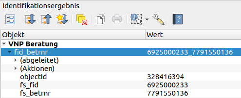
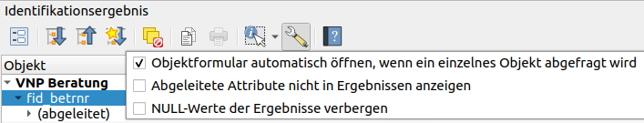
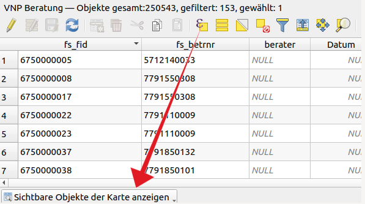
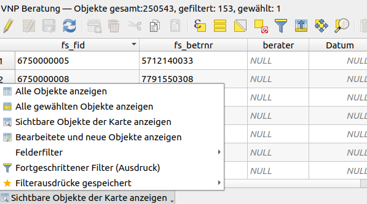
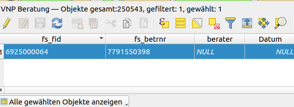
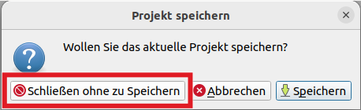

<!-- the Menu -->

<link rel="stylesheet" media="all" href="./styles.css" />

<a href="https://csgis.de">© CSGIS 2024</a>

# FAQ

## Formular erscheint nicht beim Klick auf ein Polygon

Die Editierung des Layers VNP Beratung ist einfacher, wenn man das vorbereitete Formular benutzt. Beim Klick auf ein Polygon dieses Layers kann es sein, dass nicht das Formular erscheint, sondern dieses Fenster:

Um das Formular in die Karte zu bekommen, müssen wir im Identifikationsergebnis auf Abfrageeinstellungen klicken und dort die Option auswählen: “Objektformular automatisch öffnen, wenn …“

## Es dauert lange, bis die Attributtabelle geöffnet wird

Es ist bekannt, dass es in QGIS lange dauert, wenn Attributtabellen mit vielen Datensätzen geöffnet werden. Damit sich die Öffnungsdauer verkürzt, wird die Attributtabelle nur mit den in der Karte sichtbaren Datensätzen geöffnet:

Im Dropdown Menü stehen andere sinnvolle Optionen zur Verfügung, die wir individuell und bei Bedarf auswählen können:

Zum Beispiel können wir „alle gewählten Objekte anzeigen“ auswählen, wenn wir in der Attributtabelle nur die Polygone sehen wollen, die ausgewählt sind:

> Die Zahlen hinter „“Objekte gesamt“, “gefiltert“ und “gewählt“ geben uns wichtige Informationen über die Datensätze, die wir nicht in der  Attributtabelle sehen.

## Warum können wir das QGIS Projekt nicht speichern?

Beim Versuch, das QGIS Projekt zu speichern, erscheint die Fehlermeldung, dass man das Projekt nicht speichern kann. Das ist so gewollt, wir wollen ein gemeinsames Projekt haben, das für alle gleich ist.

**In diesem Fall** (und **nur in diesem QGIS Projekt**) bitte QGIS verlassen, ohne das Projekt zu speichern.

Vorher bitte auch darauf achten, dass **die Editierungen der Layers beendet und gespeichert ist.**

