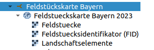
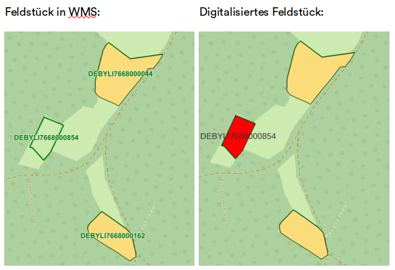
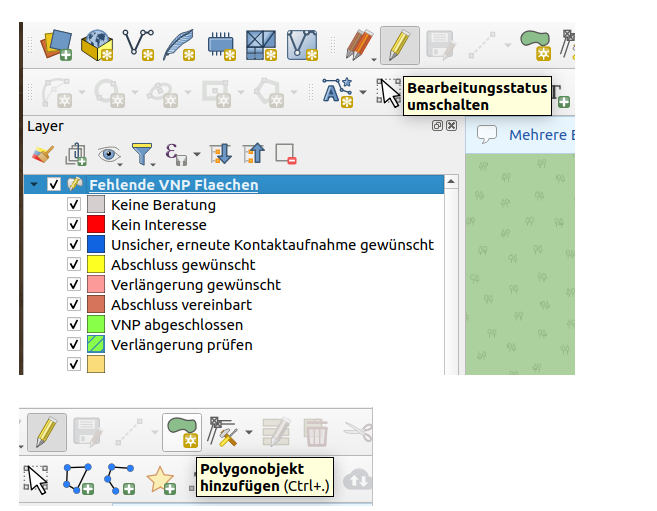
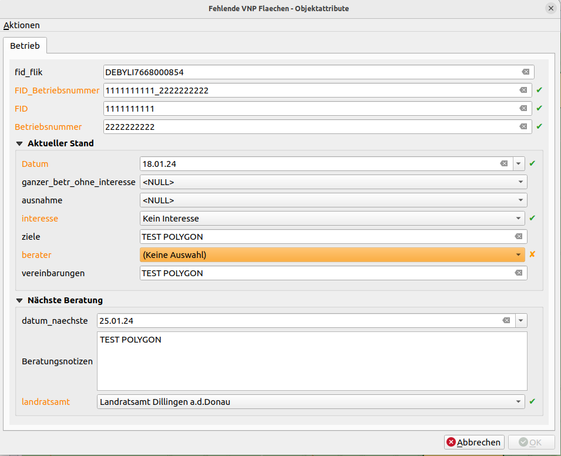
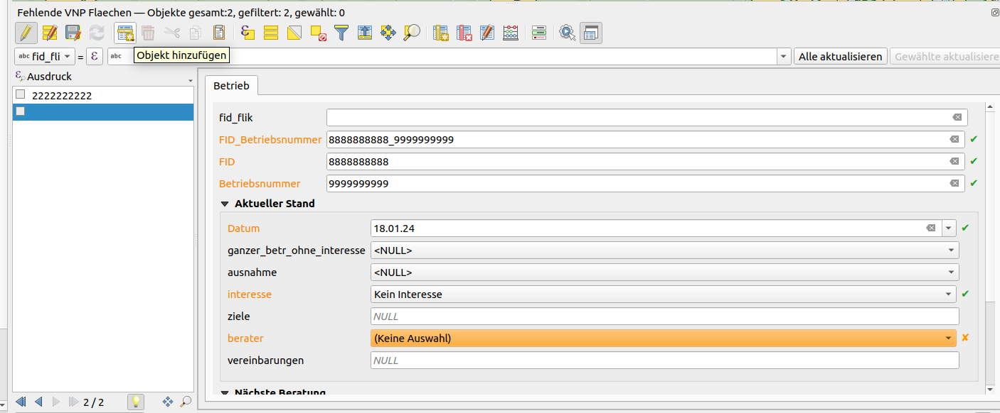
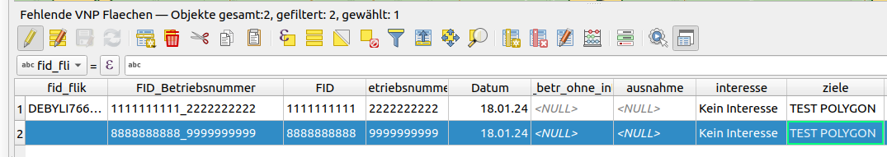
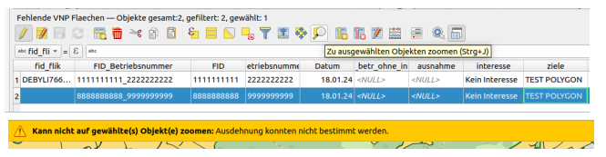

<!-- the Menu -->

<link rel="stylesheet" media="all" href="./styles.css" />

<a href="https://csgis.de">© CSGIS 2024</a>

# Layer "FIDs nicht vorhanden"

Derzeit gibt es noch keine Möglichkeit, die Beratungsinformationen von “neuen“ FID-Nummern (Feldstücke, die im vorherigen Jahr nicht existiert haben) in die Datenbank einzutragen.
Diese Feldstücke werden wir selber einpflegen. Die eingetragenen Informationen werden wir nächstes Jahr in den neuen VNP-Beratungs-Layer überführen.

Mit Hilfe des WMS-Layers Feldstückskarte Bayern können wir herausfinden, welche Feldstücke nicht in der Datenbank vorhanden sind:

Zum Beispiel sehen wir in der unteren Abbildung, dass das Feldstück DEBYLI7668000854 nicht bei uns vorhanden ist. Diese Fälle können wir digitalisieren und in der Datenbank speichern:

Um im Layer “FIDs nicht vorhanden“ zu digitalisieren, müssen wir zuerst die Editierung starten mit dem Tool “Bearbeitungsstatus umschalten“. Danach können wir Polygone mit dem Werkzeug “Polygon Objekt hinzufügen“ digitalisieren:

1\.- Mit der linken Maustaste in den Bereich der Karte klicken, in dem man den ersten Punkt des neuen Polygons erzeugen möchte.

2\.- Weitere Klicks mit der linken Maustaste für jeden weiteren Punkt setzen, den man erfassen möchte.

3\.- Wenn alle Punkte digitalisiert worden sind, mit der rechten Maustaste auf eine beliebige Stelle klicken, um die Digitalisierung des Polygons abzuschließen.

Für die Editierung der Attributtabelle stehen die notwendigen Felder im Formular zur Verfügung. Orange markierte Felder sind Pflichtangaben:

\- fid_flik: Diese Spalte ist optional. Sie sollte aber, wenn möglich, eingegeben werden. Diese Information ist im WMS Layer Feldstückskarte Bayern vorhanden (z.B.  DEBYLI7668000854)

\- FID_Betriebsnummer: Diese Spalte speichert eindeutige Werte. Sollte hier eine ID eingetragen werden, die bereits existiert, erhält man eine Fehlermeldung, dass der Wert bereits vorhanden ist.

\- ganzer_betrieb_ohne_interesse: In dieser Spalte sind 2 Werte möglich: “ja“ oder “NULL“. Bei Betrieben „“ohne Interesse“ in allen Feldstücken ist Digitalisierung aller Feldstücke nicht notwendig. Wir können nur ein Polygon digitalisieren und in diesem Feld “ja“ speichern.

\- ausnahme: In dieser Spalte sind 2 Werte möglich: “ja“ oder “NULL“. Wir tragen hier „“ja“ ein, wenn der Betrieb “Kein Interesse“ hat für alle anderen Feldstücke außer für dieses (ausnahme=“ja“).

> Im Layer VNP Beratung existieren diese 2 Spalten nicht, weil alle Polygone desselben Betriebes vorhanden sind. Wir müssen in diesem Layer die Information “Kein Interesse“ für alle Polygone selber eintragen (zum Beispiel mit dem Tool Mehrere Polygone gleichzeitig editieren).

\- landratsamt

\- berater: Werte sind abhängig vom eingetragenen Landratsamt

## Attributierung von geometrielosen Datensätzen

Es kann der Fall vorkommen, dass wir in der Karte nicht die  FID_Betriebsnummer finden, die wir speichern müssen. In diesem Fall können wir das Polygon nicht digitalisieren. Wir werden für diese Fälle mit dem Tool “Objekt hinzufügen“ arbeiten, das man in der Attribut Tabelle finden kann. Damit speichern wir die Daten in der Attributtabelle, aber erzeugen keine Polygone.

Nach Speicherung der Bearbeitung erscheint der Datensatz in der Attributtabelle:

Wenn man auf diese Datensätze zoomen möchte, erscheint die entsprechende Fehlermeldung (“Kann nicht auf gewählte(s) Objekt(e) zoomen: Ausdehnung konnte nicht bestimmt werden“), die uns informiert, dass für diesen Datensatz keine Polygone existieren.

