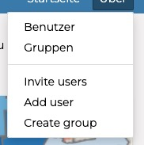
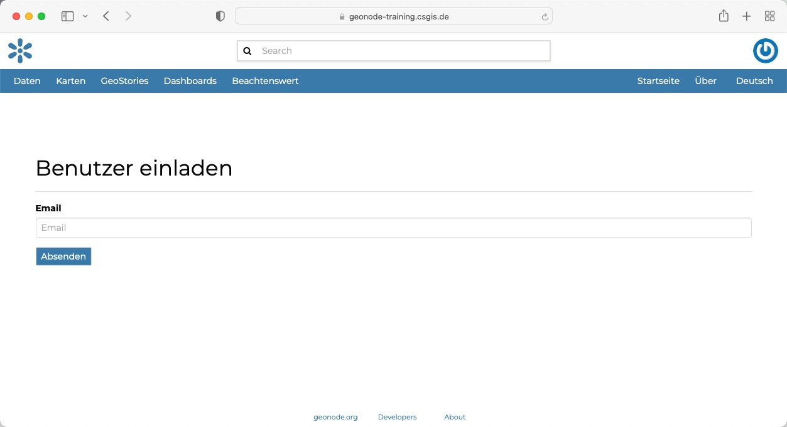
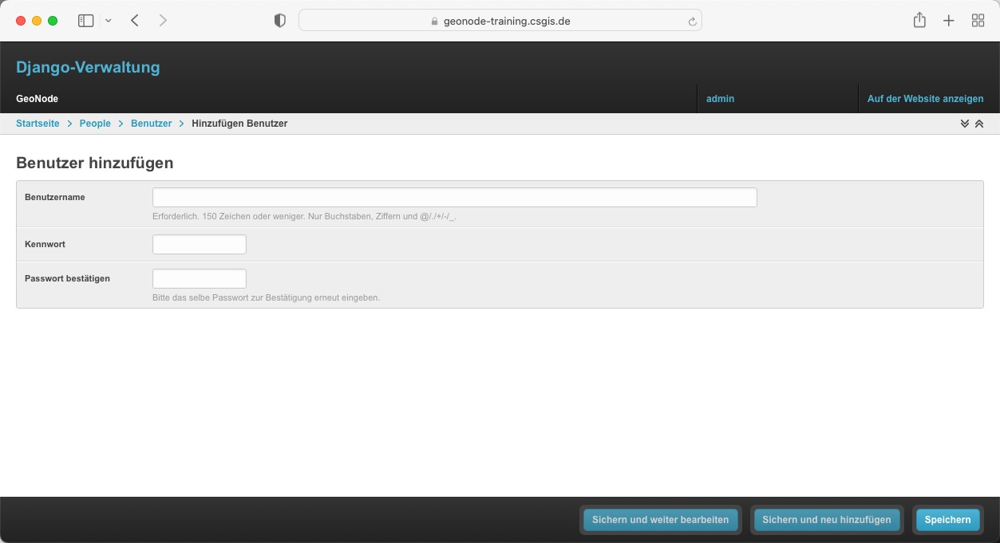
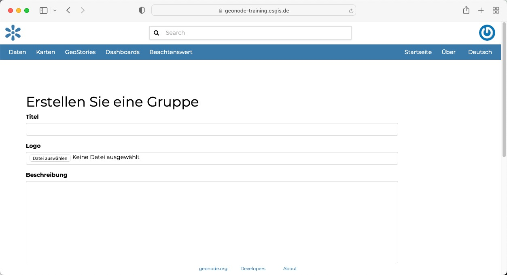
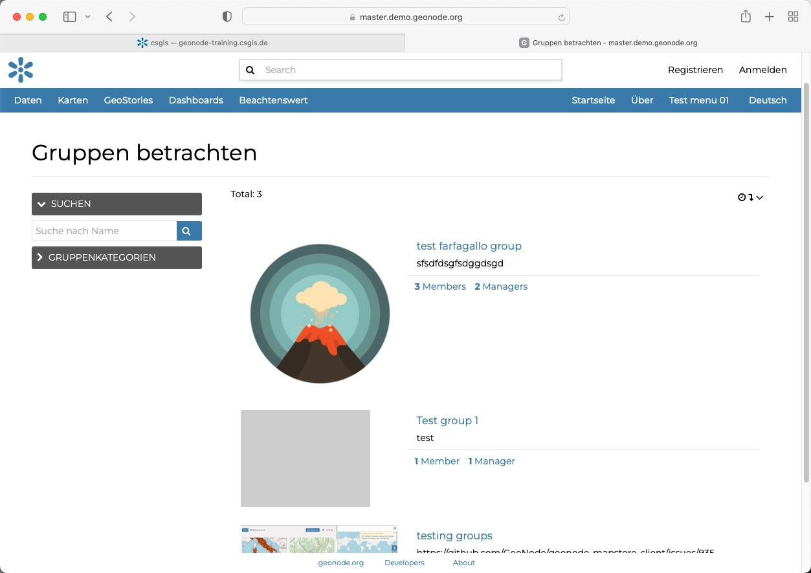
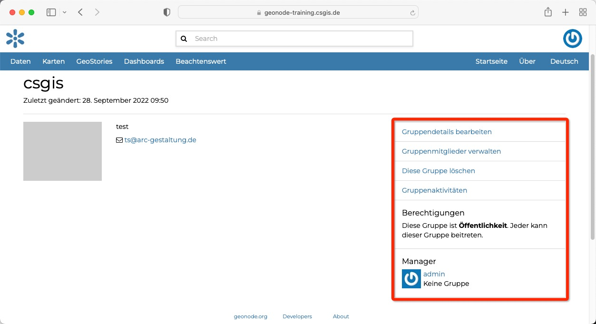

<!-- the Menu -->
    <link rel="stylesheet" media="all" href="../styles.css" />

<a href="https://csgis.de">© csgis</a>

<!-- the Menu -->

# Die GeoNode Rollen

Nach der Installation von GeoNode kennt das System folgende Rollen:

- Anonym
  - Alle nicht angemeldeten Besucher
- Registriert
  - Nutzer mit einem Benutzer Account
- Mitarbeiter
  - Registrierte Nutzer mit erweiteren Rechten
- Administratoren
  - Registrierte Nutzer mit vollständigen Rechten.

Im folgenden Betrachten wir die dritte und vierte Rolle Mitarbeiter und Administrator.

# Der Administrator im Frontend

> Frontend meint den für die Öffentlichkeit sichtbaren Bereich. Ihm gegenüber steht das Backend, welches das System im Hintergrund bezeichnet.

Administratoren Rollen dürfen per se alles sehen, bearbeiten oder löschen.

Das erste Administratoren Konto wird bei der Installation des Systems angelegt. Die Definition des Users befindet sich [hier](https://github.com/GeoNode/geonode/blob/master/.env#L107-L119).

## Beispiele für die vollständigen Rechte

Administoren werden im Menü zusätzliche Optionen angezeigt:

Dies sind:

- Invite User
  - Neue Benutzer einladen

- Add User
  - Neue User anlegen
- Create Group
  - Gruppen erstellen um User zu gruppieren.

### Invite User
Über die Maske Invite User besteht die Möglichkeit, eine E-Mail Einladung / Aufforderung an Dritte zu senden. Die E-Mail bittet um Registrierung.

### Add User

Über die Maske "Add User" besteht die Möglichkeit neue Nutzer anzulegen.

### Create Group

Über die Maske "Create Group" können Gruppen angelegt werden.
.

Gruppen sind eine Möglichkeit User zusammenzufassen. Dies ist sinnvoll um Datensätze schnell mit Rechten für einen größeren Personenkreis zu geben.

Standardmässig dürfen nur Administratoren neue Gruppen anlegen sowie Gruppen Administratoren festlegen. Wie wir auch der Mitarbeiter Rolle erlauben Gruppen anzulegen, sehen wir später.

Beim anlegen einer neuen Gruppe stehen folgende Eingabefelder zur Verfügung:

- Titel der Gruppe
- Logo der Gruppe
  - Wird für die Übersicht verwendet
- Beschreibung der Gruppe
- E-Mail
  - E-Mail die verwendet wird, um ein oder alle Gruppenmitglieder, ähnlich einer Mailingliste, zu kontaktieren.
- Schlüsselwörter
  - Eine durch Leerzeichen oder Kommas getrennte Stichwortliste
- Zugriff
  - Öffentlich: Jeder registrierte Nutzer kann eine öffentliche Gruppe betrachtenund dieser beitreten. 
  - Öffentlich (nur auf Einladung): Jeder registrierte Benutzer kann die Gruppe betrachten. Nur eingeladene Benutzer können beitreten. 
  - Nur eingeladene Benutzer können teilnehmen.
- Kategorien
  - Weitere Gruppierung der Gruppe. Funktioniert in GeoNode 4 nur fehlerbehaftet (Bug: Kann nicht mehr geläscht werden) 
  
Nach dem anlegen einer neuen Gruppe erscheint diese für alle User in der Gruppen Übersicht

Weiterhin können Administratoren User hinzufügen sowie Details der Gruppe ändern.

> Die umfangreiche Dokumentation finden Sie [hier](https://docs.geonode.org/en/master/admin/admin_panel/index.html?highlight=group#managing-a-group)