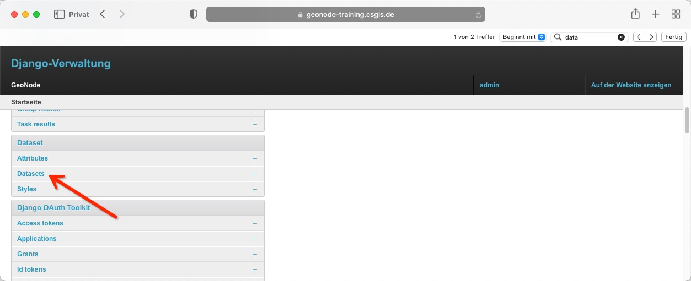
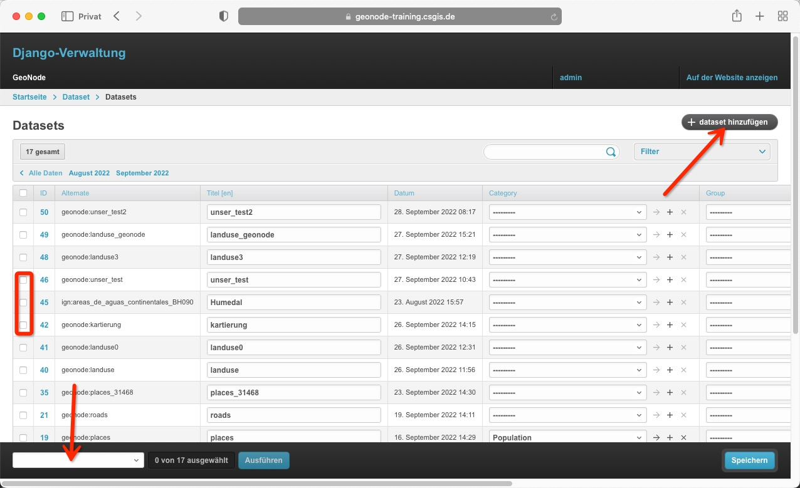
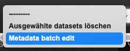
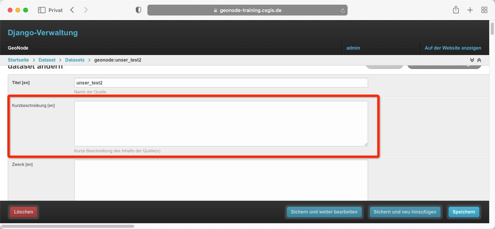
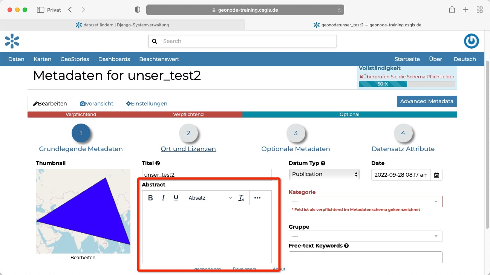
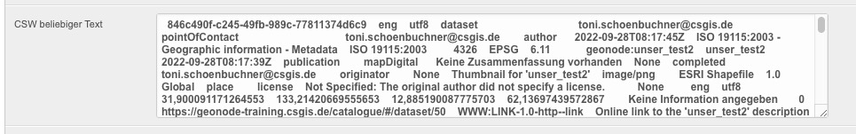

<!-- the Menu -->
<link rel="stylesheet" media="all" href="../styles.css" />

<a href="https://csgis.de">© csgis</a>

<!-- the Menu -->

# Dataset verwalten

Im letzten Kapitel haben wir uns Benutzer und Gruppen näher angesehen.
Gehen wir eine Stufe weiter und werfen einen Blick auf die Dataset Verwaltung.

> Datasets hießen vor Version 3.3 Layer

Die Tabelle gibt uns wieder einen kurzen Überblick über nützliche Infos. Zum Beispiel wann der Datensatz erzeugt wurde, den Titel, oder die ID. 

## Stapelverarbeitung

Die Option "dataset hinzufügen" sollte nicht verwendet werden. Neue Ebenen sollen über das Frontend hinzugefügt werden.
Interessant ist jedoch die Möglichkeit mehrere Datasets auszuwählen und in Stabelverarbeitung Rechte zuzuweisen. Hierzu kann das untere Menü der Fußleiste verwender werden.

## Dertailansicht

In der Detailansicht eines Datensatzes sehen wir dass zahlreiche Felder wie die Kurzbeschreibung einfach editiert werden können.

Dies entspricht der Möglichkeit aus dem Forntend die Metadaten des Datensatzes anzupassen.

Andere Felder ergeben sich rein aus der Tatsache dass der Django Admin "einen Spiegel" des Datenbanksatze darstellt. Und hierdurch zahlreiche Felder, von den Administratoren (ohne tiefes Hintergrundwissen) nicht editiert werden sollten.
Als Beispiel das CSW Feld:

