<!-- the Menu -->
<link rel="stylesheet" media="all" href="../styles.css" />

<a href="https://csgis.de">© CSGIS 2022</a>

<!-- the Menu -->

# GeoNode Harvesting

> Harvesting bezeichnet das maschinell unterstützte sammeln und speichern von Datensätzen anderer.

GeoNode ist in der Lage, Ressourcen-Metadaten von mehreren entfernten Diensten zu sammeln.

In diesem Bereich werfen wir den Blick auf auf die Konfiguriert um von entfernten Dienste, eine Liste relevanter Ressourcen abzurufen und hierdurch eine Kopie als lokale Ressourcen zu speichern. 
Neben einem einmaligen "harvesten" besteht weiterhin die Möglichkeit die Quelle in definierten Zeitabschnitten erneut zu besuchen.

Stzandardmässig unterstützung GeoNode das Harvesting von:

- Andere entfernte GeoNode-Instanzen;
- OGC WMS-Servern;
- ArcGIS REST-Dienste.

Weiterhin besteht die Möglichkeit eigene Harvester zu programmieren.

# Einmaliges Harvestern

Dieser Workflow wird meist manuell vom Benutzer ausgeführt.

### Manuellen Harvester anlegen

Klicken Sie im Django Admin auf den Link zur Harvester Übersicht.

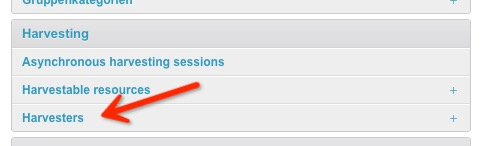

Über den Button im rechten oberen Eck legen Sie einen neuen Harvester an.

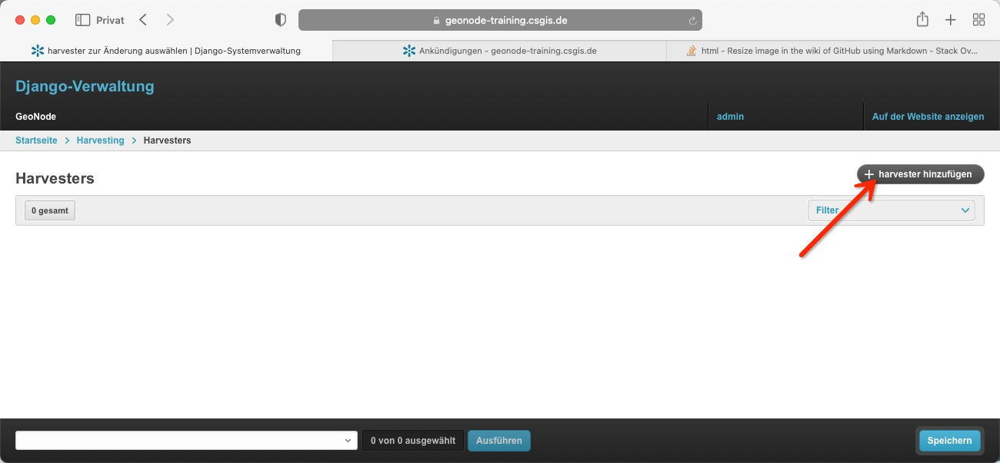

Das sich hierauf öffnenen Menü zeigt folgende Konfigurationsmöglichkeiten:

- Name
  - Der Name des Harvester zur internen Bezeichnung
- remote_url
  - Basis-URL des zu erfassenden Remote-Dienstes, z. B. https://master.demo.geonode.org
- scheduling_enabled
  - Gibt an, ob das Harvesting periodisch vom Harvesting-Scheduler durchgeführt werden soll oder nicht.
- harvesting_session_update_frequency
  - Wie oft (in Minuten) sollen neue Harvesting-Sitzungen automatisch geplant werden?
- refresh_harvestable_resources_update_frequency
  - Wie oft (in Minuten) sollen neue Aktualisierungssitzungen automatisch eingeplant werden?
- Check availability frequency
  - Wie oft (in Minuten) soll die Verfügbarkeit des externen Diensts überprüft werden?
- default_owner
  - Welcher GeoNode-Benutzer soll zum Eigentümer der Ressourcen ernannt werden?
- harvest_new_resources_by_default
  - Sollen neue Remote-Ressourcen automatisch geharvested werden?
- delete_orphan_resources_automatically
  - Verwaiste Ressourcen sind Ressourcen, die zuvor durch eine Harvesting-Operation erstellt wurden, die GeoNode aber nicht mehr auf dem zu harvestenden Remote-Dienst finden kann. Sollen diese Ressourcen automatisch aus GeoNode gelöscht werden? Dies gilt auch, wenn eine Harvesterkonfiguration gelöscht wird. In diesem Fall werden alle Ressourcen, die von diesem Harvester stammen, als verwaist betrachtet.
- harvester_type
  - Typ des Harvester-Workers, der für das Harvesting verwendet wird.
- Harvester type specific configuration
  - Spezifische Konfiguration für den gewählten Harvester Typ. Konfigurationsobjekt wird als JSON erwatet.

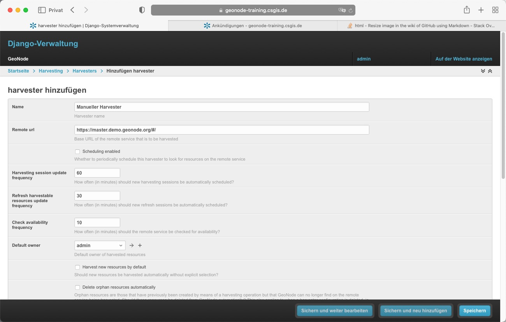

Für unseren Test verwenden wir folgende Konfiguration:

Konfiguration|Wert
---|---
Name|Manueller Harvester
Remote URL | https://master.demo.geonode.org
Scheduling enabled | Nein
Harvesting session update frequency | bleibt ohne Auswirkungen da nur einmalig geharvested wird
Refresh harvestable resources update frequency| bleibt ohne Auswirkungen da nur einmalig geharvested wird
Check availability frequency | 1
Check availability frequency | admin
Harvester type | geonode.harvesting.harvesters.geonodeharvester.GeonodeUnifiedHarvesterWorker
Harvester type specific configuration | {"resource_title_filter": "tl_2018_02_anrc0"}

Nach dem speichern des Objekts wird der neue Harvester gelistet.

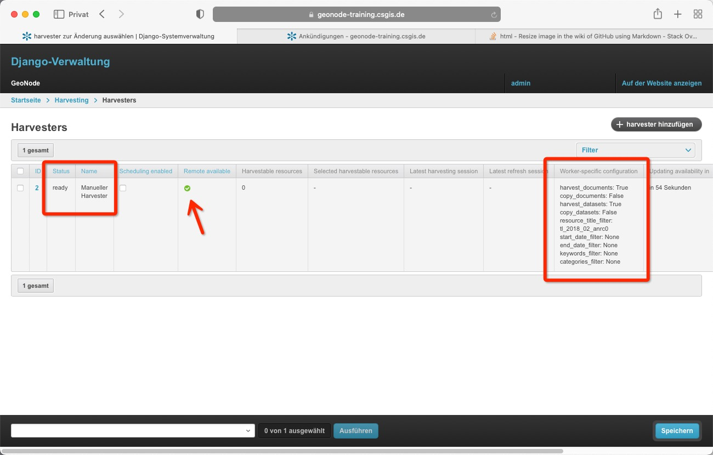

Wir sehen der Status zeicht "ready" und unsere Konfiguration um nur Ebenen mit dem Titel  "tl_2018_02_anrc0" zu harvesten wurde gesetzt.

Wir setzen den Haken vor dem Havester und wählen im unteren Menü die Option "Update harvestable resources for selected harvesters"

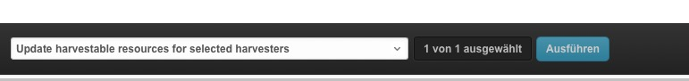

Zurück im Django Hauptmenü rufen wir die Liste der "Harvestable resources" auf.

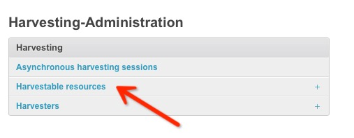

Und sehen die geharvestete Resource.
Um diese lokal zu speichern setzen wir am linken Rand der Tabelle den Haken, und wählen im unteren Auswahlfeld "Harvest selected resources".

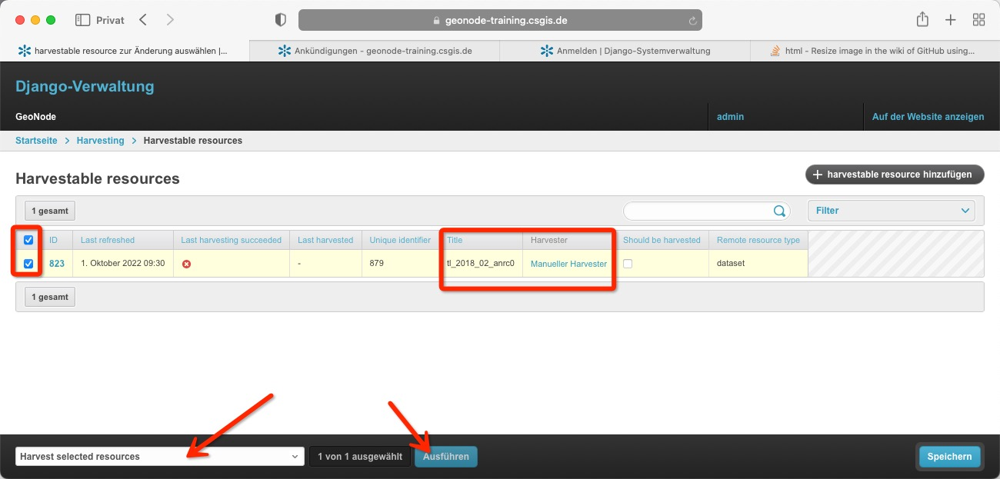

Nach einiger Zeit und neu laden der Maske sollte uns ein grünes Symbol über das erfolgreiche speichern des Datensatzes angezeigt werden.

Unser neuer Datensatz ist hiernach im GeoNode Portal sichtbar:

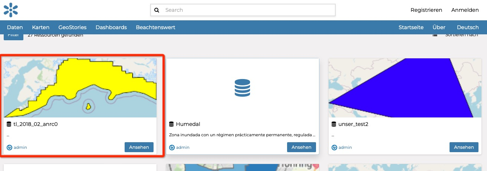

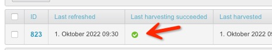

# Periodisches harvesten

Das periodisches abholen und speichern entfernter Datensätze funktioniert fast identisch zum manuellen Workflow.
Um die Funktion zu illustrieren, werden wir den vorab angelegten Harvester leicht abändern.

### löschen der bestehenden Ebene

Im Django Admin navigieren wir zur [Verwaltung von Datensätzen](https://geonode-training.csgis.de/de-de/admin/layers/dataset/) (diesmal im Django Admin). Und löschen die vorab hinzugefügte Ebene "geonode:tl_2018_02_anrc0".

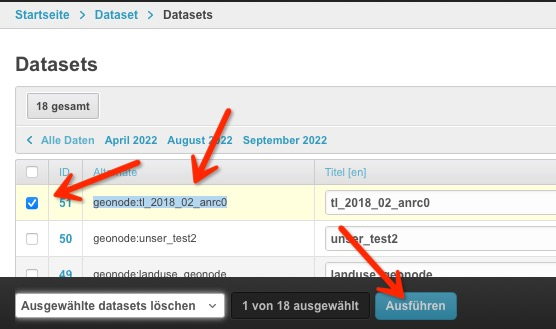

Die hierauf folgende Rückfrage zum löschen, bestätigen wir mit "Ja, ich bin sicher".

In der [Übersicht der Harvestable resources](https://geonode-training.csgis.de/de-de/admin/harvesting/harvestableresource/), löschen wir den vorab gefundenen Datensatz:

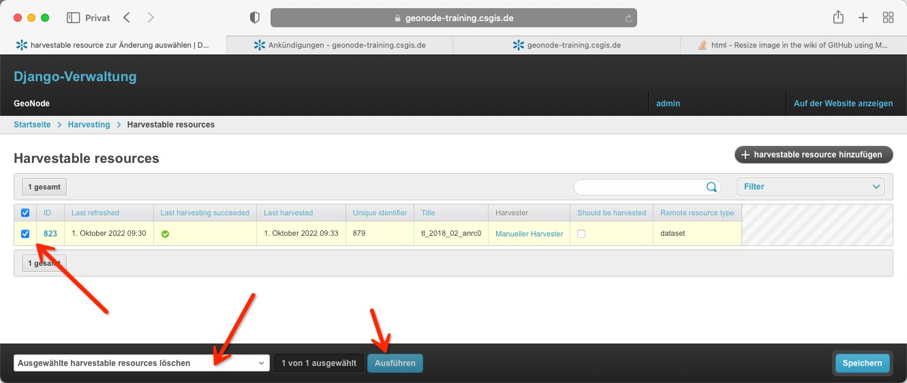

Zurück in der [Übersicht aller Harvester](https://geonode-training.csgis.de/de-de/admin/harvesting/harvester/) editieren wir den vorab angelegten Harvester "Manueller Harvester".

In der Maske ändern wir folgende Angaben:

Konfiguration|Wert
---|---
Name | Automatischer Harvester
Scheduling enable | Checkbox angehakt
Harvesting session update frequency | 2
Refresh harvestable resources update frequency | 2
Harvest new resources by default | Checkbox angehakt
Delete orphan resources automatically | Checkbox angehakt

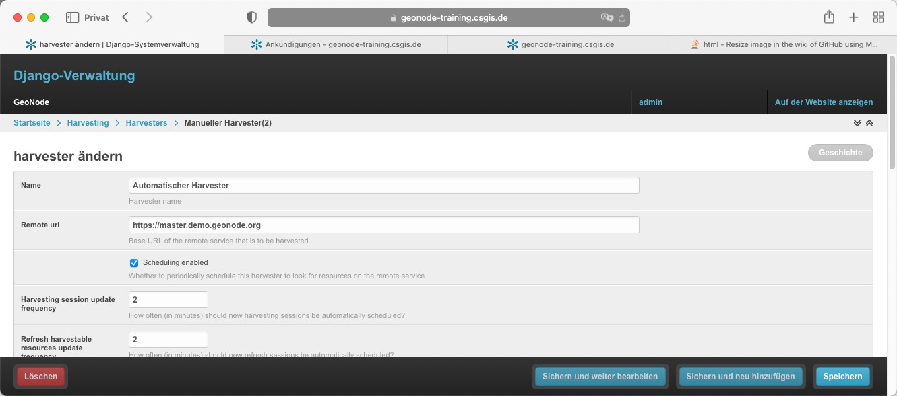

Und speichern die Konfiguration ab.

Nach einiger Zeit sollte die geharvestete Resource in der [Übersicht der zu harvesten Resourcen](https://geonode-training.csgis.de/de-de/admin/harvesting/harvestableresource/) auftauchen.

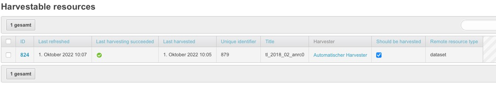

Sowie die Ebene im Portal sichtbar werden.

# Weiterführende Links

- [GeoNode Docs: Harvesting](https://docs.geonode.org/en/master/intermediate/harvesting/index.html?)