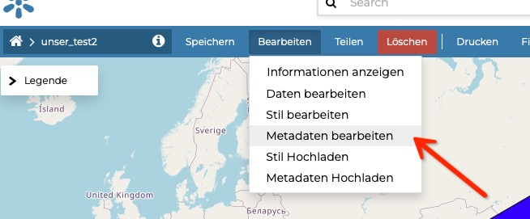
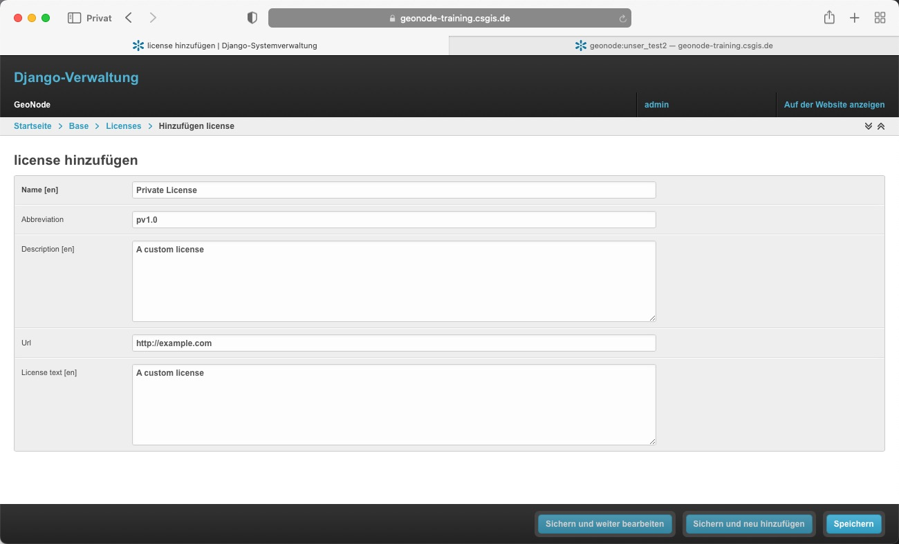
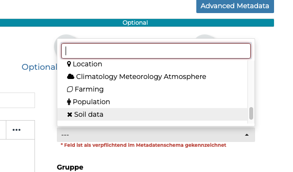

<!-- the Menu -->
<link rel="stylesheet" media="all" href="../styles.css" />

<a href="https://csgis.de">© csgis</a>

<!-- the Menu -->

# Metadaten Modell

Besondere Bedeutung kommt den Metadaten jedes Datensatzes hinzu. 

dabei Standard-Metadatenformaten wie den Metadatenstandards [ISO 19115](https://de.wikipedia.org/wiki/ISO_19115) zu.

Sobald der Upload abgeschlossen ist, kann der Nutzer die Metadaten der Ressource füllen. Dieser werden hiernach über die CSW (OGC Catalogue Service) Endpunkte und APIs verfügbar gemacht.

> Benutzer können auch ein XML-Metadaten-Dokument (ISO-, FGDC- und Dublin Core-Format) hochladen, um wichtige GeoNode-Metadatenelemente automatisch zu füllen.

# Endpunkte für den Metadatenkatalog

- Die Rest Schnittstelle
  - https://geonode-training.csgis.de/api/v2/datasets?format=json
- Der CSW Endpunkt
  - https://geonode-training.csgis.de/catalogue/csw?service=CSW&version=2.0.2&request=GetCapabilities

Dies erlaubt anderen Applikationen auf die GeoNode Daten in maschinenlesbarer Form zuzugreifen.
Als Metadaten Server kommt [pycsw](https://pycsw.org/) zum einsatz. Das manchmal in Dokumentation genannte [geonetwork](https://www.geonetwork-opensource.org/) kann aktuell nicht als Backend genutzt werden.

Wie bereits bekannt, können User den Metadatensatz Ihrer Daten setzen. Dies erfolgt im Frontend auf Ebene Datensatz über "Metadaten bearbeiten".

Administratoren können in beschrängkten Umfang Einfluss auf die angegeben Daten nehmen.
Zwei einfache Beispiele:

## Lizenzen anpassen

In diesem Beispiel legen wir eine neue auswählbare Lizenz an. Im Django Admin navigieren wir über den Menüpunkt

zur Liste der Lizenzen wo wir auf "lizenz hinzufügen" klicken

> Natürlich hätten wir hierüber auch die Möglichkeit bestehende zu verändern oder zu löschen.

In der folgenden Maske legen wir unsere Test Lizenz an und speichern diese ab:

Hiernach steht den Usern die neue Lizenz im Frontend zur Auswahl bereit:

## Metadata Topic Categories

Als zweite Änderung wollen wir eine bestehende "Metadata Topic Kategorie" entfernen sowie eine neue hinzufügen.

Im Django Admin wählen wir den Link "Metadata Topic Category":

In der hierauf folgenden Maske scrollen wir etwas nach unten und klicken auf "society".

Wir entfernen den Haken bei "is Choise" und speichern den Datensatz ab:

Zurück in der Liste aller Topic Kategorien wählen wir über den Rechten oberen Button "Hinzufügen topic category" und füllen das Formular mit Beispiel Daten.

Beim betrachten der Metadatenmaske verschwindet "Society" aus der Auswahl. Weiterhin zeigt sich unsere neue Metadaten Kategorie "Soil data".

