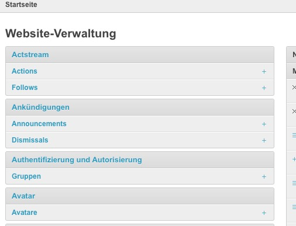

<!-- the Menu -->
<link rel="stylesheet" media="all" href="../styles.css" />

<a href="https://csgis.de">© csgis</a>

<!-- the Menu -->

# Geonode Admin User

Dieser Schulungsbereich gibt eine einführende Zusammenfassung für Administratoren.
 
Benutzen Sie das Menü auf der Rechten Seite um zwischen den Themen zu navigieren.

{:  width="350px" }.

| Tables        | Are           | Cool  |
| ------------- |:-------------:| -----:|
| col 3 is      | right-aligned | $1600 |
| col 2 is      | centered      |   $12 |
| zebra stripes | are neat      |    $1 |

---

hello

kj

ydf

Django bietet eine gebrauchsfertige Benutzeroberfläche für administrative Tätigkeiten. Wir alle wissen, wie wichtig eine Verwaltungsoberfläche für ein Webprojekt ist. Django generiert automatisch eine Admin-Oberfläche auf der Grundlage der Datenbank Modelle.