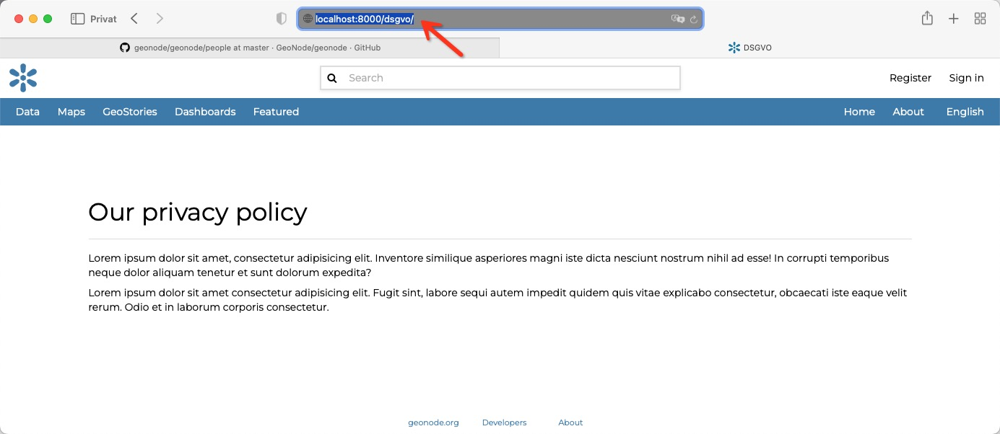

<!-- the Menu -->
<link rel="stylesheet" media="all" href="../styles.css" />
<div id="logo"><a href="https://csgis.de">© CSGIS 2022</a></div>
<div id="menu"></div>
<div id="jumpMenu"></div>
<script src="../menu.js"></script>
<script src="../jumpmenu.js"></script>
<!-- the Menu -->


# Eigene Seite anlegen

Im vorherigen Abschnitt haben wir die bestehende Seite "about.html" überschrieben. In diesem Kapitel wollen wir eine neue Seite anlegen.  
Hierfür werden wir eine neue HTML Datei erstellen sowie die urls.py verwenden um die neue Seite zu verlinken.


### dsgvo.html anlegen

Zunächst legen wir wiederrum im Templates Ordner unsere neue HTML Datei `dsgvo.html` an.


```html
    
    

    
    DSGVO

    
    <div class="page-header">
    <h2>Datenschutzgrundverordnung</h2>
    </div>
    <p>
    Lorem ipsum dolor sit amet, consectetur adipisicing elit. Inventore similique asperiores magni iste dicta nesciunt nostrum nihil ad esse! In corrupti temporibus neque dolor aliquam tenetur et sunt dolorum expedita?</p>
    <p>
    Lorem ipsum dolor sit amet consectetur adipisicing elit. Fugit sint, labore sequi autem impedit quidem quis vitae explicabo consectetur, obcaecati iste eaque velit rerum. Odio et in laborum corporis consectetur.</p>

    
    
```


### urly.py

```python
    from geonode.urls import urlpatterns
    from django.views.generic import TemplateView
    from django.conf.urls import url

    # You can register your own urlpatterns here
    urlpatterns = [
        url(r'^dsgvo/$',
            TemplateView.as_view(template_name='dsgvo.html'),
            name='dsgvo'),
    ] + urlpatterns
 ```

Hiernach sollte die neue DSGVO Seite im Browser sichtbar werden.



> Tipp: in Kombination mit einem "Custom Menu" lassen sich so einfach eigene Seiten erzeugen.


# Weiterführende links

- [Django Docs - URLs definieren](https://docs.djangoproject.com/en/4.1/topics/http/urls/)


