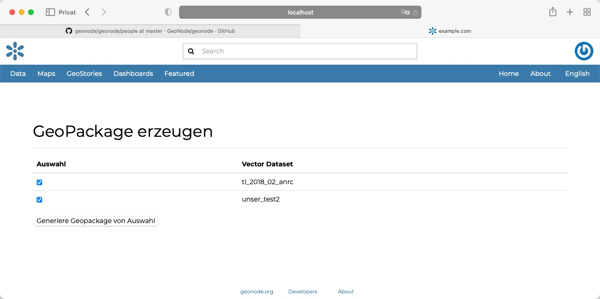
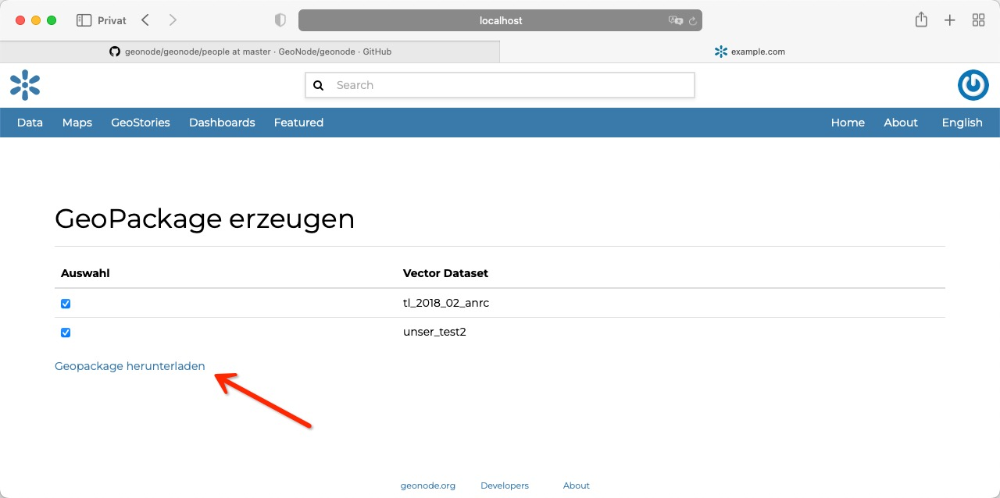
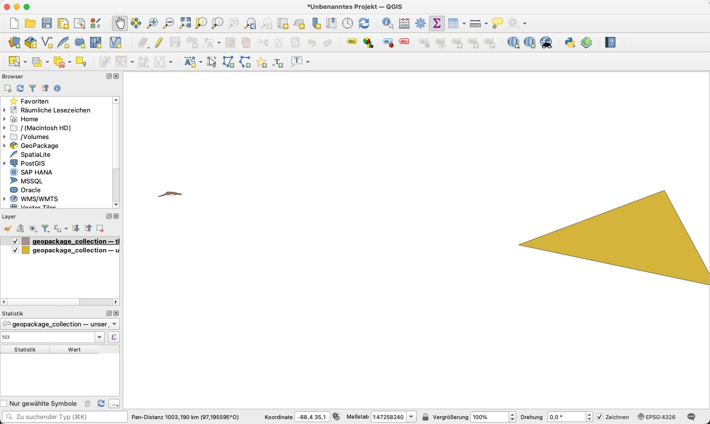

<!-- the Menu -->
<link rel="stylesheet" media="all" href="../styles.css" />
<div id="logo"><a href="https://csgis.de">© CSGIS 2022</a></div>
<div id="menu"></div>
<div id="jumpMenu"></div>
<script src="../menu.js"></script>
<script src="../jumpmenu.js"></script>
<!-- the Menu -->


# Export geopackage APP

In diesem Abschnitt wollen wir uns die Grundzüge einer eigenen App ansehen.  
Unsere APP wird Usern die Möglichkeit geben Vektor-Datensätze auszuwählen und diese
gesammelt in einem geopackage herunter zu laden.  
Die Hauptarbeit wird hierbei von dem im Hintergrund agierenden Kartenserver `geoserver` erledigt. Dieser stellt über den WPS Endpunkt bereits die Möglichkeit Ebenen als Geopackage zu exportieren. Als Input erwartet er ein XML Dokument mit den Layer Definitionen.

> ACHTUNG: Der gezeigte Code ist nicht produktionsfähig. Er vermisst wichtige Sicherheitsabfragen und Fehlerbehandlungen.

Programm Ablauf:

```
-> User wählt Datensätze zum Export über Checkboxen
    -> JS sendet Namen der Ebenen an JSON View als POST request 
       -> Django sendet request an GeoServer WPS Endpunkt um das geopackage erstellen zu lasen 
          -> JS nimmt link zu Geopackage Download entgegen und gibt diesen an User aus
```

## Eine neue Django APP erstellen

Django macht uns den Start für eigene Entwicklungen sehr leicht.
Das Kommando 

```bash
 python manage.py startapp geopackage_collection
 ```

 erzeugt uns einen neuen Ordner innerhalb unserer Verzeichnisstruktur mit den wichtigsten Dateien wie `views.py`, `models.py` etc. bereits angelegt.

```bash
geopackage_collection
├── __init__.py
├── __pycache__
│   ├── __init__.cpython-39.pyc
│   ├── admin.cpython-39.pyc
│   ├── apps.cpython-39.pyc
│   ├── helper.cpython-39.pyc
│   ├── models.cpython-39.pyc
│   └── views.cpython-39.pyc
├── admin.py
├── apps.py
├── helper.py
├── migrations
│   ├── __init__.py
│   └── __pycache__
│       └── __init__.cpython-39.pyc
├── models.py
├── templates
│   └── base
│       └── resourcebase_list.html
├── tests.py
└── views.py

5 directories, 16 files
```

Unsere neue App müssen wir lediglich noch in den Django settings vermerken:

```python
 if PROJECT_NAME not in INSTALLED_APPS:
    INSTALLED_APPS += (PROJECT_NAME,)
    INSTALLED_APPS += ('geopackage_collection',)
```

## Anlegen der views.py

Das Bindeglied zwischen Datenbank und Ausgabe stellt die Datei `views.py` dar.  
Wir legen diese mit folgendem Inhalt an:

```python
from django.views.generic.list import ListView
from django.http import JsonResponse
from django.contrib.auth.decorators import login_required
from django.contrib.auth.mixins import LoginRequiredMixin
from django.views.decorators.http import require_http_methods
from geonode.base.models import ResourceBase
from .helper import get_wfs_Template, http_client
import json


class GpkgList(LoginRequiredMixin, ListView):
    """Django List View um alle Datensätze auszugeben"""
    queryset = ResourceBase.objects.filter(subtype="vector")


@login_required
@require_http_methods(['POST'])
def gpkg_json_result(request):
    """View um Datensätze entgegen zu nehmen und 
    die URL zum Datensatz zurück zu geben.
    """
    request_payload = json.loads(request.body.decode("utf-8"))
    datasets = request_payload['datasets']
    wfs_template = get_wfs_Template(datasets)
    wps_return = http_client(wfs_template)
    data = {"result_link": wps_return}
    
    return JsonResponse(data, safe=False)
```

### Anlegen der helpers.py

Die angelegte views.py greift auf einige Hilfefunktionen zurück. So zum Beispiel eine Funktion die das XML für die Anfrage an GeoServer erstellt, oder einen einfach abstrahierten HTTP Clienten. Wir legen die Funktionen in einer neuen Datei namens `helpers.py` an.

```python
from django.conf import settings
import requests
import logging

# Neuen Logger erzeugen
logger = logging.getLogger("geonode")

# Zugangsdaten zum GeoServer für http_client()
geoserver_user = settings.OGC_SERVER_DEFAULT_USER
geoserver_user_password = settings.OGC_SERVER_DEFAULT_PASSWORD
geoserver_settings_url = settings.GEOSERVER_WEB_UI_LOCATION
geoserver_url = f"{geoserver_settings_url}wps"

wfs_template = """<?xml version="1.0" encoding="UTF-8"?><wps:Execute version="1.0.0" service="WPS" xmlns:xsi="http://www.w3.org/2001/XMLSchema-instance" xmlns="http://www.opengis.net/wps/1.0.0" xmlns:wfs="http://www.opengis.net/wfs" xmlns:wps="http://www.opengis.net/wps/1.0.0" xmlns:ows="http://www.opengis.net/ows/1.1" xmlns:gml="http://www.opengis.net/gml" xmlns:ogc="http://www.opengis.net/ogc" xmlns:wcs="http://www.opengis.net/wcs/1.1.1" xmlns:xlink="http://www.w3.org/1999/xlink" xsi:schemaLocation="http://www.opengis.net/wps/1.0.0 http://schemas.opengis.net/wps/1.0.0/wpsAll.xsd">
                <ows:Identifier>gs:GeoPackage</ows:Identifier>
                <wps:DataInputs>
                        <wps:Input>
                                <ows:Identifier>contents</ows:Identifier>
                                <wps:Data>
                                        <wps:ComplexData mimeType="text/xml; subtype=geoserver/geopackage">
                                                <![CDATA[
                                                    <geopackage xmlns="http://www.opengis.net/gpkg" name="geopackage_collection">
                                                        {partials}
                                                    </geopackage>
                                                ]]>
                                        </wps:ComplexData>
                                </wps:Data>
                        </wps:Input>
                </wps:DataInputs>
                <wps:ResponseForm>
                        <wps:RawDataOutput>
                                <ows:Identifier>geopackage</ows:Identifier>
                        </wps:RawDataOutput>
                </wps:ResponseForm>
                </wps:Execute>
                """

def get_build_partials(datasets):
    """Erzeuge für jede zu ladende Ebene einen XML Knoten."""
    partials_source = '<features identifier="{dataset}" name="places">' \
                      '<featuretype>{dataset}</featuretype>' \
                      '</features>'                       

    partials_payload = ""
    for dataset in datasets:
        partials_payload += partials_source.format(dataset = dataset)

    return partials_payload  

def get_wfs_Template(datasets):
    """Gibt das fertige XML Dokument an den View zurück."""
    generated_partials = get_build_partials(datasets)
    wfs_payload = wfs_template.format(partials = generated_partials)
    return wfs_payload


def http_client(geoserver_payload):
    """Hilfefunktion um HTTP POST request abzusetzen."""
    try:
        geoserver_response = requests.post(geoserver_url, data=geoserver_payload.encode('utf-8'), auth=(
            geoserver_user, geoserver_user_password))
        print(geoserver_response.text)

        if (geoserver_response.status_code < 200 or geoserver_response.status_code > 201):
            logger.error(geoserver_response.content)        
        return geoserver_response.text
    except Exception as e:
        raise e
```

## Template anlegen

Abschließend erstellen wir im Verzeichniss unserer App ein neues Verzeichnis namens `templates`, hierin ein Verzeichnis mit dem Namen `base` und legen die Datei `resourcebase_list.html` mit folgendem Inhalt an:

```html




<h2>GeoPackage erzeugen</h2>
<hr>
<table class="table">
    <thead>
      <tr>
        <th scope="col">Auswahl</th>
        <th scope="col">Vector Dataset</th>
      </tr>
    </thead>
    <tbody>
        
        <tr>
            <th scope="row"><input type="checkbox" name="layerselect" value="{{ object.alternate }}"></th>
            <td>{{ object.title }}</td>
        </tr>    
        
            No objects yet.
        
    </tbody>
    </table>
    <div id="result"></div>
    <button id="submit">Generiere Geopackage von Auswahl</button>

    <script>

    /* Hilffunktion um korrekten Cookie zu denden */
    function getCookie(name) {
        var cookieValue = null;
        if (document.cookie && document.cookie !== '') {
            var cookies = document.cookie.split(';');
            for (var i = 0; i < cookies.length; i++) {
                var cookie = cookies[i].trim();
                if (cookie.substring(0, name.length + 1) === (name + '=')) {
                    cookieValue = decodeURIComponent(cookie.substring(name.length + 1));
                    break;
                }
            }
        }
        return cookieValue;
    }

    const result_div = document.getElementById("result");
    /* Auf Button klick auswahl senden und Resultat in Empfang nehmen */
    var element = document.getElementById("submit")
        .onclick = function() {
            let node_values = [];
            var checkedBoxes = document.querySelectorAll('input[name=layerselect]:checked');
            checkedBoxes.forEach((node) => {
                node_values.push(node.value)
            });

            let data = JSON.stringify({"datasets": node_values})
            let csrftoken = getCookie('csrftoken');
            let response = fetch("/gpkg/gpkg_json_result/", {
                method: 'POST',
                body: data,
                headers: { 'Accept': 'application/json, text/plain, */*',
                    'Content-Type': 'application/json',
                    "X-CSRFToken": csrftoken},
            })
            .then(response => response.json())
            .then(res => {
                result_div.innerHTML = `<a href='${res["result_link"]}' target='_blank'>Geopackage herunterladen</a>`
                this.remove()
            }).catch(err => {
                console.log(err)
                result_div.innerHTML = err
        });
        };
    </script>


```

### urls.py

Abschließend verknüpfen wir unsere views.py mit unseren URL-Definitionen der Datei `urls.py`.

```python
from geonode.urls import urlpatterns
from django.views.generic import TemplateView
from django.conf.urls import url

from geopackage_collection.views import GpkgList, gpkg_json_result
from django.urls import path


# You can register your own urlpatterns here
urlpatterns = [
    url(r'^gpkg/$',
        GpkgList.as_view(),
        name='gpkg'),
        url(r'^gpkg/gpkg_json_result/$',
        gpkg_json_result,
        name='gpkg_json_result'),
] + urlpatterns
```


# Ergebnis

Unter unserer neuen URL `http://localhost:8000/gpkg` sollten wir alle Vektor Datensätze aufgelistet bekokmmen. 



Treffen wir eine Auswahl und klicken "Genereiere Geopackage von Auswahl" sollte der Link zum Download des Geopackage nach einiger Zeit angezeigt werden:



Öffnen wir die heruntergeladene Datei in QGIS sehen wir die beiden exportieren Ebenen:



# Fazit

# Weiterführende Links

