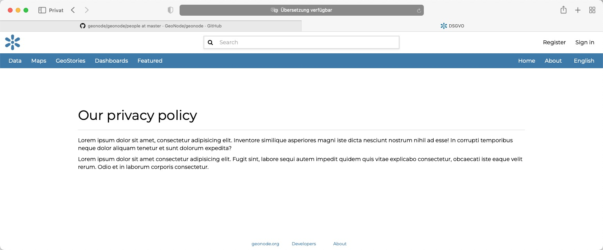
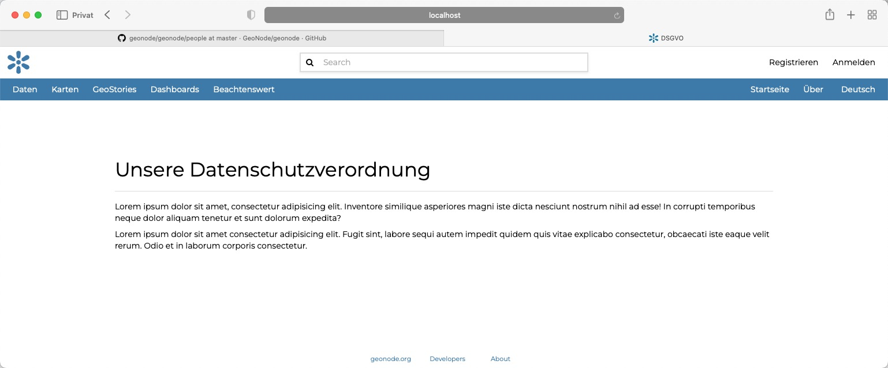

<!-- the Menu -->
<link rel="stylesheet" media="all" href="../styles.css" />
<div id="logo"><a href="https://csgis.de">© CSGIS 2022</a></div>
<div id="menu"></div>
<div id="jumpMenu"></div>
<script src="../menu.js"></script>
<script src="../jumpmenu.js"></script>
<!-- the Menu -->


# Übersetzng anlegen

In diesem Abschnitt wollen wir einen Blick auf das Internationalisierungssytem von Django werfen.

Ziel ist unsere vorab als zu übersetzend ausgezeichnete Überschrift 

```shell

<h1></h1>

```

mit einer Übersetzung zu versehen. Django erlaubt das anlegen von Übersetzungen über sogenannte `po` und `mo` Dateien.  
Die `po` Datei stellt hierbei die Quelldatei. Die `mo` Datei die kompilierte Datei mit Übersetzungen dar.

Zunächst können wir den Umfang der Sprachen in unserer settings.py Datei wie folgt einschränken

```python
LANGUAGES = (
    ('en-us', 'English'),
    ('de-de', 'Deutsch'),
)
```

## Locale Dateien anlegen

Im Hauptverzeichnis unseres GeoNode-Projekts legen wir den neuen Ordner locale an.

```shell
 mkdir locale
```

Über das durch Django bereitgestellte Kommando `makemessages` lassen wir alle zur Übersetzung angelegten Textfragmente in `po` Dateien einsammeln:

```shell
django-admin makemessages --no-location -l en -l de -d django -e "html" 
```

`--locale` gibt hierbei die zu erzeugenden Übersetzungen an.
`-e "html"` gibt die Extension der Dateien an die wir berücksichtigen wollen 

```shell
(e) tonischonbuchner@Tonis-MacBook-Pro $% tree locale      
locale
├── de
│   └── LC_MESSAGES
│       └── django.po
└── en
    └── LC_MESSAGES
        └── django.po

4 directories, 2 files
```

Hiernach sollten wir die neuen Ordner je Sprache sowie die Quelldateien im Ordner "locale" vorfinden.

## po Dateien bearbeiten

Im nächsten Schritt legen wir in `locale/de/LC_MESSAGES/django.po` eine Übersetzung für unsere Überschrift an:

```shell
 ...
 msgid "Our privacy policy"
 msgstr "Unsere Datenschutzgrundverordnung"
 ... 
 ```

## po Dateien in mo Dateien kompilieren

Nachdem wir die Quelldateien übersetzt haben können wir Django anweisen die Dateien zu kompilieren.

```shell
django-admin compilemessages --locale de --locale en                    
processing file django.po in /Users/tonischonbuchner/dev/github/gn-auth3/geonode_training/locale/en/LC_MESSAGES
processing file django.po in /Users/tonischonbuchner/dev/github/gn-auth3/ils/geonode_training/de/LC_MESSAGES
```

Hiernach sollten wir in unserem locale Ordnern die neu kompilierten `*.mo` Dateien sehen.

```shell
locale
├── de
│   └── LC_MESSAGES
│       ├── django.mo
│       └── django.po
└── en
    └── LC_MESSAGES
        ├── django.mo
        └── django.po
```

Um die Änderungen online zu stellen kopieren wir den locale Ordner eine Ebene tiefer ins Projektverzeichnis.

> Das Projektverzeichnis erhält beim erstellen von GeoNode-Project den von Ihnen angegebenen Namen. Es handelt sich hierbei um dieses Verzeichnis: https://github.com/GeoNode/geonode-project/tree/master/src/project_name

```shell
cp -r locale geonode_training
```

Hiernach sollten die Übersetzungen der Sprachen im Browser angezeigt werden.

> Vergessen Sie in live Umgebungen nicht den Python Server neu zu starten





# Weiterführende Links

- [Django Docs – Internationalization and localization](https://docs.djangoproject.com/en/4.0/topics/i18n/)

