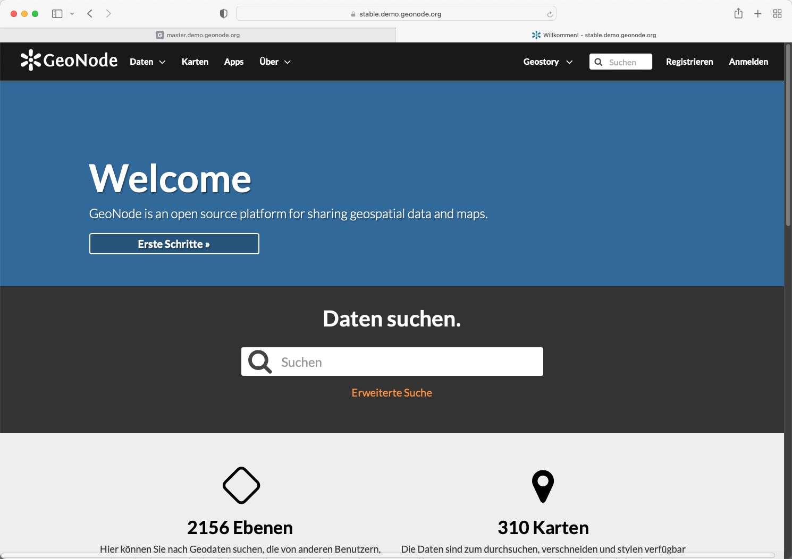

<!-- the Menu -->
<link rel="stylesheet" media="all" href="../styles.css" />

<a href="https://csgis.de">© CSGIS 2022</a>

<!-- the Menu -->

# Frontendänderungen in GeoNode Version 4

In den vorausgehenden Kapiteln haben wir gesehen wie wir Templates überschreiben können.
Vergleichen wir jedoch die Oberfläche der GeoNode Version 3.3 mit der Oberfläche der Version 4, stechen große Untschiede ins Auge.

Der Vergleich zeigt dass die Oberfläche für die Version 4 weitreichende Änderungen erfahren hat.

### Django Templates durch React ersetzt

https://reactjs.org/
https://mapstore2.readthedocs.io/en/latest/