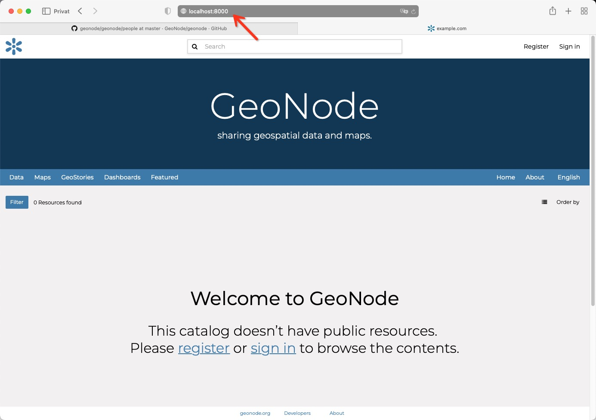

<!-- the Menu -->
<link rel="stylesheet" media="all" href="../styles.css" />
<div id="logo"><a href="https://csgis.de">© CSGIS 2022</a></div>
<div id="menu"></div>
<div id="jumpMenu"></div>
<script src="../menu.js"></script>
<script src="../jumpmenu.js"></script>
<!-- the Menu -->


# GeoNode Quelltext

Um im folgenden Änderungen oder Neuentwicklungen an unserer Instanz vorzunehmen werfen wir zunächst einen Blick auf das Code Repository von GeoNode. Dieses findet sich unter der URL:

[https://github.com/geonode/geonode](https://github.com/geonode/geonode)

Der eigentliche Programm-Code befindet sich hier im Ordner "geonode".


Die sich hierunter befindenen Ordner, stehen für sogenannte "Django-Apps". Wir erinnern uns, Django, das Web-Framework hinter Django ermöglicht die einzelnen Programmbereiche in Module aufzuteilen.


Dem/der aufmerksamen Zuhörer*in  wird nun auffallen, dass sich die einzelnen Ordner, im "Django Admin" des vorhergehenden Artikels wiederfinden. Grund hierfür ist, dass Django die Administrationsoberfläche automatisiert aus den einzelnen Apps erstellen kann.  

Betrachten wir uns eine App wie Beispielsweise die "people"-App, die die Benutzer des Portals regelt, sollen 3 Dateien mit besonderem Augenmerk beachtet werden.

- models.py
- templates/*
- views.py

Diese Struktur bezeichnet sich als MVT. Ein Programmiermuster dass die Grundlage aller Django-Apps darstellt.

### models.py
Hierbei stellt die *models.py* die jeweilige Datenbank Definition dar. Hierüber werden also alle benötigten Tabellen und Funktionen rund um die Datenbank definiert.

### templates/*
Im Ordner templates, befinden sich alle Dateien die für die Ein-/Ausgabe zuständig sind. Dies sind größtenteils HTML Dateien die über die Templatesprache "Jinja2" die Ausgabe im Browser besorgen.

### views.py
views.py stellt Funktionen, die als Bindeglied zwischen Datenbankdefinitionen (models.py) und Ein-/Ausgabe Ansichten (templates/*) stehen.


Beachtenswert ist ebenfalls noch die sich sogut wie in allen Apps befindliche Datei "urls.py". Sie enthält die URL Definitionen Bereit um Browseranfragen an die richtige Stelle zu leiten. 


# GeoNode Entwicklungsumgebung

Eine grundlegende Regel bei der Entwicklung mit GeoNode ist, den Code-Kern wenn möglich nie anzufassen. [https://github.com/GeoNode/geonode-project](https://github.com/GeoNode/geonode-project) gibt uns jedoch die Möglichkeit einzelne Bereiche in GeoNode zu überschreiben. Zudem kann das Projekt lokal gestartet werden um Änderungen direkt live verfolgen zu können oder automatisierte Tests ablaufen zu lassen.

> Da es unter Windows zu vielerleit Problemen mit abhängigen Bibliotheken kommt, soll die lokale Entwicklungsumgebung lediglich unter Linux oder OSX gestartet werden.

## Neues GeoNode Project erzeugen

```
git clone https://github.com/GeoNode/geonode-project.git -b master
source /usr/share/virtualenvwrapper/virtualenvwrapper.sh
mkvirtualenv --python=/usr/bin/python3 my_geonode
pip install Django==3.2.14

django-admin startproject --template=./geonode-project -e py,sh,md,rst,json,yml,ini,env,sample,properties -n monitoring-cron -n Dockerfile my_geonode

cd my_geonode
```

> Beachtenwert ist hierbei die Datei `src/requirements.txt` sie zeigt dass der GeoNode Kern Quelltext in Form eines Python Pakets als Abhängigkeit installiert wird.

```
git+https://github.com/GeoNode/geonode.git@master#egg=GeoNode
```


### Settings erzeugen

Das Herzstück der Konfiguration ist die Datei src/settings.py in GeoNode (wir werden Sie im letzten Abschnitt noch im Detail betrachten). Um unser Projekt zu starten muss diese Konfiguration in einem nächsten Schritt erzeugt werden.


Wir erstellen im aktuellen Hauptverzeichnis der Datei, eine json Datei mit folgendem Inhalt:

*file.json*

```
{
  "hostname": "value",
  "https": "value",
  "email": "value",
  "geonodepwd": "value",
  "geoserverpwd": "value",
  "pgpwd": "value",
  "dbpwd": "value",
  "geodbpwd": "value",
  "clientid": "value",
  "clientsecret": "value"
} 
```

Hiernach sollten wir die Einstellungsdatei `.env` mit folgendem Befehl erzeugen können.

python create-envfile.py -f ./file.json \
  --hostname localhost \
  --https \
  --email random@email.com \
  --geonodepwd gn_password \
  --geoserverpwd gs_password \
  --pgpwd pg_password \
  --dbpwd db_password \
  --geodbpwd _db_password \
  --clientid 12345 \
  --clientsecret abc123 

Ebenfalls ist es erforderlich noch Abhängigkeiten zu installieren sowie einige Management Dateien zu generieren:

```
cd src
pip install -r requirements.txt --upgrade
pip install -e . --upgrade

# Install GDAL Utilities for Python
pip install pygdal=="`gdal-config --version`.*"

# Dev scripts
mv ../.override_dev_env.sample ../.override_dev_env
mv manage_dev.sh.sample manage_dev.sh
mv paver_dev.sh.sample paver_dev.sh

source ../.override_dev_env
```


### Starten des Servers

Mit folgenden Befehlen sollten wir abschließend den lokalen Server starten können.

```
# Using the Default Settings
sh ./paver_dev.sh reset
sh ./paver_dev.sh setup
sh ./paver_dev.sh sync
sh ./paver_dev.sh start
```

Und wenn alles korrekt verlaufen ist in der Terminal Ausgabe folgende Meldung sehen:


Weiterhin das Projekt im Browser unter http://localhost:8000 aufrufen können.



> Beachte: Der Entwicklungsserver verwendet Spatialite als Datenbank. Diese verursacht oftmals Probleme. Es wird daher empfohlen eine lokale Postgres/Postgis Installation aufzustzen und diese in der .env zu vermerken. (Siehe Weiterführende Links)

# Weiterführende Links

- [GeoNode Docs – GeoNode Project](https://docs.geonode.org/en/master/install/advanced/project/index.html)
- [GeoNode Docs – Docker als Entwicklungsumgebung](https://docs.geonode.org/en/master/devel/docker/index.html)