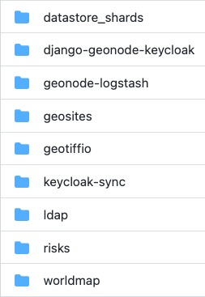

<!-- the Menu -->
<link rel="stylesheet" media="all" href="../styles.css" />
<div id="logo"><a href="https://csgis.de">© CSGIS 2022</a></div>
<div id="menu"></div>
<div id="jumpMenu"></div>
<script src="../menu.js"></script>
<script src="../jumpmenu.js"></script>
<!-- the Menu -->


# Contrib Apps

"Contrib Apps" sind Erweiterungen die sie GeoNode hinzufügen können.  
Diese finden Sie in folgendem Repository:

https://github.com/GeoNode/geonode-contribs




> In Django Umgebungen sind die Contrib Apps bereits installiert.
Auf zwei Erweiterungen soll hingewiesen werden.

# ldap Erweiterung

Erlaubt die Authentifizierung von Usern über LDAP.
Die Konfiguration finden sie bereits in der bekannten `settings.py`

```
# LDAP
LDAP_ENABLED=False
LDAP_SERVER_URL=ldap://<the_ldap_server>
LDAP_BIND_DN=uid=ldapinfo,cn=users,dc=ad,dc=example,dc=org
LDAP_BIND_PASSWORD=<something_secret>
LDAP_USER_SEARCH_DN=dc=ad,dc=example,dc=org
LDAP_USER_SEARCH_FILTERSTR=(&(uid=%(user)s)(objectClass=person))
LDAP_GROUP_SEARCH_DN=cn=groups,dc=ad,dc=example,dc=org
LDAP_GROUP_SEARCH_FILTERSTR=(|(cn=abt1)(cn=abt2)(cn=abt3)(cn=abt4)(cn=abt5)(cn=abt6))
LDAP_GROUP_PROFILE_MEMBER_ATTR=uniqueMember
```
Siehe: https://github.com/GeoNode/geonode-project/blob/master/.env.sample#L214-L223

# keyloak-sync Erweiterung

Diese Contrib App erlaubt die Authentifizierung von Usern über einen eigenständigen [Keycloak Server](https://www.keycloak.org/).
Keycloak als Authentifizierungsserver unterstützt wiederum eine vielzahl an Authentifizierungsquellen.

Um das Modul zu konfigurieren müssen folgende Settings hinzugefügt werden.

```
if 'keycloaksync' not in INSTALLED_APPS:
    INSTALLED_APPS += ('keycloaksync',)
    
KEYCLOAK_URL=os.getenv('KEYCLOAK_URL', None)
KEYCLOAK_CLIENT=os.getenv('KEYCLOAK_CLIENT', None)
KEYCLOAK_CLIENT_ID=os.getenv('KEYCLOAK_CLIENT_ID', None)
KEYCLOAK_CLIENT_SECRET=os.getenv('KEYCLOAK_CLIENT_SECRET', None)
KEYCLOAK_REALM=os.getenv('KEYCLOAK_REALM', None)
KEYCLOAK_USER=os.getenv('KEYCLOAK_USER', None)
KEYCLOAK_PASSWORD=os.getenv('KEYCLOAK_PASSWORD', None)
KEYCLOAK_USER_REALM=os.getenv('KEYCLOAK_USER_REALM', None)
```

> Beachten Sie die [Readme](https://github.com/GeoNode/geonode-contribs/tree/master/keycloak-sync) des Repositiroy

# Weiterführende Links

- [GeoNode Docs – Contrib Apps](https://docs.geonode.org/en/master/advanced/contrib/index.html)
- [LDAP Contrib App](https://github.com/GeoNode/geonode-contribs/tree/master/ldap)
- [Keycloak Contrib App](https://github.com/GeoNode/geonode-contribs/tree/master/keycloak-sync)