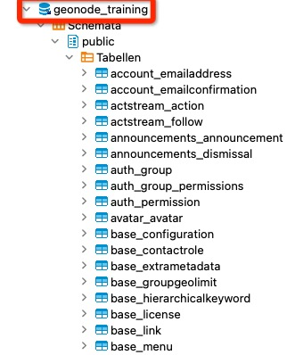
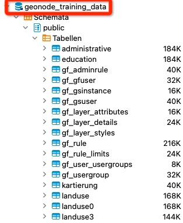
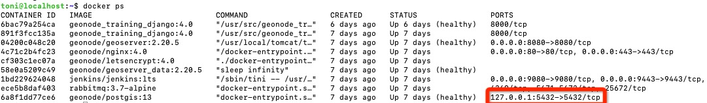
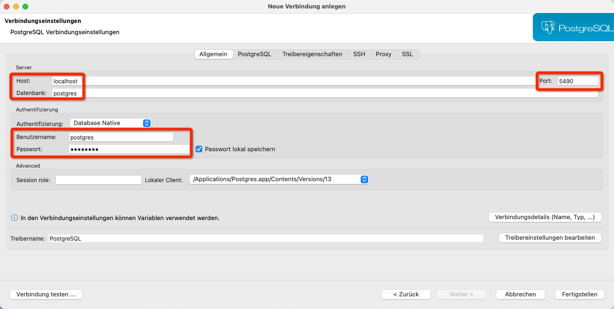
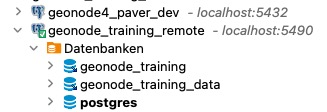

<!-- the Menu -->
<link rel="stylesheet" media="all" href="../styles.css" />
<div id="logo"><a href="https://csgis.de">© CSGIS 2022</a></div>
<div id="menu"></div>
<div id="jumpMenu"></div>
<script src="../menu.js"></script>
<script src="../jumpmenu.js"></script>
<!-- the Menu -->

# Die GeoNode Datenbanken

GeoNode arbeitet mit zwei Datenbanken:

1. geonode
1. geonode_data

Wobei "geonode" durch den jeweiligen Projektnamen erstzt wird

- geonode_training
- geonode_training_data

In der Datenbank 1. `geonode` werden alle Tabellen der einzelnen Django Apps abgelegt.



In der Datenbank 2. `geonode_data` werden alle Tabellen von Vektor Datenstäzen abgelegt. Auf diese Datenbank greift der GeoServer ebenfalls zu.



> beide Datenbanken benötigen die `POSTGIS` Erweiterung!


# Datenbank Verbindung

Diese Anleitung zeigt den empfohlenen Weg sich mit den Datenbanken von GeoNode in einer Docker Umgebung zu finden.

Standardmässig ist von außen keine Verbindung zu der im Postres-Container laufenden Datenbankserver möglich.
Wir ändern dies indem wir in unserer `docker-compose.yml` die Ports verlinken.

```
  db:
    # use geonode official postgis 13 image
    image: geonode/postgis:13
    command: postgres -c "max_connections=${POSTGRESQL_MAX_CONNECTIONS}"
    container_name: db4${COMPOSE_PROJECT_NAME}
    env_file:
      - .env
    volumes:
      - dbdata:/var/lib/postgresql/data
      - dbbackups:/pg_backups
    restart: on-failure
    healthcheck:
      test: "pg_isready -d postgres -U postgres"
    # Hier die Verlinkung zwischen den Ports zwischen Host und Container
    ports:
        - "127.0.0.1:5432:5432"
```

> Achtung: wir verwenden auf Host Seite nicht `5432` sondern `127.0.0.1:5432`. Bei Verwendung von `5432` würden wir den Port komplett nach außen hin öffnen was wir nicht wollen.

Um uns nun mit den Datenbanken mit einem lokalen Datenbank-Clienten wie "Dbeaver" oder "pgadmin" verbinden zu können, müssen wir einen sogenannten SSH Tunnel herstellen.

```
ssh toni@geonode-training.csgis.de -L 5490:127.0.0.1:5432
```

Über die -L Angabe binden wir den POrt 5490 an den Port 5432 des Servers. (In diesem Fall geonode-training.csgis.de)

Eine letzte überprüfung der Docker Container stellt sicher dass der Port für den Host sichtbar ist:

```
docker ps
```



Hiernach können wir uns mit unserem lokalen Datenbank-Clienten über den Tunnel verbinden:




- Wir verwenden den Tunnelport `5490`
- Als Host wählen wir `localhost`
- Als Datenbank die gewünschte Datenbank: `{projectname}_geonode` oder `{projectname}_geonode` 
  - Da wir hier den User postgres verwenden belasse ich die Datenbank auf `postgres`
- Als Benutzername und Passwort haben wir drei Möglichkeiten. Je nachdem mit wem wir und Verbinden, müssen wir ebenso die gewählte Datenbank Definition verändern.
  - Den User der `{projectname}_geonode` Datenbank
  - Den User der `{projectname}_geonode` 
  - Den Postgres User
  


Hiernach können wir uns mit den Datenbanken verbinden / mit diesen arbeiten.

