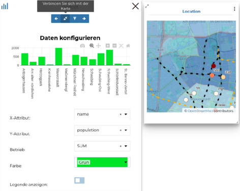
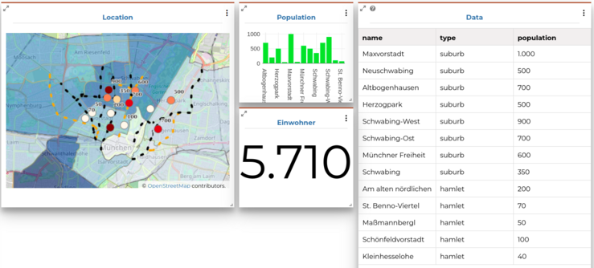
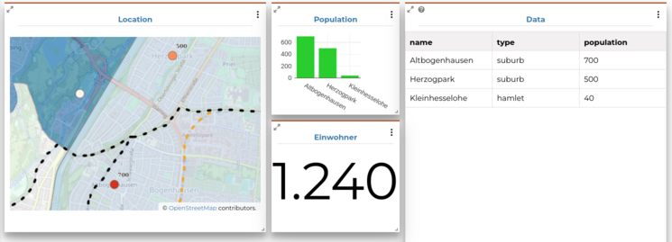

<!-- the Menu -->
<link rel="stylesheet" media="all" href="../styles.css" />

<a href="https://csgis.de">© csgis 2022</a>

<!-- the Menu -->

# Dashboards

Sie eignen sich gut für die Präsentation von Ergebnisse oder Zusammenfassungen von Daten (siehe [zum Beispiel](https://geonode-training.csgis.de/catalogue/#/dashboard/30)).

## Übung

**Erstellung eines Dashboards**

1. Um ein Dashboard zu machen müssen Sie wie gewohnt den entsprechenden GeoNode Ressource erstellen: Ressource hinzufügen → Dashboard erstellen → Speichern

    In einem Dashboard können Sie folgende widgets integrieren:

    

1. Fügen Sie zuerst die Karte die sie im Punkt 1.4 erzeugt haben

1. Danach bringen Sie in den dashboard folgende Diagramm mit den Einwohnerzahlen.

    >In Dashboard können die Inhalte dynamisch verknüpft mit anderen Inhalte sein 	(zum Beispiel wenn man in die Karte zoom würde das Diagramm nur die Daten 	anzeigen die man gerade in die Karte sieht)
    >

1. Fügen Sie die Tabelle der places in den Dashboard hinzu. Diese Daten sollen auch mit der Karte und Diagramm verknüpft werden.
Mit  “Verbindungen ausblenden“ sehen Sie eine rote Umrandung oben über die 	widgets die Ihnen informieren welche Elementen des Dashboards miteinander verknünpft sind.

1. Als letztes können Sie zum Beispiel einen Zähler hinzufügen mit der gesamten Einwohnerzahl.

    

    
