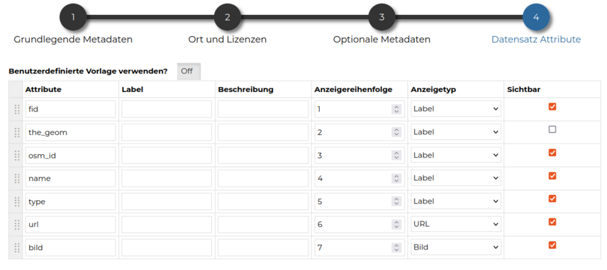

<!-- the Menu -->
<link rel="stylesheet" media="all" href="../styles.css" />

<a href="https://csgis.de">© csgis</a>

<!-- the Menu -->

# Geodaten publizieren und bearbeiten

Nach dem die daten hochgeladen sind stehen uns unter Datensatz ansehen folgende Funktionen zur Verfügung:

**Speichern:** sollen Änderungen an den Daten, Symbologie, Berechtigungen,etc. vorgenommen werden, können Sie diese hier dauerhaft speichern. Mit **“speichern als“** erzeugen Sie einen neuen Dataset.

Im Menü **bearbeiten** können wir:

**Informationen anzeigen:** lassen (allgemeine Informationen zu den Ressource). Hier haben Sie auch die Möglichkeit diesen Ressource als Favorit zu speichern, den Link zu teilen oder die Datei zum downloaden.

## Daten bearbeiten

Geometrien und Tabellen können in GeoNode bearbeitet werden. Die Optionen für die Digitalisierungen der Geometrien sind begrenzt. Wir schauen die Editierungen Optionen am besten mit einer Übung an (detaillierte Informationen finden Sie [hier](https://mapstore.readthedocs.io/en/latest/user-guide/attributes-table/)). Der erster Schritt ist die **Bearbeitungsmodus** einzuschalten.

### Übung:

**Editierungen im Dataset places**

1. Starten Sie die Edtierung. Wählen Sie Schwabing aus und zoomen Sie zu den Extent

1. Filtern Sie  Schwabing,  Schwabing-West und  Schwabing-Ost, lassen Sie nur diese Orte sichtbar auf der Karte und verändern Sie die Einwohnerzahlen (Spalte population) dieser Orten.

1. Untersuchen Sie weitere Filter Optionen wie “Interessengeiet“
1. Erzeugen Sie einen Punkt und vergeben Sie die Attribute in die Tabelle
1. Verschieben Sie einen Punkt in die Karte
1. Löschen Sie einen beliebigen Punkt

**Editierungen im Dataset natural**

1. Fügen Sie einen neuen Polygon hinzu
1. Digitalisieren Sie einen neuen benachbarten Polygon (Snap Optionen)

> Zum selektieren in die Karte nur ein Mal klicken
>
> Selektieren von mehreren Objekten können wir über Filter machen

## Stil bearbeiten

Es gibt 3 verschiedene Gruppen (Regeln) von  Stilen die man benutzen kann (sie können miteinander kombiniert werden)

Außerdem gibt es die Möglichkeit für die verschiedene Regel die Daten zu filtern (wenn man zum Beispiel nur bestimmten Daten darstellen möchten – type=forest -) oder nur innerhalb von einem bestimmten Maßstab die Daten darstellen zu lassen.

Innerhalb der **Markierung** Option haben wir 2 verschiedene Legenden zur Verfügung:

- Einfacher Stil
- Klassifizierungsstil (mit verschieden Methoden)

### Übung

**Symbologie von places**

1. Erstellen Sie diese zwei verschiedene Legende für den Ressource ***places*** und speichern Sie die Ergebnisse (mit der Änderung .sld):

  

1. Lassen Sie die ***places*** mit einer einfachen Symbol darstellen und laden Sie die gespeicherten Stile (sld Dateien) hoch (**Bearbeiten → Stil hochladen**)

## Übung

**Symbologie von railways**

1. Erstellen Sie die railways wie in der unteren Abbildung dar. Benutzen Sie den einfacher Stil und erstellen sie die entsprechenden Filter ein 				(*type=subway und type =tram*)

  

1. Speichern Sie den Stil als sld und Laden Sie diese Datei als Dokument in GeoNode hoch 	

1. Benachrichtigen Sie Ihren Kollegen dass es eine neue Legende gibt und schauen Sie Ihren Mailbox die gesendeten/empfangenen Nachrichten an.

### Übung

**Symbologie von roads**

1. Lassen Sie roads klassifiziert darstellen nur mit folgenden Kategorien der Spalte “Type“: primary, residential, secundary, tertiary. Roads soll nur ercheinen innerhalb diesen Maßtäbe 1:144448 und 1:9028

2. Wie kann man erreichen dass nur den type residential innerhalb von diesen Maßtäbe erscheint aber dass die andere Typen immer sichtbar bleiben?

  

> Die symbolregel ermöglicht die Erstellung von Legenden mit Symbolen wie 	Grafikdateien(svg, png, etc.). Man braucht die url wo die Bilder gehostet 		sind
>
>

## Metadaten bearbeiten

Die Metadaten in GeoNode haben 2 wesentlichen Zwecken:

- sie geben mehr Auskünft über die Daten
- sie vereinfachen die Suche von Resoourcen durch andere Benutzer und damit können die Daten leichter abgerufen werden.

> Ausführliche Informationen über die Bearbeitung von Metadaten finden Sie [hier](https://docs.geonode.org/en/master/usage/managing_datasets/dataset_metadata.html)

### Übung

**Metadaten von administrative**

1. • Thumbnail aktualisieren
1. • Kategorie population speichern unter die Grundlegende Metadaten
1. • Unter regions soll Germany gespeichert werden
1. • Speichern Sie die Metadaten und suchen sie auf der Startseite in GeoNode nach Daten mit zum Beispiel die Kategorie  population oder nach der Region  Germany
1. Probieren Sie die Suche nach Daten mit dem Filter Option “Ausmaß“

> Im Schritt 4 (Datensatz Attribute) lässt sich unter Anzeigetyp speichern, wie die gespeicherten Daten in einer Spalte angezeigt werden sollen. Mit Klick auf einen Objekt in die Karte erscheinen die Informationen entsprechend formatiert.
>
>
>
>

## Ressource teilen

Beim Erstellen oder Hochladen eines neuen Datensatzes müssen Sie festlegen, wer diesen Datensatz **anzeigen, herunterladen, bearbeiten** und **verwalten** kann. Standardmäßig können nur Eigentümer Datensätze bearbeiten und verwalten, jeder kann sie ansehen.

>Weitere führenden Informationen finden Sie unter [Dataset permissions](https://docs.geonode.org/en/4.x/usage/managing_datasets/dataset_permissions.html)

Sie können die folgenden Berechtigungen festlegen:

- Anzeigen (ermöglicht das Anzeigen des Datensatzes).
- Herunterladen (ermöglicht das Anzeigen und Herunterladen des Datensatzes).
- Bearbeiten (ermöglicht das Ändern der Metadaten, der Attributen und Geometrien und des Stils).
- Verwalten (ermöglicht das Bearbeiten, Löschen, Ändern der Freigabeoptionen und Publizieren eines Datensatzes). Datensätze die nicht publiziert sind können nur von Admin gesehen und bearbeitet werden.

### Übung

**Berechtigungen von places**

1. Erstellen Sie dass die places nicht heruntergeladen werden können. Melden Sie sich ab und prüfen Sie dass keine Option zum herunterladen angeboten ist.
1. Erlauben Sie dass die places von anderen Benutzer verwaltet werden können

  

## Filtern

Sie können mit dieser Option die Anzeige der Daten beeinflüßen mit folgenden Möglichkeiten:

- Attribut
- Interssengebiet

Beide Optionen können auch gleichzeitig benutzt werden:

## Herunterladen

Mit dieser Funktion können Sie die datesets herunterladen in mehreren Formaten (GeoJSON, GML, Shapefile, CSV, GeoPackage oder KML).

Sie können entscheiden ob Sie die Daten mit der ursprüngliche Projektion (prj Datei die beim Import der Daten benutzt wurde) herunterladen worden oder in WGS84 (EPSG 4326).

Außerdem können Sie definieren ob sie nur die gefilterte Daten oder die Daten des aktuellen Kartenfenster herunterladen möchten.

