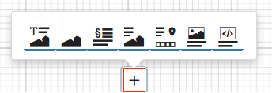
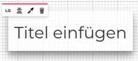
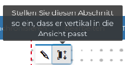
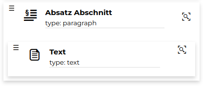
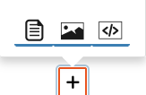
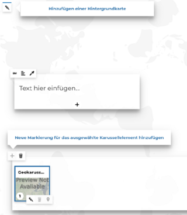

<!-- the Menu -->
<link rel="stylesheet" media="all" href="../styles.css" />

<a href="https://csgis.de">© csgis</a>

<!-- the Menu -->

# Geostories

Eine Geostory ist ein GeoNode Ressource  mit der man ein Artikel mit interaktive Inhalten (Videos, Text, Bilder, Webseiten, dynamische Karten, andere GeoNode Ressourcen, etc.) veröffentlichen kann.

Eine Geostory kann mit folgenden Elementen aufgebaut werden:

- Titelabschnitt
- Bannerbereich
- Absatzabschnitt
- Immersive Section
- Geokarussel
- Medienabschnitt
- Webseitenabschnitt

> Ein Beispiel mit allen Elementen einer Geostory finden Sie [hier](https://geonode-training.csgis.de/catalogue/#/geostory/22)
>
>Im [Handbuch von Mapstore](https://mapstore2.readthedocs.io/en/latest/user-guide/exploring-stories/) sind alle Funktionen detailliert beschrieben.

Mit der nächsten Übung bauen wir selber eine Geostory auf.

### Übung

**Erstellung einer Geostory**

1. Ressource hinzufügen → Geostory erstellen → Speichern
1. Im ersten Schritt wird uns angeboten dass wir mit einem **Titelabschnitt** anfangen. Hier finden wir 2 widgets:

  Mit einfachen Klicken bearbeiten unf formatieren Sie den Titel.

  

  Die Größe des Titelabschnittes können Sie anpassen oder einen Hintergrund hinzufügen mit Bilder, Videos oder Karten.

  

  Der erste Teil unser Geostory wäre fertig. Wir haben jetzt den Titelabschnitt mit 2 Elemente: Titel und Hintergrund (einer GeoNode Karte).

  

1. Im zweiten Schritt erweitern wir unsere Geostory mit einem **Absatzabschnitt**.

  

  Hier können wir hinzufügen:

  

  - Text
  - Medien (Bilder,
  - Videos, Karten)
  - eine Webseite

1. Lassen wir unser Geostory mit einer **immersive section** erweitern. Sie besteht aus zwei Elementen: dem Hintergrund und dem Inhalt.

  Der Unterschied mit der vorherigen Option (Absatzabschnitt) ist dass die Inhalte bleiben 	zusammen im gleichen Abschnitt

  

1. Im nächsten Schritt möchten wir uns beschäftigen mit der **Geocarousel** Option:

  

- Der Hintegrund dient für den gesamten Abschnitt.
- Der Text und das untere kleine Bild werden verknüpft mit einer bestimmten Ort in die Karte.
- Sie können damit beliebigen Anmerkungen an bestimmten Orten hinzufügen.
