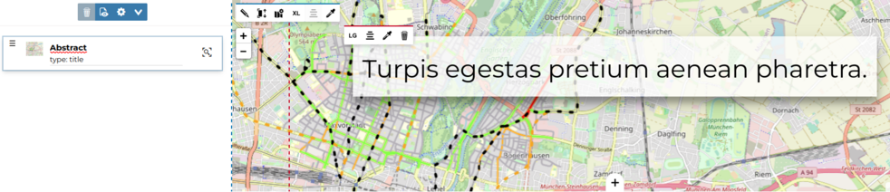
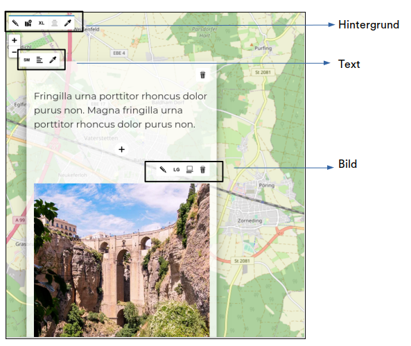

<!-- the Menu -->

<link rel="stylesheet" media="all" href="../styles.css" />

<a href="https://csgis.de">© csgis</a>

<!-- the Menu -->

# Geostories

Eine Geostory ist eine GeoNode Ressource, mit der man einen Artikel mit interaktiven Inhalten (Videos, Text, Bilder, Webseiten, dynamische Karten, andere GeoNode Ressourcen etc.) veröffentlichen kann.

Eine Geostory kann mit folgenden Elementen aufgebaut werden:

- Titelabschnitt
- Bannerbereich
- Absatzabschnitt
- Immersive Section
- Geokarussel
- Medienabschnitt
- Webseitenabschnitt

> Ein Beispiel mit allen Elementen einer Geostory finden Sie [hier](https://geonode-training.csgis.de/catalogue/#/geostory/22)
> 
> Im [Handbuch von Mapstore](https://mapstore2.readthedocs.io/en/latest/user-guide/exploring-stories/) sind alle Funktionen detailliert beschrieben.

Mit der nächsten Übung bauen wir eine Geostory auf.

### Übung

**Erstellung einer Geostory**

1. Ressource hinzufügen → Geostory erstellen → Speichern

2. Im ersten Schritt wird uns angeboten, dass wir mit einem **Titelabschnitt** anfangen. Hier finden wir 2 widgets:
   
    Mit einfachem Klick bearbeiten und formatieren Sie den Titel.
   
    
   
    Die Größe des Titelabschnittes können Sie anpassen oder einen Hintergrund hinzufügen mit Bildern, Videos oder Karten.
   
    
   
   Der erste Teil unser Geostory wäre fertig. Wir haben jetzt den Titelabschnitt mit 2 Elementen: Titel und Hintergrund (einer GeoNode Karte).
   
    

3. Im zweiten Schritt erweitern wir unsere Geostory mit einem **Absatzabschnitt**.
   
    
   
    Hier können wir hinzufügen:
   
    
   
   - Text
   - Medien (Bilder, Videos, Karten)
   - eine Webseite

4. Lassen wir unsere Geostory mit einer **immersive section** erweitern. Sie besteht aus zwei Elementen: dem Hintergrund und dem Inhalt.
   
    Der Unterschied zu der vorherigen Option (Absatzabschnitt) ist, dass die Inhalte im gleichen Abschnitt zusammen bleiben.
   
    

5. Im nächsten Schritt beschäftigen wir uns mit der**Geokarussel** Option:
   
    
- Der Hintegrund dient dem gesamten Abschnitt.
- Der Text und das untere kleine Bild werden mit einem bestimmten Ort in der Karte verknüpft.
- Sie können damit beliebige Anmerkungen zu bestimmten Orten hinzufügen.
