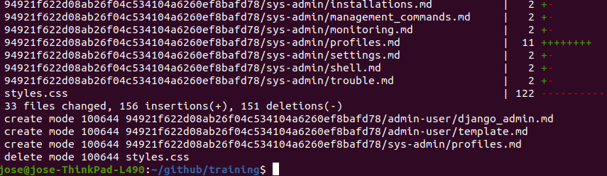

<!-- the Menu -->
<link rel="stylesheet" media="all" href="../styles.css" />

<a href="https://csgis.de">© csgis</a>

<!-- the Menu -->

# User Guide

lorem ipsum …

# Jhjh

image1 ist:

quelle

> servas

- hallo
- hallo2
  - hallo3

1. hola
1. hola 1
  1. hola 1.1

[doku](https:csgis.de)

    hier bin ich
    wo bist du

aqui estamos  
donde estas tu?

## klkl

### zuzu

Übungen
Links
