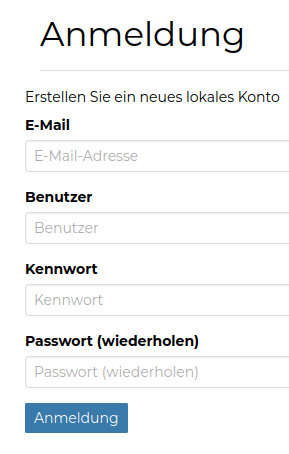
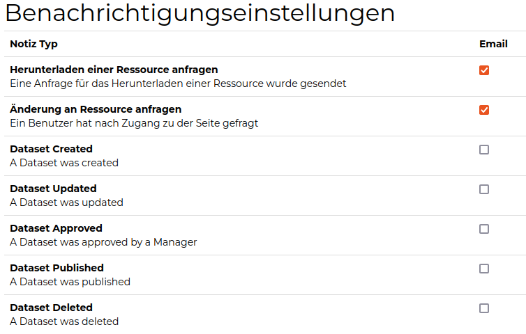
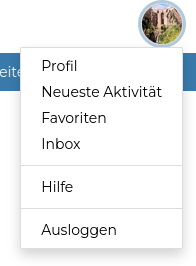
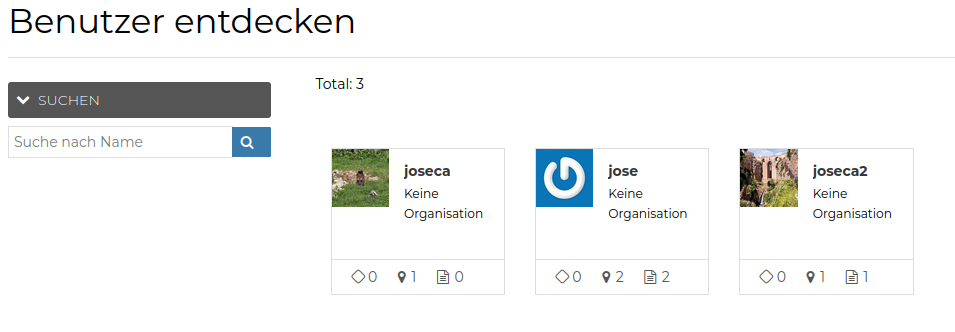

<!-- the Menu -->

<link rel="stylesheet" media="all" href="../styles.css" />

<a href="https://csgis.de">© CSGIS 2022</a>

<!-- the Menu -->

# Registrieren

Im ersten Schritt erfolgt eine Registrierung in den GeoNode Plattform. Ohne Registrierung können die Daten (Karten, Datensätze, Dokumente, etc.) visualisiert und geteilt aber nicht bearbeitet werden.
Nachdem sich einen Anwender erfolgreich registriert hat, kann sich gleich anmelden GeoNode im vollen Umfang benutzen.

> Die Option zum registrieren kann nach Bedarf ausgeblendet werden sodass einen Admin die Registrierung eigenständig durchführt.
> Standardmäßig läuft die Registrierung automatisch. Man kann aber diese Option ändern sodass einen Admin die Registrierung bestätigten muss

# User Profil

Im Profil stehen den user u.a. folgende Funktionen zur Verfügung:

- Andere Anwender kontaktieren und Nachrichten senden
- Emailadresse der Registrierung ändern
- Passwort ändern
- Benachrichtigungseinstellungen
- Andere Anwender einladen Ihrer GeoNode Plattform zu benutzen

> Es lohnt sich diese Optionen in Ruhe zum lesen und hier entscheiden mit welchen Aktionen eine Email an den Anwender gesendet werden soll (standardmäßig sind     alle Optionen ausgewählt.
> 
> Mit einer GeoNode Instance, die von vielen Anwender aktiv benutzt wird, werden Sie dann viele Emails bekommen!)

Außerdem können registrierte Benutzer:

- Die letzte Aktivitäten von allen Benutzer sehen und zugreifen (Ebenen, Karten, Dokumenten, Geostories und Dashboards)
- eine Liste mit aller Favoriten Inhalten sehen
- Mailbox abfragen
- Das Hilfe Dokument (mit verlinkten Inhalten) lesen

> *Weitere empfehlenswert GeoNode Dokumentationen sind:*
> 
> - *[GeoNode Handbuch](https://docs.geonode.org/en/master/usage/index.html)*
> - *[Mapstore Handbuch](https://mapstore.readthedocs.io/en/latest/user-guide/home-page/)*  
> 
> *Auf der Startseite, im Menü Über  kann man visualisieren, filtern und sehen welche User im GeoNode registriert sind und welche Daten haben sie   veröffentlicht*

## Übung

1. Finden Sie die Email die mit Ihrer Account verknüpft ist
2. Erstellen Sie die gewünschten Aktionen unter Benachrichtigungen
