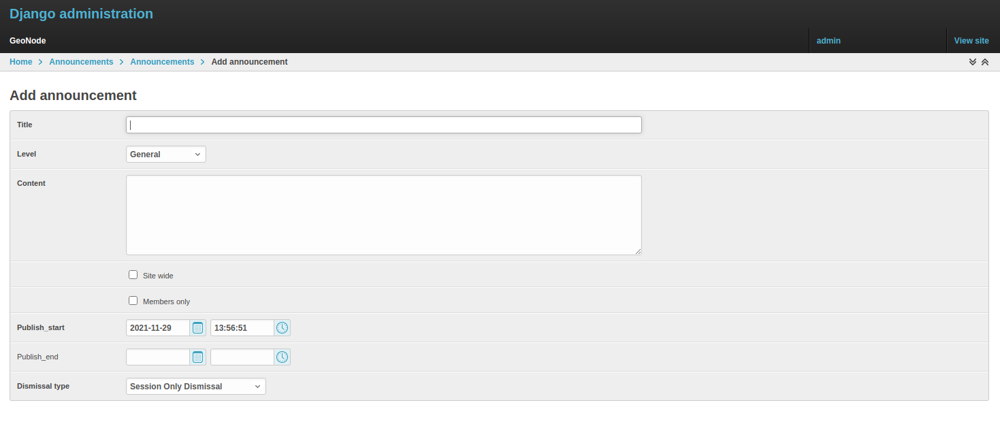

<!-- the Menu -->
<link rel="stylesheet" media="all" href="../styles.css" />

<a href="https://csgis.de">© CSGIS 2022</a>

<!-- the Menu -->

# Ankündigungen (announcements)

Als Administrator müssen Sie von Zeit zu Zeit Ankündigungen an User veröffentlichen.

GeoNode "announcements" ermöglichen genau das; ein Administrator hat die Möglichkeit:

- drei Arten von Nachrichten entsprechend ihrem Schweregrad zu erstellen
- ihre Gültigkeit in Bezug auf den Zeitraum zu bestimmen (Start- und Ablaufdatum der Ankündigung)
- wer sie sehen kann oder nicht (jeder oder nur die registrierten Mitglieder) 
- wann Benutzer die Nachricht ausblenden können

Es gibt drei Arten von Bekanntmachungen, die nach ihrem Schweregrad unterschieden werden: **Allgemein**, **Warnung** und **Kritisch**. Der Unterschied liegt in der Farbe der Ankündigungsbox.

Nur Administratoren und Mitarbeiter können Ankündigungen erstellen und verwalten.

Derzeit gibt es zwei Möglichkeiten, auf die Liste der Ankündigungen zuzugreifen und sie zu verwalten:

## Über die GeoNode-GUI, aus dem Profil-Panel

## Über den Django Admin

Die Funktionalitäten sind für beide Oberflächen fast gleich, außer dass es über das Admin-Panel möglich ist, auch die "Ablehnungen" (dismissal) zu verwalten.

"Ablehnungen" sind Aufzeichnungen von Mitgliedern, die die Ankündigung gelesen und das Nachrichtenfeld geschlossen haben. Eine Ankündigung kann eine der drei folgenden "Ablehnungensgründen" haben:

- Keine Ablehnungen erlaubt: 
  - Das Mitteilungsfeld der Ankündigung kann nicht geschlossen werden.

- "Session Only Dismissal (*)_,
  - die Standardeinstellung, ermöglicht es, die Nachrichtenbox der Ankündigung für die aktuelle Browser-Sitzung zu schließen. Sie wird beim nächsten Zugriff wieder angezeigt.

- Dauerhafte Ablehnungen erlaubt:   
  - die Nachrichtenbox erscheint für das aktuelle Mitglied nicht mehr, sobald sie geschlossen wurde.

## Announcement im Frontend über Profil anlegen

Klicken Sie im Profilbereich auf den Link Ankündigungen

Klicken Sie entweder auf "Neue Ankündigung", um eine neue Bekanntmachung zu erstellen, oder auf den Titel einer bestehenden Ankündigung, um deren Inhalt zu verwalten.

Füllen Sie hierauf alle Felder des Formulars aus.

## Ankündigung über den Django Admin

Das Verwalten von Ankündigungen über das Admin-Panel ist im Grunde dasselbe; die Felder für das Formular sind identisch.

Der Zugriff auf die Ankündigungsoptionen über das Admin-Panel ermöglicht Ihnen auch die Verwaltung von "Ablehnungen". Über diese Oberfläche können Sie selektiv entscheiden, welche Mitglieder eine bestimmte Ablehnung sehen können und welche nicht, oder Sie können sie zwingen, die Nachrichten erneut zu sehen, indem Sie die Ablehnungen entsprechend löschen.

