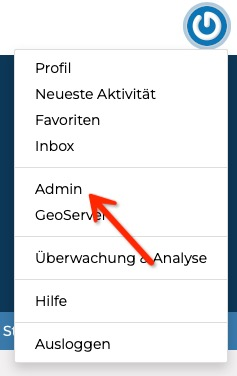

<!-- the Menu -->
<link rel="stylesheet" media="all" href="../styles.css" />

<a href="https://csgis.de">© CSGIS 2022</a>

<!-- the Menu -->

# Django Admin

Das GeoNode System basiert auf einem Python Web-Framework namens [Django](https://www.djangoproject.com/).

Neben Hilfestellungen in vielerlei Bereichen, stellt es eine automatisierte Administrations-Oberfläche zur Verfügung.  
Die Oberfläche generiert sich hierbei aus den Datenbankdefinitionen der einzelnen “Apps”.

> Im Django Kontext sind Apps, in Module aufgeteilte Abschnitte einer Website wie Shop, Benutzerverwalten etc. GeoNode besitzt zahlreiche GIS spezifische "Apps". Wie Datasets, Maps, etc.

Um auf die Administrations-Oberfläche zugreifen zu können, muss ein User Mitarbeiter, oder Administrator Status besitzen.

Die Administrations-Oberfläche erreichen Sie nach dem Login über das Menü, welches die eingestellte Sprache berücksichtigt.

Die hierauf folgende Übersicht listet alle "Django Apps", die GeoNode besitzt.

