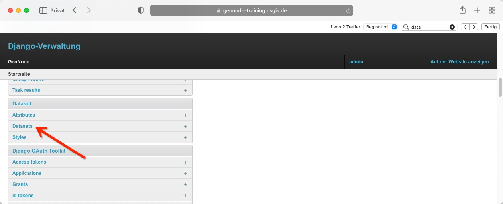
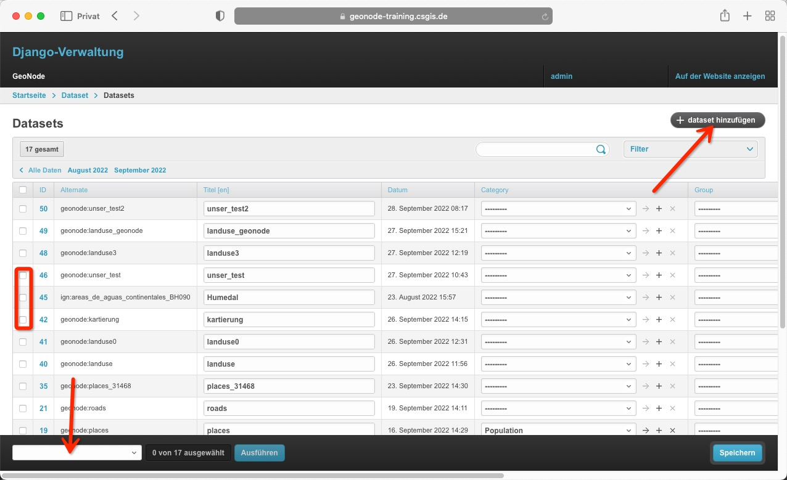
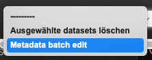
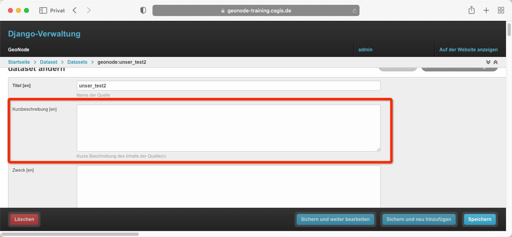
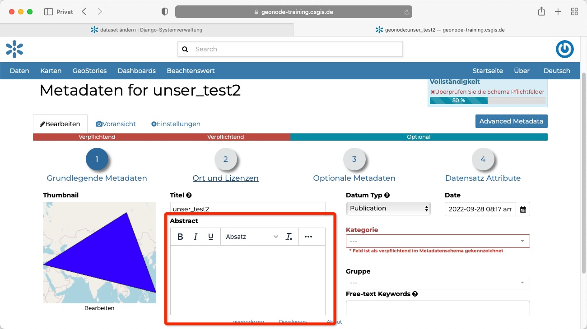
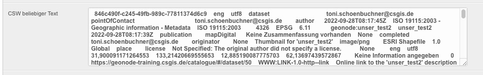

<!-- the Menu -->
<link rel="stylesheet" media="all" href="../styles.css" />

<a href="https://csgis.de">© CSGIS 2022</a>

<!-- the Menu -->

# Dataset verwalten

Im letzten Kapitel haben wir uns die Administration von Benutzer und Gruppen näher angesehen.
Gehen wir einen Schritt weiter und werfen einen Blick auf die _Dataset_ Verwaltung.

> Datasets hießen vor der GeoNode Version 3.3 Layer

## Stapelverarbeitung

Die Tabelle der bestehenden Datasets gibt uns einen kurzen Überblick über die wichtigsten Informationen.  
Zum Beispiel wann der Datensatz erzeugt wurde, den Titel, oder die ID. 

Die Option "dataset hinzufügen" sollte nicht verwendet werden. Neue Ebenen sollen über das Frontend hinzugefügt werden.

Interessant ist jedoch die Möglichkeit, mehrere Datasets auszuwählen und in Stapelverarbeitung Rechte zuzuweisen. Hierzu kann das untere Menü der Fußleiste verwendet werden.

## Detailansicht

In der Detailansicht eines Datensatzes sehen wir dass zahlreiche Felder wie die Kurzbeschreibung einfach editiert werden können.

Dies entspricht der Möglichkeit aus dem Frontend, die Metadaten des Datensatzes anzupassen.

Andere Felder ergeben sich rein aus der Tatsache, dass der Django Admin "einen Spiegel" des Datenbanksatzes darstellt. Hierdurch zeigen sich zahlreiche Felder, die von Administratoren (ohne tiefes Hintergrundwissen) nicht editiert werden sollten.
Als Beispiel das CSW Feld:

