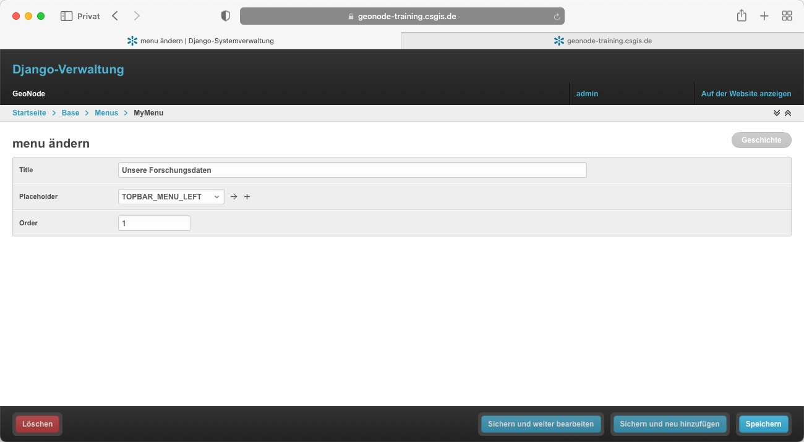
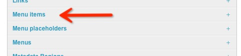
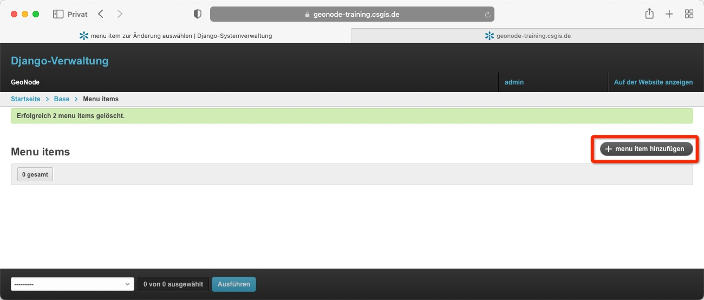
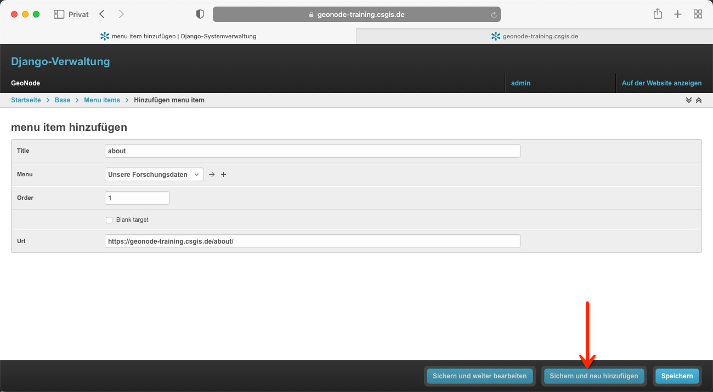
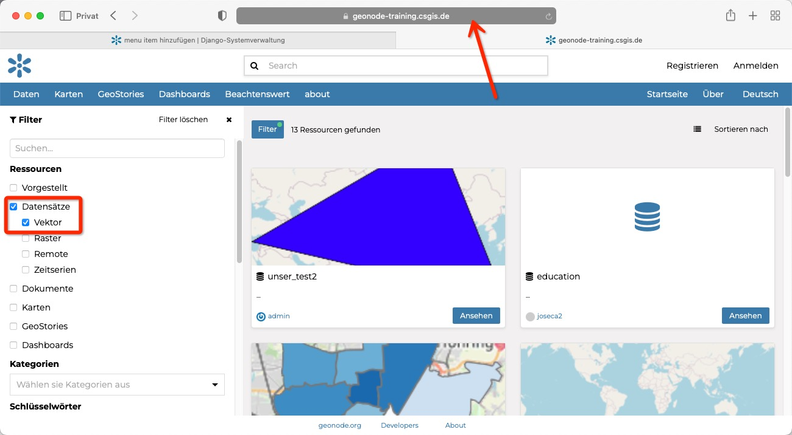
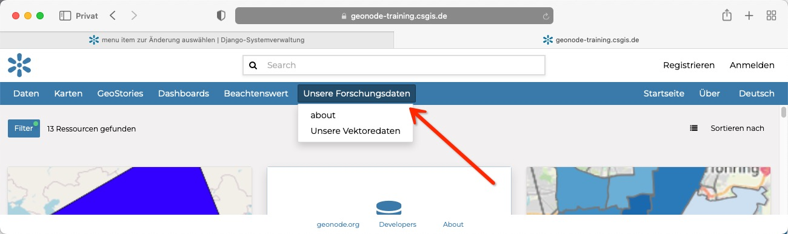
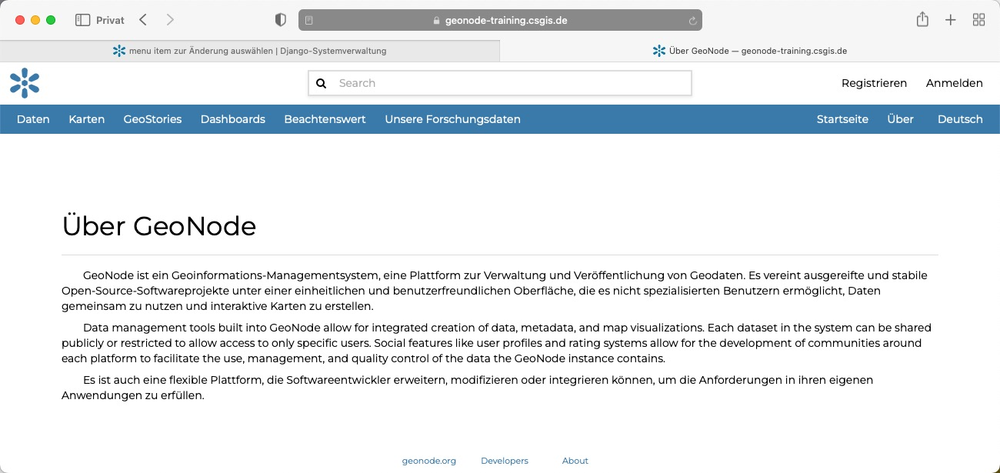
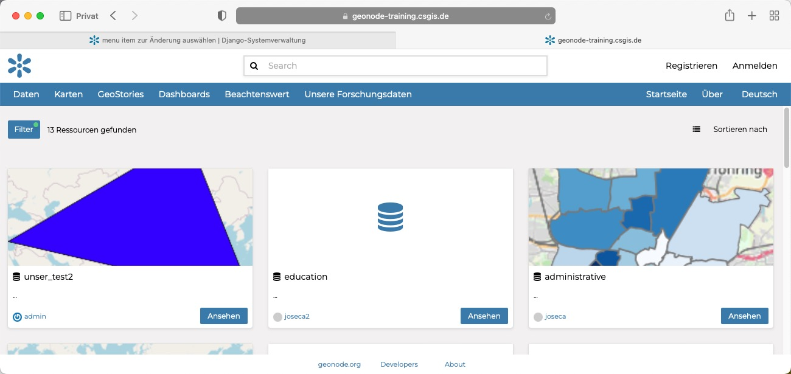

<!-- the Menu -->
<link rel="stylesheet" media="all" href="../styles.css" />

<a href="https://csgis.de">© CSGIS 2022</a>

<!-- the Menu -->

# Eigene Menüpunkte erstellen

GeoNode bietet einige integrierte Funktionen, mit denen Sie das Menü in der oberen Leiste schnell und einfach anpassen können (siehe das Beispiel unten).

##  Neues Menü anlegen

Die relevanten Punkte finden wir im Django Admin unter "Menu Items", "Menu placeholders", "Menus".

Wir öffnen Menus und klicken in der darauf folgenden Maske auf "menu hinzufügen".
In der darauffolgenden Maske vergeben wir einen Titel für das Menü (wird nur intern verwendet).
Die Position (Feld Placehoder), sowie die Reihenfolge, falls mehrere Menus unter dem Placeholder erscheinen sollen.

Und speichern das Menü ab.

> Placeholder bezeichnet einen Ort im Template, an dem das Menü ausgegeben wird. Standardmäßig besitzt GeoNode 4 vordefinierte Positionen. Über das Template Tag `render_nav_menu 'CUSTOM_MENU'` könnten wir einen neuen Platzhalter an anderer Stelle definieren.

## Neuen Menüpunkt anlegen

Nachdem wir ein neues Menü definiert haben, legen wir in diesem Schritt zwei neue Menüpunkte an:

- über diese Plattform
- Alle Vectordaten

In der Django Übersicht wählen wir nun den Menüpunkt "Menu Items"

### Erster Menüpunkt

Und legen uns in der darauffolgenden Maske über den bekannten rechten Button "menu item hinzufügen" ein neues Menu Item an:

Die sich hierauf öffnende Maske bietet die Formularfelder:

- Title
  - Der Titel des Menüpunktes
- Menu
  - Das Menu indem der Butteon erscheinen sollen (wir haben vorhin eie Menü mit dem Namen "Unsere Forschungsdaten erstellt")
- Order
  - Die Reihenfolgen falls mehrere Menüpunkte erscheinen
- Blank Target
  - Der Link öffnet in einem neuen Browser-Tab
- Url
  - die URL auf die der Link verweisen soll

Für unseren ersten Menüpunkt füllen wir die Felder wie folgt

---|---
Feld|Wert
---|---
Title | about
Menu | Unsere Forschungsdaten
Order| 1
Blank Target |  nicht gesetzt
Url | https://geonode-training.csgis.de/about/

Hiernach klicken wir auf "Sicher und neu hinzufügen".

### Zweiter Menüpunkt

Für unseren nächsten Datensatz öffnen wir ein neues Browserfenster. Navigieren zu den Datensätzen und setzen den Haken bei Vektor und kopieren uns die URL aus der Adresszeile:

Zurück in der Maskedes neuen Menüpunkts füllen wir die Werte wie folgt:

---|---
Feld|Wert
---|---
Title | Unsere Vektoredaten
Menu | Unsere Forschungsdaten
Order| 2
Blank Target | nicht gesetzt
Url | https://geonode-training.csgis.de/catalogue/#/search/?f=dataset&f=store-vector

Wir speichern und schließen den Menpunkt über speichern und betrachten das Ergebnis im Frontend.

### Darstellung des Menüs

Unser neues Menü zeigt sich in der oberen Navigationsleiste der Seite.

Ein Klick auf About bringt die User zur About Seite:

> Wie Sie diese Seite überschreiben, sehen Sie im nächsten Abschnitt "Einführung in die Entwicklung".

Ein Klick auf "Unsere Vektordaten" zeigt eine vorab gefiltere Liste an Vektor Datensätzen.

> Mit dieser Technik ließen sich natürlich auch Links speziell einer Gruppe oder in einer Region denken.

## Weiterführende Links

- [GeoNode Docs: Menus, Items und Placeholder](https://docs.geonode.org/en/master/admin/admin_panel/index.html#menus-items-and-placeholders)