<!-- the Menu -->
<link rel="stylesheet" media="all" href="../styles.css" />

<a href="https://csgis.de">© CSGIS 2022</a>

<!-- the Menu -->

# Benutzer verwalten

Betrachten wir zunächst einen sehr einfachen, jedoch wesentlichen Abschnitt des Django Admins. Die Benutzerverwaltung.

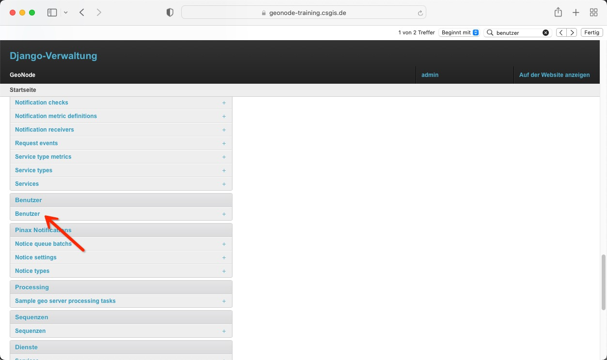

In der hierauf öffnenden Übersicht zeigen sich alle im System vorhandenen Benutzer. Die Tabelle zeigt hierbei ID, Name, E-Mail Adresse, Status und Aktiv des Benutzers.

## aufllisten

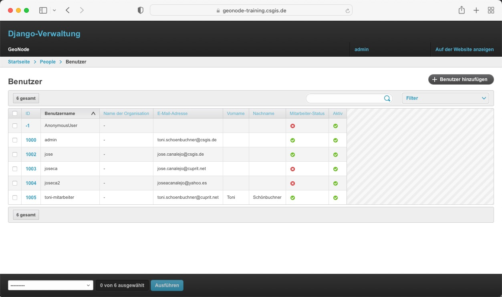

> Achten Sie darauf, dass alle Nutzer eine E-Mail-Adresse hinterlegt haben!

Über die Checkbox und das Menü am Seitenfuß können Sie User löschen. Sowie über den Button in der rechten oberen Ecke neue User anlegen.

## löschen
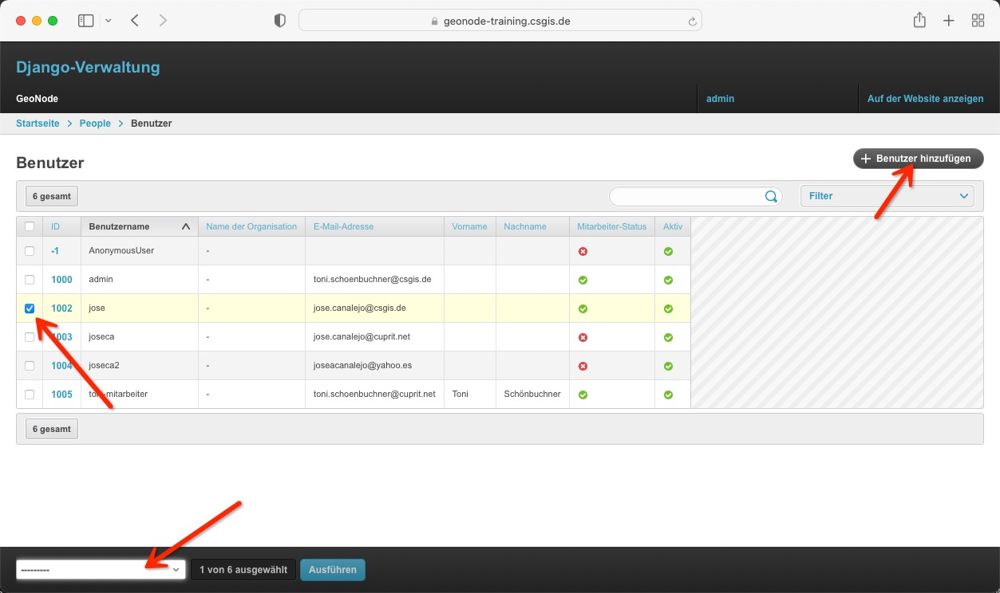

Durch Klick auf die ID gelangen Sie zur Detailseite des jeweiligen Benutzers, um diesen zu editieren.

## editieren
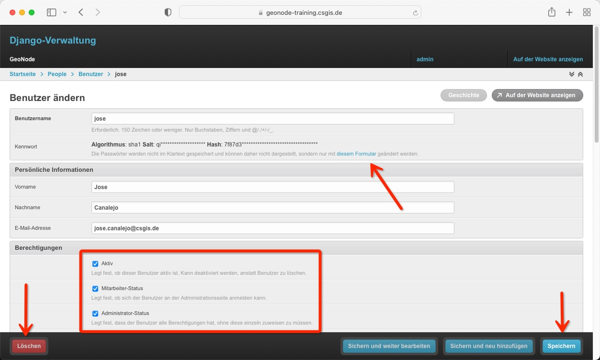

Wie auch in der Übersicht können Sie den User löschen oder Änderungen speichern (Seitenfuß). Das Passwort ändern, oder die Berechtigungen ändern:

- Aktiv
  - Legt fest, ob dieser Benutzer aktiv ist. Kann deaktiviert werden, anstatt Benutzer zu löschen.
- Mitarbeiter Status
  - Legt fest, ob sich der Benutzer an der Administrationsseite anmelden kann.
- Administrator Status
  - Legt fest, dass der Benutzer alle Berechtigungen hat, ohne diese einzeln zuweisen zu müssen.

##  Rechte zuweisen

Wie wir gesehen haben, dürfen Administratoren alle Django Admin Bereiche aufrufen und ausführen.  

Benutzer mit Mitarbeiter-Status können sich zwar in die Django Oberfläche einloggen, besitzen aber so gut wie keine Möglichkeiten administrative Aufgaben zu übernehmen.

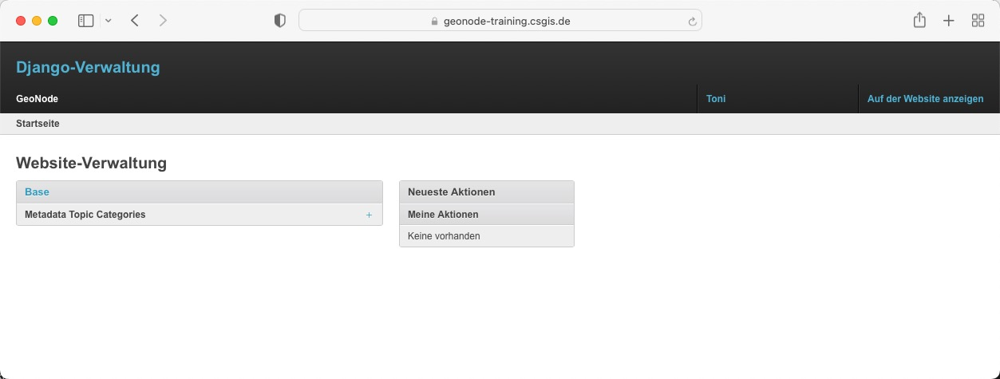

### Gruppe anlegen

Um Mitarbeiter mit weiteren Rechten auszustatten, ist es nötig 

- eine Gruppe für die Mitarbeiter zu erstellen
- der Gruppe die jeweiligen Rechte zu geben
- die Mitarbeiter der Gruppe hinzuzufügen

### Gruppe / Rechte erstellen

*Als Administrator* legen wir im Django Admin eine neue Gruppe mit frei wählbarem Namen an. Wir verwenden hier "Editoren".

In der Übersicht klicken wir auf Gruppen:

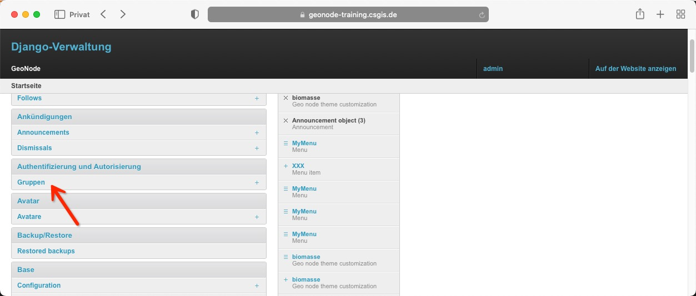

Und drücken in der hierauf folgenden Ansicht den Button, um eine neue Gruppe zu generieren.

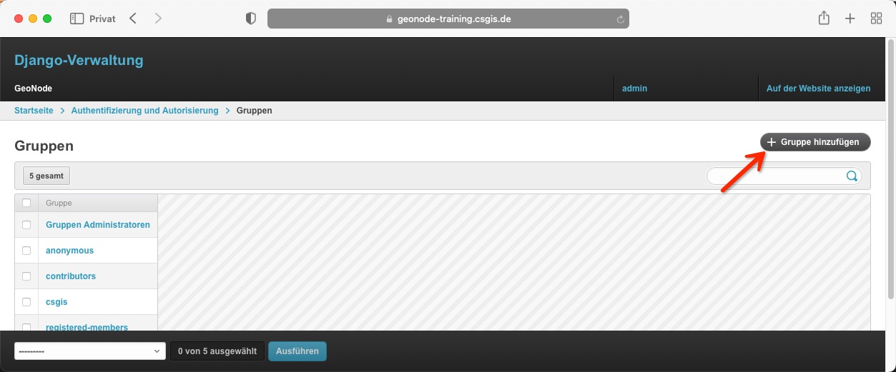.

In der folgenden Übersicht vergeben wir den Namen "Editoren", weisen aus der Liste die benötigten Rechte zu und speichern die neue Gruppe abschließend ab.

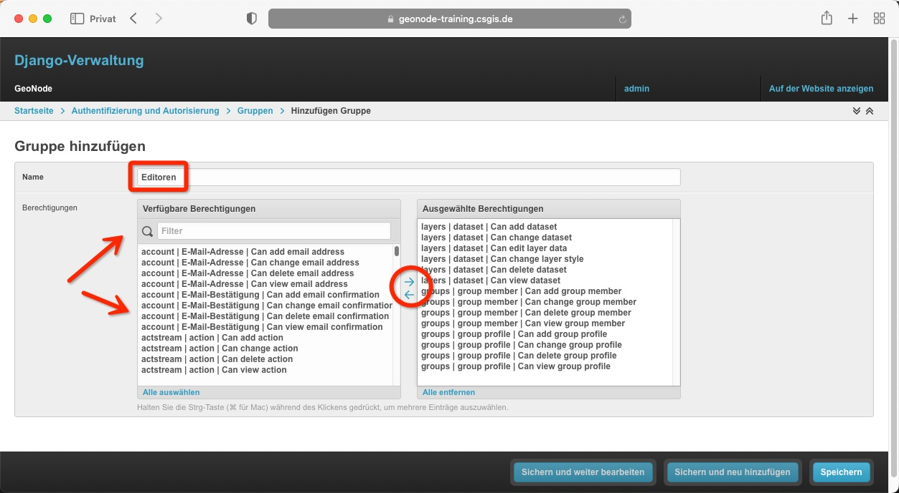

### Mitarbeiter hinzufügen

In der Übersicht gehen wir hierauf auf Benutzer,

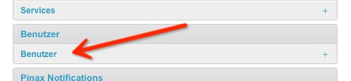

Und weisen dem jeweiligen Mitarbeiter unsere neue Editoren-Rolle zu.

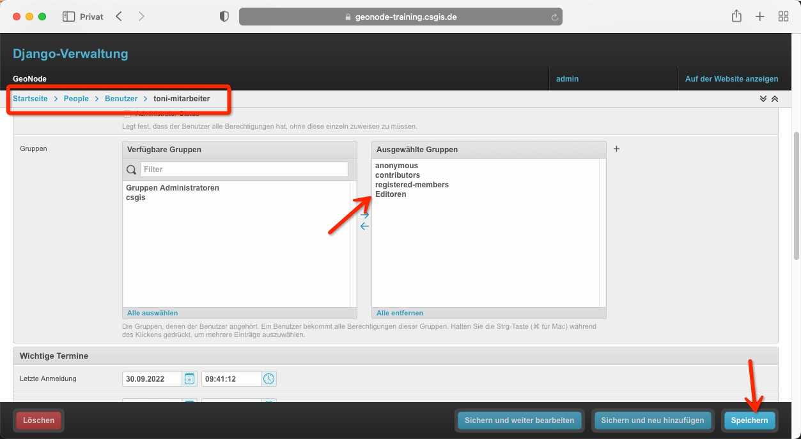

Loggt sich der Mitarbeiter nun mit seinem Account ein, besitzt er über erweiterte Berechtigungen, um Datensätze zu verwalten oder im Frontend neue User-Gruppen anzulegen.

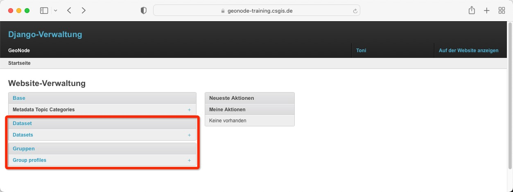

> Wir würden erwarten, dass der User im Frontend ebenfalls das Menü zum Anlegen neuer Gruppen erhält. 

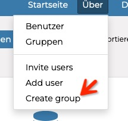

> Dem ist leider nicht so, hierbei handelt es sich um einen Bug über GeoNode4. Die neue Gruppe kann jedoch trotzdem bei direkt Aufruf des links https://geonode-training.csgis.de/groups/create/ oder über die Django Administrationsoberfläche erzeugt werden.

