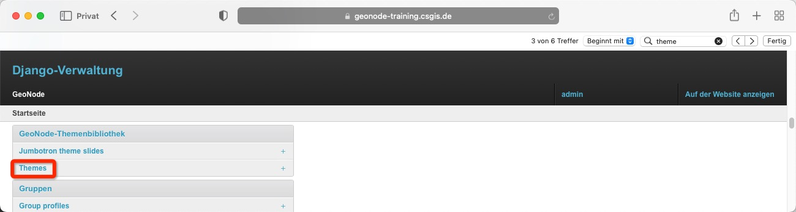
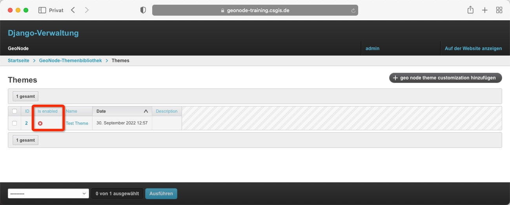
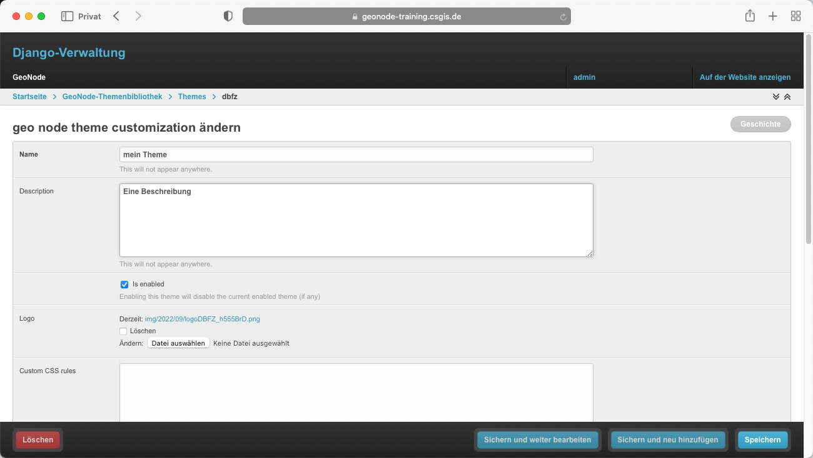
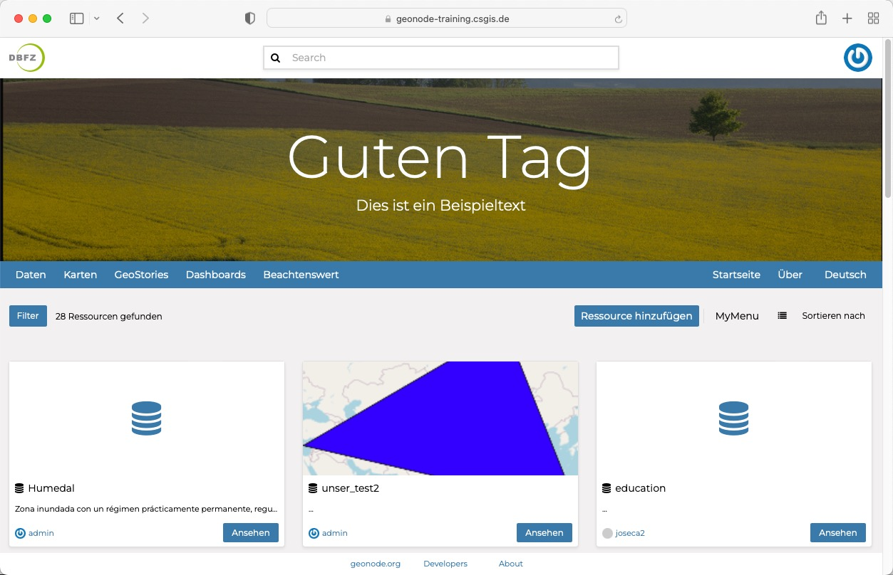

<!-- the Menu -->
<link rel="stylesheet" media="all" href="../styles.css" />

<a href="https://csgis.de">© CSGIS 2022</a>

<!-- the Menu -->

# GeoNode Theming

GeoNode bietet standardmäßig einige _Theming-Optionen_, die direkt über die Administrationsoberfläche verwaltet werden können. In den meisten Fällen können Sie mit diesen Optionen das Aussehen von GeoNode ganz einfach ändern, ohne eine einzige Zeile HTML oder CSS zu verändern.

Im Django Admin öffnen wir die Theme-Administration über den Link Themes:

Die hierauf folgende Ansicht listet alle vorhandenen Themes. Achten Sie auf den Status "is enabled". Trägt ein Datensatz "is enabled" (grüner Haken) wird das Thema verwendet.

Über die bekannte Schaltfläche im rechten oberen Eck "geonode theme customisation hinzufügen" legen wir ein neues Thema an.

Die Oberfläche gibt uns folgende Möglichkeiten:

- Name
  - Der Name des Themas (Erscheint nirgendwo)
- Description
  - Eine Beschreibung (Erscheint nirgendwo)
-  Is enabled
   -  Setzt das Thema aktiv
- Logo
  - Einbinden eines eigenen Logos
- Custom CSS rules
  - Erlaubt das hinzufügen eigener CSS Regeln zum Styling
- Jumbotron Background
  - Erlaubt das hinzufügen einer Grafik im großen Banner Bereich
- Hide Text in jumbotron
  - Angehakt wird der Text im Banner der Startseite unterdrückt
-  Welcome theme
   -  Slideshow oder Jumbotron background
-  Jumbotron Slideshow
   -  Falls Slideshow gewählt ist, Slides Auswahl
- Jumbotron Title
  - Der Titel im Banner der Startseite
- Jumbotron content
  - Der im Banner angezeigte Text

> Tipp: Verwenden Sie den [Theme-Generator](https://geonode.org/geonode-mapstore-client/docs/customizations/theme.html), um die "Custom CSS rules" zu erzeugen und hierdurch die komplette Farbgebung zu beeinflussen. 

zeigt sich auf der Startseite

## Weiterführende Links

- [GeoNode Docs Theming](https://docs.geonode.org/en/master/admin/admin_panel/index.html#simple-theming)