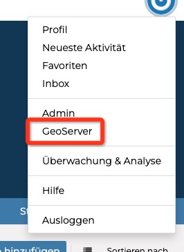
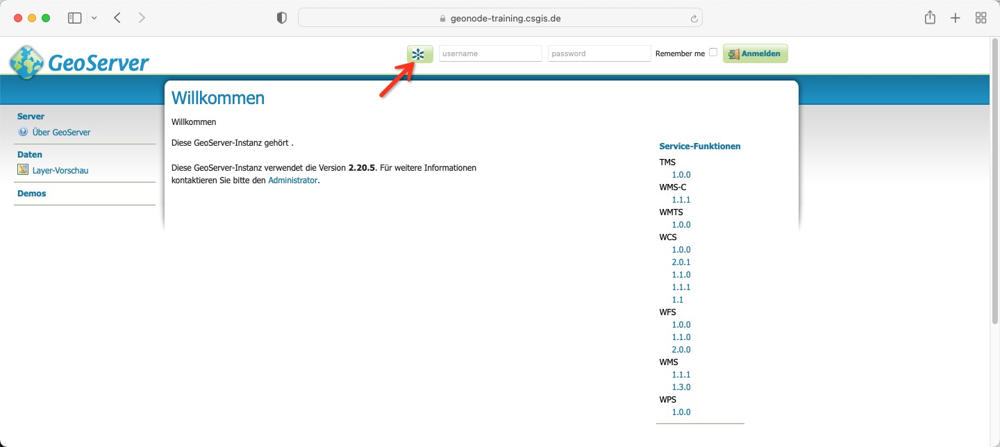
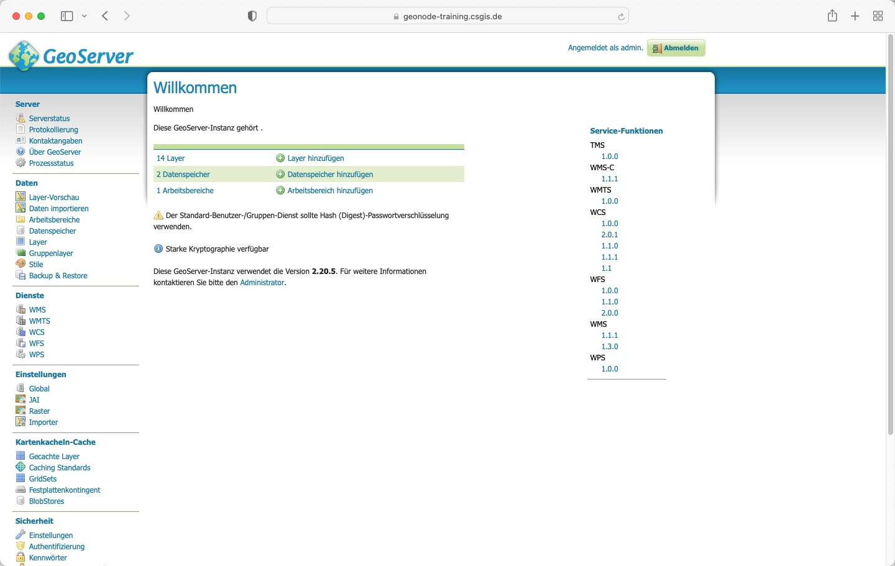

<!-- the Menu -->
    <link rel="stylesheet" media="all" href="../styles.css" />
    
<a href="https://csgis.de">© CSGIS 2022</a>

    

    

    
    
<!-- the Menu -->

# GeoServer Admin Oberfläche

Neben der "Django Admin Oberfläche" gibt es noch eine zweite wesentliche Oberfläche für Administratoren.
Wie wir später noch genauer sehen werden, agiert hinter "Django" der OpenSource-Kartenserver "GeoServer". 
Dieser ist für die Bereitstellung der Geo-Daten zuständig.

Wir erreichen die Oberfläche über den Link im oberen rechten Menü.

Über das kleie GeoNode Symbol

können wir uns in die Administrationsoberfläche einloggen.

