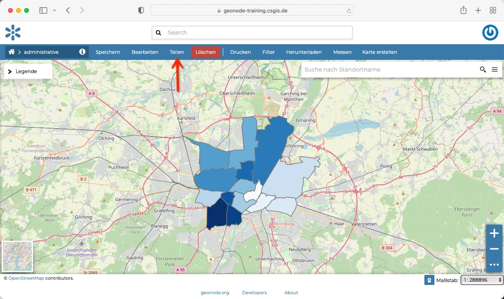
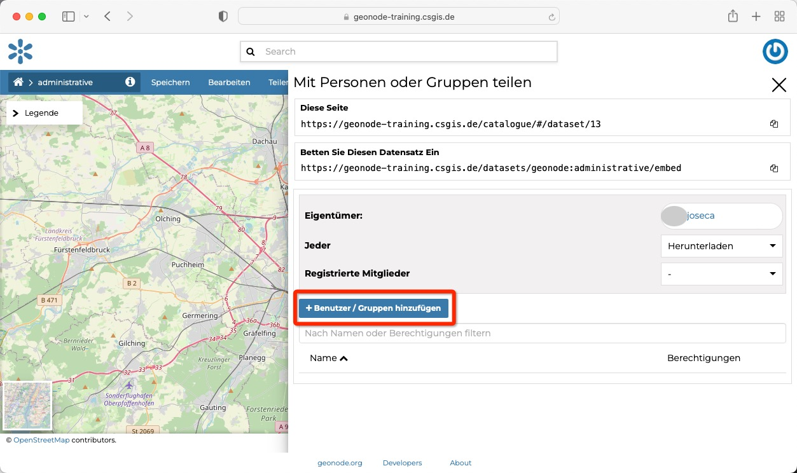
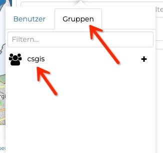
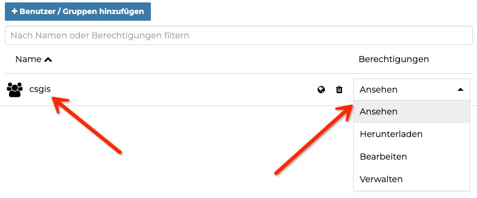

<!-- the Menu -->
<link rel="stylesheet" media="all" href="../styles.css" />

<a href="https://csgis.de">© CSGIS 2022</a>

<!-- the Menu -->

# Gruppenrechte

> Um Ihren Datensätze-Gruppenberechtigungen zuzuweisen, müssen Sie kein Administrator sein. Jedoch, wie im vorherigen Kapitel gezeigt, um Gruppen zu erstellen.

## Rechte zuweisen 

Ihren Datensätzen und Karten können über das Menü teilen, Gruppen-Rechte hinzugefügt werden.

Im bekannten Panel zur Rechtevergabe wählen Sie die jeweiligen Gruppen:

Und vergeben hiernach die gewünschte Sichtbarkeit:

## Übungen

1. Vergeben Sie bei Ihrem Datensatz Gruppenrechte für eine beliebige Gruppe.

## Weiterführende Links

1. [GeoNode Docs, Share Option](https://docs.geonode.org/en/master/usage/managing_datasets/dataset_permissions.html?highlight=share)