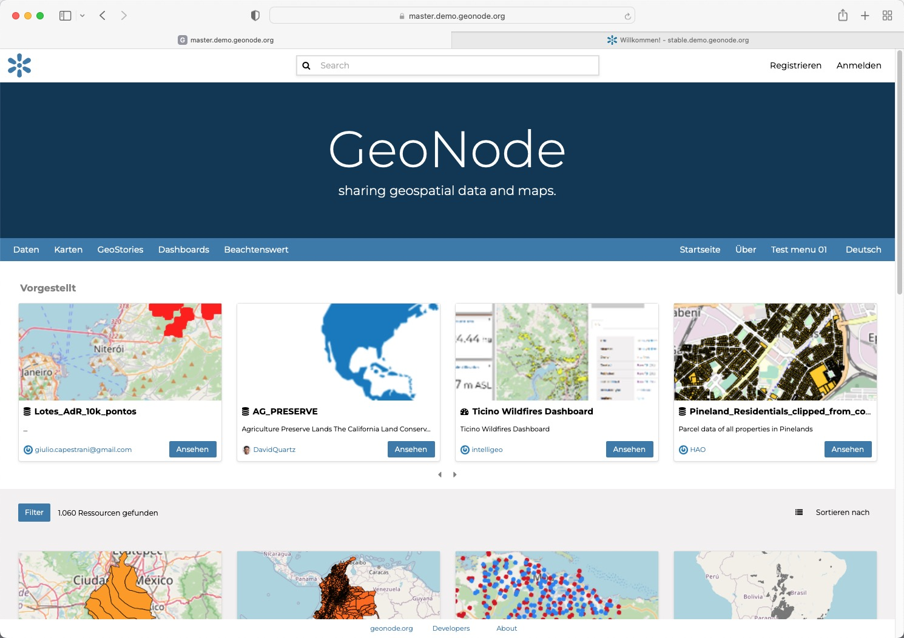

<!-- the Menu -->
<link rel="stylesheet" media="all" href="../styles.css" />

<a href="https://csgis.de">© CSGIS 2022</a>

<!-- the Menu -->

# Geändertes Frontend in GeoNode Version 4

In den vorausgehenden Kapiteln haben wir gesehen wie wir Templates überschreiben können.
Vergleichen wir jedoch die Oberfläche der GeoNode Version 3.3 mit der Oberfläche der Version 4, stechen große Untschiede ins Auge.

Der Vergleich zeigt dass die Oberfläche für die Version 4 weitreichende Änderungen erfahren hat.

### Django Templates durch React ersetzt

Da bereits die Kartenkomponente von GeoNode3 dauf dem [React](https://reactjs.org/) basierte Framework [Mapstore2](https://mapstore2.readthedocs.io/en/latest/),
basiert wurde entschieden weitere Kompponenten (wie die Startseite) ebenfalls hierüber abwicklen zu lassen.

> React ist eine JavaScript-Programmbibliothek[3] zur Erstellung von webbasierten Benutzeroberflächen.

Das bedeutet leider dass nicht mehr alle Templates, die vormals durch Django ausgegeben wurden, wie gezeigt überschrieben werden können.
Für diese Seitenbereiche ist es unter Umständen erforderlich die Mapstore2 Komponente zu "forken" und einen eigenen Build zu erstellen.

Aufgrund der Komplexität der Komponente ist die Entwicklung hier nur _sehr_ erfahrenen Javascript Entwicklern anzuraten.

## Weiterführende Links

- [Github GeoNode Mapstore Client Readme](https://github.com/GeoNode/geonode-mapstore-client)
- [Video Tutorial Developing with Mapstore](https://www.youtube.com/watch?v=ybuivDWypdQ)

