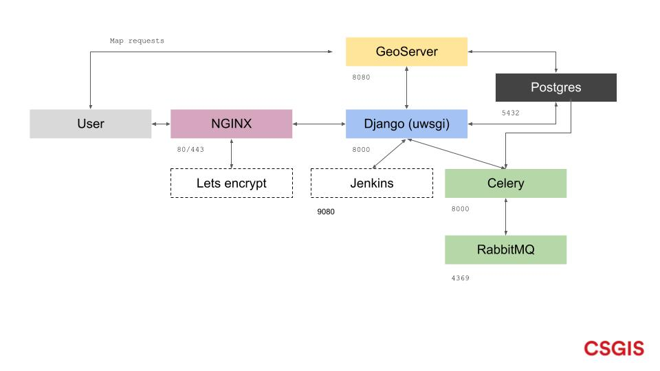

<!-- the Menu -->
<link rel="stylesheet" media="all" href="../styles.css" />
<div id="logo"><a href="https://csgis.de">© CSGIS 2022</a></div>
<div id="menu"></div>
<div id="jumpMenu"></div>
<script src="../menu.js"></script>
<script src="../jumpmenu.js"></script>
<!-- the Menu -->


# Die Komopnenten im Zusammenspiel.

Das was wir als GeoNode beschreiben ist eigentlich ein Zusammenspiel aus unterschiedlichen Open-Source Komponenten.

Die Aufgaben sind wie folgt:

- NGINX
  - Frontend Server, nimmt Anfragen entgegen und leitet dieses weiter (Proxy)
- Lets Encrypt
  - Stellt https Zertifikate bereit
- Django
  - Das Python Framework, dass sich größtenteils um die "Business Logik" des Systems kümmert. Also zum Beispiel die Datenhaltung, die API oder die URL Definitionen regelt.
- Jenkins
  - Erlaubt die Automatisierung von diversen Abläufen. Im Kontext von GeoNode wird, ist optional für die Erstellung von Backups verwendet
-  GeoServer
   -  Ein auf den OGC Standards basierter Kartenserver. Dieser verarbeitet/liefert letztendlich die Geo-Daten aus.
-  Celery
   -  Eine python Komponente um Abläufe im Hintergrund (asynchron) auszuführen. Wird zum Beispiel für das Erstellen von Thumbnails verwendet, um so die User Oberfläche nicht zu blockieren.
-  RabbitMQ
   - Speichert die Aufgaben (Tasks) für Celery
- Postgres
  - Ein relationaler Datenbank Server der über die POSTGIS Extension leistungsstarke GIS Funktionalitäten bereitstellt.




Betrachten wir die laufenden Container einer Docker Umgebung, zeigen sich exakt diese Dienste als Container abstrahiert:

> Docker ist eine Software zur Isolierung von Anwendungen mithilfe von Containervirtualisierung.

```
toni@localhost:~/geonode_training$ docker-compose ps
            Name                          Command                  State                                             Ports                                       
-----------------------------------------------------------------------------------------------------------------------------------------------------------------
celery4geonode_training        /usr/src/geonode_training/ ...   Up             8000/tcp                                                                          
db4geonode_training            docker-entrypoint.sh postg ...   Up (healthy)   127.0.0.1:5432->5432/tcp                                                          
django4geonode_training        /usr/src/geonode_training/ ...   Up (healthy)   8000/tcp                                                                          
geoserver4geonode_training     /usr/local/tomcat/tmp/entr ...   Up (healthy)   0.0.0.0:8080->8080/tcp                                                            
gsconf4geonode_training        sleep infinity                   Up (healthy)                                                                                     
jenkins4geonode_training       /sbin/tini -- /usr/local/b ...   Up             0.0.0.0:50000->50000/tcp, 8080/tcp, 0.0.0.0:9080->9080/tcp, 0.0.0.0:9443->9443/tcp
letsencrypt4geonode_training   ./docker-entrypoint.sh /bi ...   Up                                                                                               
nginx4geonode_training         /docker-entrypoint.sh ngin ...   Up             0.0.0.0:443->443/tcp, 0.0.0.0:80->80/tcp                                          
rabbitmq4geonode_training      docker-entrypoint.sh rabbi ...   Up             25672/tcp, 4369/tcp, 5671/tcp, 5672/tcp     
```