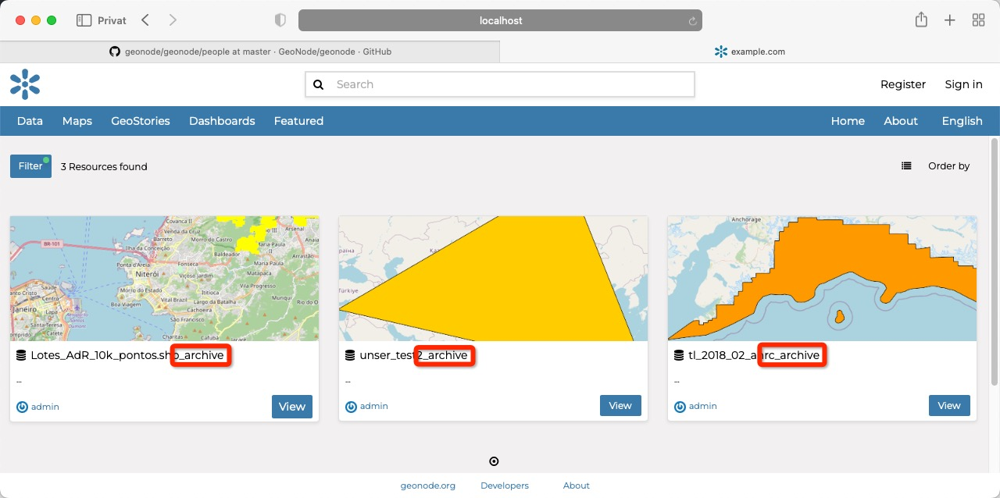

<!-- the Menu -->
<link rel="stylesheet" media="all" href="../styles.css" />
<div id="logo"><a href="https://csgis.de">© CSGIS 2022</a></div>
<div id="menu"></div>
<div id="jumpMenu"></div>
<script src="../menu.js"></script>
<script src="../jumpmenu.js"></script>
<!-- the Menu -->


# Die Django shell

Neben den Managementkommandos des vorherigen Kapitels besitzen Administratoren mit Shell Zugang ein weiteres mächtiges Werkzeug. 
Die "Django Shell".

Wir starten Sie mit

```python
python ./manage.py shell
```

In dieser Python Sitzung haben wir Zugriff auf die GeoNode Datenbank und Ihre Datensätze.

## Beispiel: Ändern aller Titel bestehender Datensätze

```python
In [1]: from geonode.base.models import ResourceBase
In [2]: all_datasets = ResourceBase.objects.all()
In [3]: for dataset in all_datasets:
   ...:     dataset.title += '_archive'
   ...:     dataset.save()
   ...: 
```

Betrachten wir hiernach alle Titel, sehen wir, dass die Datensätze bearbeitet wurden.




# Weiterführende Links

- [Django Dokumentation - manage.py](https://docs.djangoproject.com/en/4.0/ref/django-admin/)