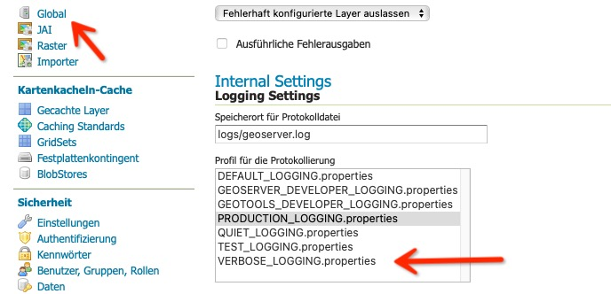

<!-- the Menu -->
<link rel="stylesheet" media="all" href="../styles.css" />
<div id="logo"><a href="https://csgis.de">© CSGIS 2022</a></div>
<div id="menu"></div>
<div id="jumpMenu"></div>
<script src="../menu.js"></script>
<script src="../jumpmenu.js"></script>
<!-- the Menu -->


# Erste Hilfe bei Problemen

Die erste Handlung, die Sie bei Problemen unternehmen, ist die Betrachtung der Log-Files. In einer Docker
In einer Docker Umgebung setzen wir hierfür das Log-Level von GeoServer auf ein höheres als "production".



Und betrachten hiernach die Log-Ausgabe der Container

```
docker-compose logs -f
```

Um nur die Logs von einem Service zu bekommen, vermerken wir diesen wie folgt:

```
docker-compose logs -f django
```

# Die häufigsten Fehler

## Upload schlägt fehl

Kontrollieren Sie das Admin-Passwort des Geoservers in `.env` und setzen Sie dieses in der GeoServer Admin GUI erneut.

## Datensätze werden nicht angezeigt, obwohl die Berechtigungen stimmen

GeoServer regelt die Regeln über "Geofence" Regeln. Um diese mit Django/GeoNode abzugleichen, verbindet sich GeoServer über oauth2 mit Django.
Prüfen Sie die oauth2 Einstellungen der "geoserver app" im Django Admin (Abschnitt oauth2). Sowie die oauth2 Einstellungen auf Seiten von Geoserver.

- Siehe:  https://docs.geonode.org/en/master/advanced/components/index.html?highlight=oauth2

Weitere kurze Problembeschreibungen finden Sie in folgendem Wiki:

- https://github.com/GeoNode/geonode/wiki/Good-to-know

# Orte um Hilfe zu finden
GeoNode ist ein Open-Source-Projekt, deren Mitwirkende in unterschiedlichen Foren versammeln:

- Mailingliste für Benutzer: https://lists.osgeo.org/cgi-bin/mailman/listinfo/geonode-users
- Mailing-Liste für Entwickler: https://lists.osgeo.org/cgi-bin/mailman/listinfo/geonode-devel
- Gitter Chat: https://gitter.im/GeoNode/general

Wir empfehlen den Gitter-Chat, um nach Hilfe zu fragen. Erfahrungsgemäß können Fragen hier am schnellsten beantwortet werden.

> Der [Issue-Tracker auf Github](https://github.com/GeoNode/geonode/issues) sollte nur für Bugs oder "Feature Requests" verwendet werden


# Weiterführende links

- [GeoNode Docs - oauth2](https://docs.geonode.org/en/master/advanced/components/index.html?highlight=oauth2)
- [Cithub Wiki – Good to know](https://github.com/GeoNode/geonode/wiki/Good-to-know)