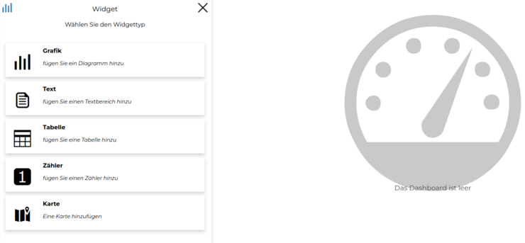
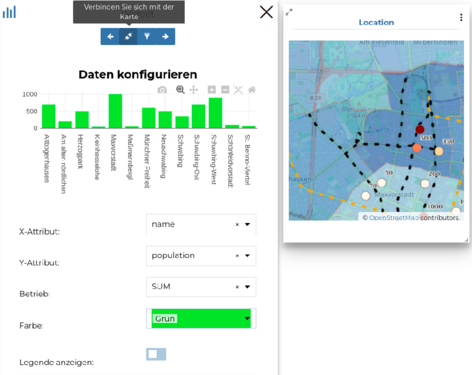
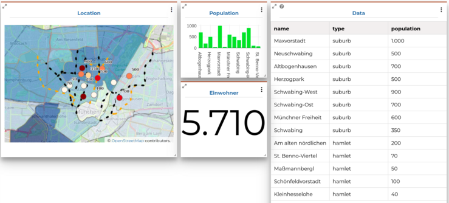
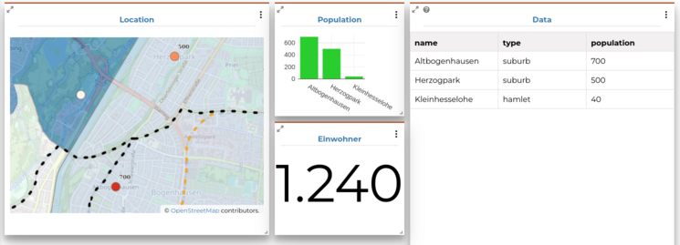

<!-- the Menu -->

<link rel="stylesheet" media="all" href="../styles.css" />

<a href="https://csgis.de">© CSGIS 2022</a>

<!-- the Menu -->

# Dashboards

Sie eignen sich gut für die Präsentation von Ergebnissen oder Zusammenfassungen von Daten (siehe [zum Beispiel](https://geonode-training.csgis.de/catalogue/#/dashboard/30)).

## Übung

**Erstellung eines Dashboards**

1. Um ein Dashboard zu machen, müssen Sie wie gewohnt die entsprechende GeoNode Ressource erstellen: Ressource hinzufügen → Dashboard erstellen → Speichern

   In ein Dashboard können Sie folgende widgets integrieren:

   

2. Fügen Sie zuerst die Karte hinzu, die Sie in der Übung "Karten erstellen" gespeichert haben.

3. Danach integrieren Sie in das Dashboard folgendes Diagramm mit den Einwohnerzahlen.

   > Im Dashboard können die Inhalte dynamisch  mit anderen Inhalten verknüpft sein.

   

1. Fügen Sie die Tabelle der places zum Dashboard hinzu. Diese Daten sollen auch mit der Karte und dem Diagramm verknüpft werden.
   Mit  “Verbindungen ausblenden“ sehen Sie eine rote Umrandung oben über den    widgets, die Sie informiert, welche Elemente des Dashboards miteinander verknüpft sind.

5. Als letztes können Sie zum Beispiel einen Zähler  mit der gesamten Einwohnerzahl hinzufügen.

    

    
