<!-- the Menu -->

<link rel="stylesheet" media="all" href="../styles.css" />

<a href="https://csgis.de">© CSGIS 2022</a>

<!-- the Menu -->

# Geodaten publizieren und bearbeiten

Nach dem die Daten hochgeladen sind, stehen uns unter "Datensatz ansehen" folgende Funktionen zur Verfügung:

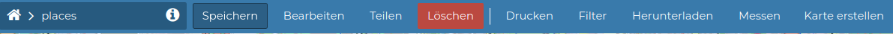

**Speichern:** Sollen Änderungen an den Daten, der Symbologie, den Berechtigungen etc. vorgenommen werden, so können Sie diese hier dauerhaft speichern. Mit **“speichern als“** erzeugen Sie ein neues Dataset.

Im Menü **Bearbeiten** können wir:

**Informationen anzeigen lassen:** (allgemeine Informationen zu der Ressource). Hier haben Sie auch die Möglichkeit, diese Ressource als Favorit zu speichern, den Link zu teilen oder die Datei downzuloaden.

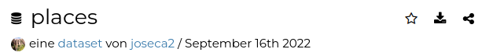

## Daten bearbeiten

Geometrien und Tabellen können in GeoNode bearbeitet werden. Die Optionen für die Digitalisierung der Geometrien sind begrenzt. Wir schauen die Editierungs-Optionen am besten mit einer Übung an (detaillierte Informationen finden Sie [hier](https://mapstore.readthedocs.io/en/latest/user-guide/attributes-table/)). Der erste Schritt ist, den **Bearbeitungsmodus** einzuschalten.

### Übung:

**Editierungen im Dataset places**

1. Starten Sie die Edtierung. Wählen Sie Schwabing aus und zoomen Sie zum Extent

2. Filtern Sie  Schwabing,  Schwabing-West und  Schwabing-Ost, lassen Sie nur diese Orte sichtbar auf der Karte und verändern Sie die Einwohnerzahlen (Spalte population) dieser Orte.

   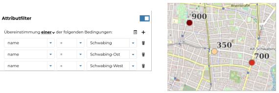

3. Untersuchen Sie weitere Filter Optionen wie “Interessengebiet“

4. Erzeugen Sie einen Punkt und vergeben Sie die Attribute in der Tabelle

5. Verschieben Sie einen Punkt in der Karte

6. Löschen Sie einen beliebigen Punkt

**Editierungen im Dataset natural**

1. Fügen Sie ein neues Polygon hinzu.
2. Digitalisieren Sie ein neues benachbartes Polygon (Snap Optionen)

> - Zum Selektieren  nur ein Mal  in die Karte klicken.
> - Selektieren von mehreren Objekten können wir über Filter machen.

## Stil bearbeiten

Es gibt 3 verschiedene Gruppen (Regeln) von Stilen, die man benutzen kann (sie können miteinander kombiniert werden)

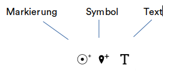

Außerdem gibt es die Möglichkeit, für die verschiedenen Regeln, die Daten zu filtern (wenn man zum Beispiel nur bestimmte Daten darstellen möchte – type=forest -) oder nur innerhalb eines bestimmten Maßstabs die Daten darstellen zu lassen.

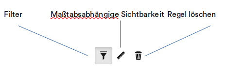

Innerhalb der **Markierungsoption*** haben wir 2 verschiedene Legenden zur Verfügung:

- Einfacher Stil
- Klassifizierungsstil (mit verschieden Methoden)

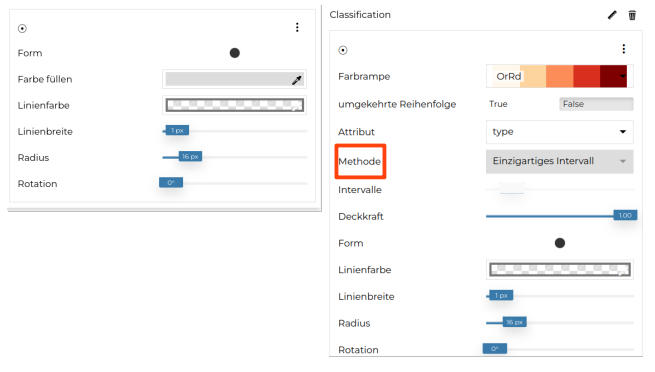

### Übung

**Symbologie von places**

1. Erstellen Sie diese zwei verschiedenen Legenden für die Ressource ***places*** und speichern Sie die Ergebnisse (mit der Änderung .sld):
   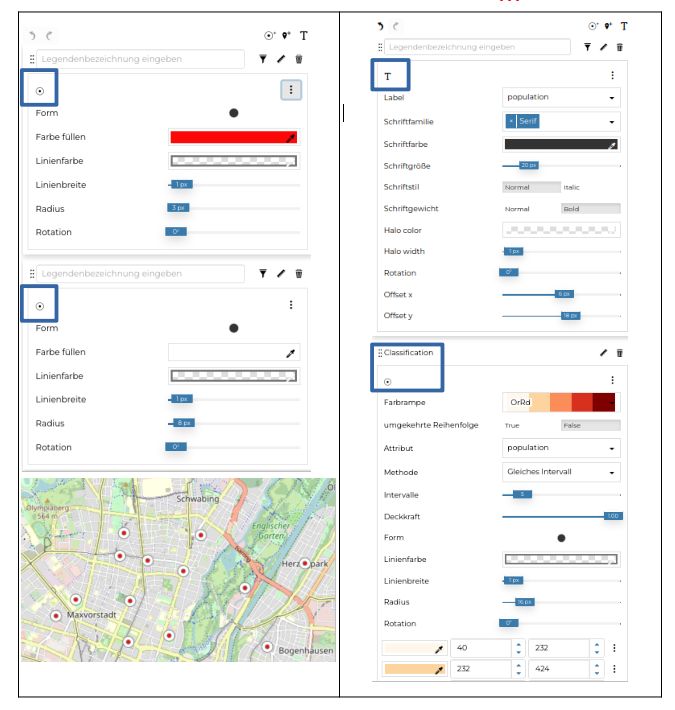

2. Lassen Sie die ***places*** mit einem einfachen Symbol darstellen und laden Sie die gespeicherten Stile (sld Dateien) hoch (**Bearbeiten → Stil hochladen**)

## Übung

**Symbologie von railways**

1. Stellen Sie die railways wie in der unteren Abbildung dar. Benutzen Sie den einfachen Stil und erstellen sie die entsprechenden Filter (*type=subway und type =tram*).
   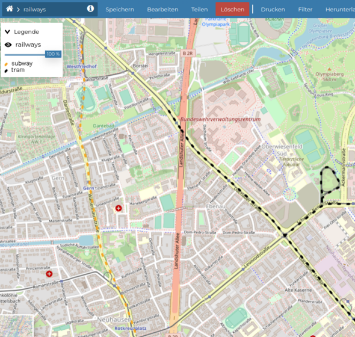

2. Speichern Sie den Stil als sld und laden Sie diese Datei als Dokument in GeoNode hoch.     

3. Benachrichtigen Sie Ihre Kollegen, dass es eine neue Legende gibt und prüfen Sie Ihre Mailbox bzgl. der gesendeten/empfangenen Nachrichten.

### Übung

**Symbologie von roads**

1. Lassen Sie roads klassifiziert darstellen nur mit folgenden Kategorien der Spalte “Type“: primary, residential, secundary, tertiary. Roads soll nur innerhalb dieser Maßstäbe erscheinen 1:144448 und 1:9028

2. Wie kann man erreichen, dass nur der Typ residential innerhalb dieser Maßstäbe erscheint aber die anderen Typen immer sichtbar bleiben?

   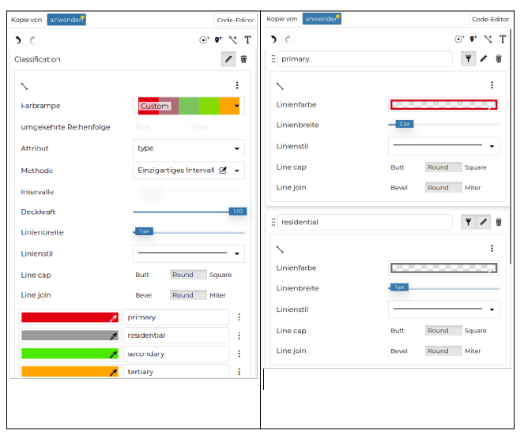

> *Die Symbolregel ermöglicht die Erstellung von Legenden mit Symbolen wie Grafikdateien (svg, png, etc.). Man braucht die url, bei der die Bilder gehostet sind*

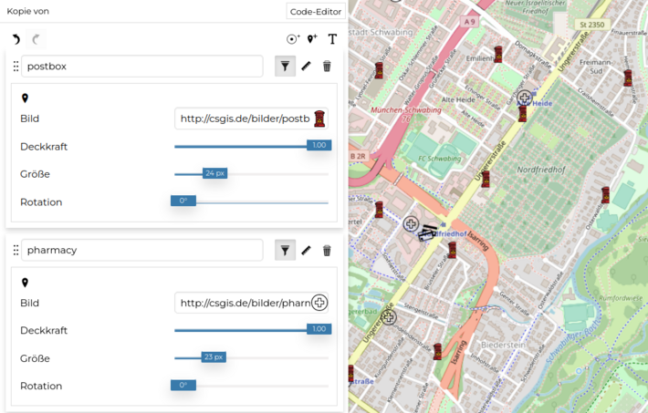

## Metadaten bearbeiten

Die Metadaten in GeoNode dienen 2 wesentlichen Zwecken:

- sie geben zusätzliche Auskunft über die Daten.
- sie vereinfachen die Suche von Ressourcen durch andere Benutzer und damit können die Daten leichter abgerufen werden.

> Ausführliche Informationen über die Bearbeitung von Metadaten finden Sie [hier](https://docs.geonode.org/en/master/usage/managing_datasets/dataset_metadata.html)

### Übung

**Metadaten von administrative**

1. Thumbnail aktualisieren
2. Kategorie population speichern unter den grundlegenden Metadaten
3. Unter regions soll Germany gespeichert werden
4. Speichern Sie die Metadaten und suchen Sie auf der Startseite in GeoNode nach Daten mit z. B. der Kategorie  population oder nach der Region  Germany
5. Probieren Sie die Suche nach Daten mit der Filteroption “Ausmaß“

> *Im Schritt 4 (Datensatz Attribute) lässt sich unter Anzeigetyp speichern, wie die gespeicherten Daten in einer Spalte angezeigt werden sollen. Mit Klick auf ein Objekt in der Karte erscheinen die Informationen entsprechend formatiert.*

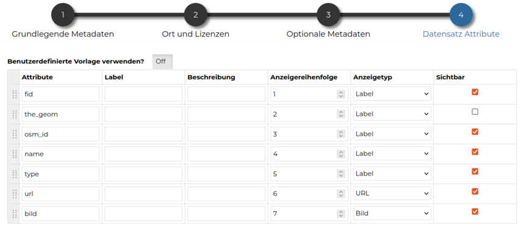

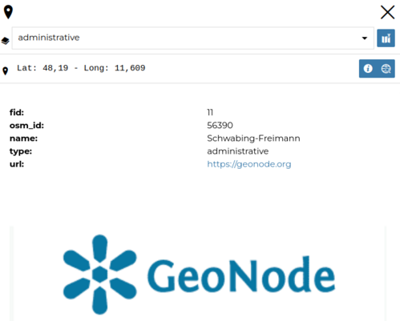

## Ressource teilen

Beim Erstellen oder Hochladen eines neuen Datasets müssen Sie festlegen, wer diesen Datensatz **anzeigen, herunterladen, bearbeiten** und **verwalten** kann. Standardmäßig können nur Eigentümer Datensätze bearbeiten und verwalten, jeder kann sie ansehen.

> Weiterführende Informationen finden Sie unter [Dataset permissions](https://docs.geonode.org/en/4.x/usage/managing_datasets/dataset_permissions.html)

Sie können die folgenden Berechtigungen festlegen:

- Anzeigen (ermöglicht das Anzeigen des Datensatzes).
- Herunterladen (ermöglicht das Anzeigen und Herunterladen des Datensatzes).
- Bearbeiten (ermöglicht das Ändern der Metadaten, der Attribute und Geometrien und des Stils).
- Verwalten (ermöglicht das Bearbeiten, Löschen, Ändern der Freigabeoptionen und Publizieren eines Datensatzes). Datensätze, die nicht publiziert sind, können nur vom Admin gesehen und bearbeitet werden.

### Übung

**Berechtigungen von places**

1. Stellen Sie sicher, dass die places nicht heruntergeladen werden können. Melden Sie sich ab und prüfen Sie, dass keine Option zum Herunterladen angeboten ist.

2. Erlauben Sie, dass die places von anderen Benutzern verwaltet werden können

   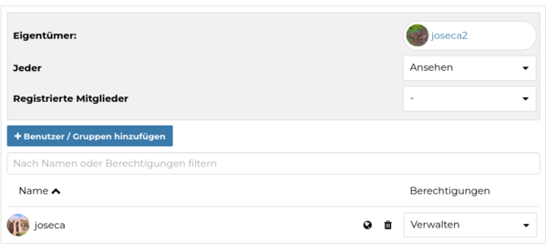

## Filtern

Sie können mit dieser Option die Anzeige der Daten beeinflussen mit folgenden Möglichkeiten:

- Attribut
- Interessengebiet

Beide Optionen können auch gleichzeitig benutzt werden:

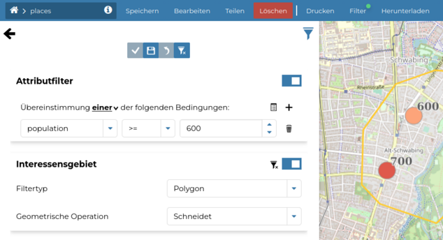

## Herunterladen

Mit dieser Funktion können Sie die Datasets herunterladen in mehreren Formaten (GeoJSON, GML, Shapefile, CSV, GeoPackage oder KML).

Sie können entscheiden, ob Sie die Daten mit der ursprünglichen Projektion (prj Datei, die beim Import der Daten benutzt wurde) herunterladen werden oder in WGS84 (EPSG 4326).

Außerdem können Sie definieren, ob Sie nur die gefilterten Daten oder die Daten des aktuellen Kartenfensters herunterladen möchten.

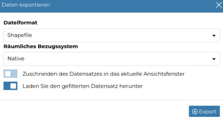
