<!-- the Menu -->

<link rel="stylesheet" media="all" href="../styles.css" />

<a href="https://csgis.de">© CSGIS 2022</a>

<!-- the Menu -->

# Karten erstellen

Zu einer Karte können mehrere datasets hinzugefügt werden. Karten sind eigene GeoNode Ressourcen, die man publizieren oder mit anderen Benutzern bearbeiten/teilen kann.

In der Karte stehen mehrere Hintergrundkarten oder eine Adresssuche zur Verfügung.

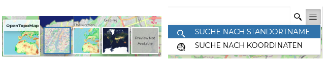

Zusätzlich können mehrere [Widgets](https://docs.geonode.org/en/master/usage/managing_maps/exploring_maps/creating_widgets.html) (z.B. Diagramme, Text, Tabellen) hinzugefügt werden, um die Karte mit anderen Informationen zu begleiten.

## Übung

**Erstellung folgender Karte**

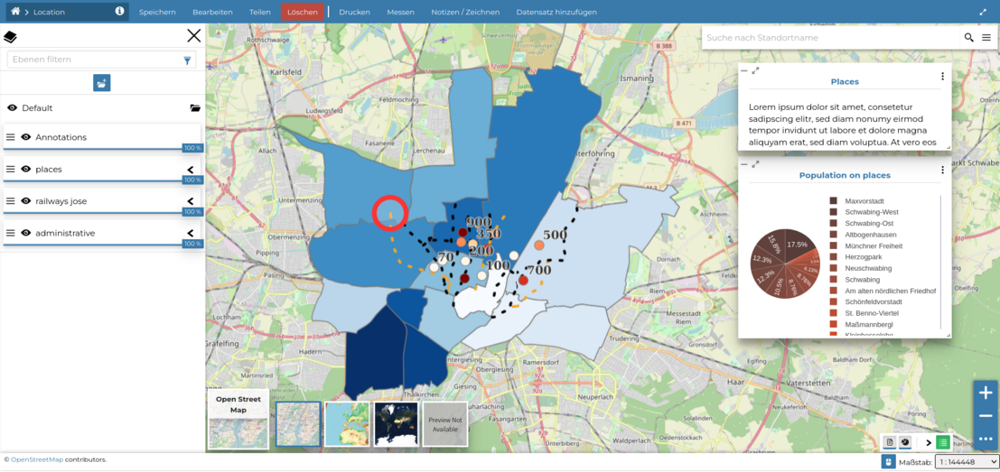

1. Ressource hinzufügen → Karte erstellen → Speichern
1. Datensatz hinzufügen → Im Datensatzkatalog die Ressource administrative, railways und places auswählen.
  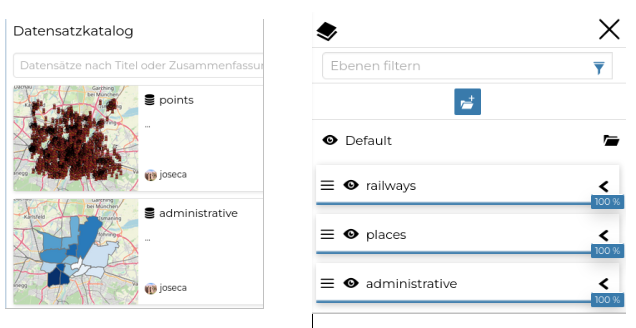
1. Mit Klick auf eine Ebenen erscheint eine Reihe von interessanten Funktionalitäten. Wir können hier zum Beispiel:

  - die Ebene filtern und nur einen Teil der Daten in der Karte anzeigen lassen
  - die Attributtabelle öffnen und die Daten hier bearbeiten
  - Widgets für die ausgewählte Ebene erstellen
  - die Symbologie der Ebene verändern  

    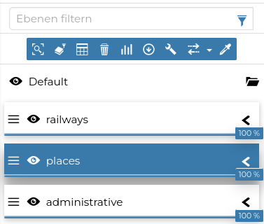

1. Verändern Sie die Symbologie von ***places***: öffnen Sie die Datei places.sld, kopieren Sie den Inhalt und fügen Sie ihn in den Code-Editor ein.

  > In der Karte können wir die Symbole einer Ebene ändern, ohne die Symbologie der ursprünglichen Ressource zu verändern  
  > 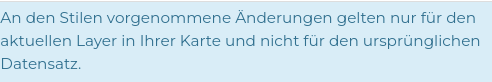

1. Prüfen Sie, dass sich die Symbologie der GeoNode Ressource ***places*** nicht geändert hat.

1. Begleiten Sie die Karte mit folgenden Widgets des Layers places:

  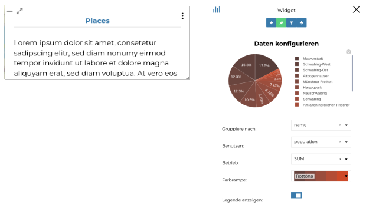

1. Beachten Sie, die Diagramme zeigen immer die Daten, die man im aktuellen Ausschnitt der Karte sieht.

  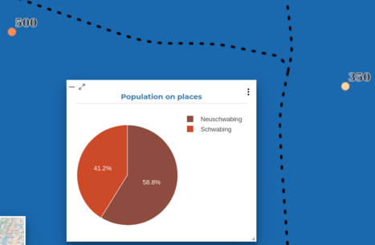

1. Fügen Sie die Tabelle der Ebene administrative in die Karte ein.

1. Mit dem Tool Notizen/Zeichen fügen Sie eine Anmerkung (Annotation) hinzu. Danach lassen Sie sich mit einfachem Klick auf die Karte die Informationen anzeigen.    

  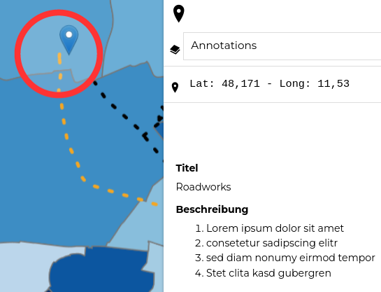

  > GeoNode gibt die Informationen von allen Ebenen aus, auf die man geklickt hat und den Hinweis auf Ebenen, die keine Daten enthalten:
  > 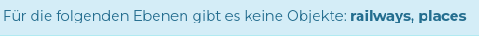

1. Schalten Sie alle Widgets ein und aus und lassen Sie nur den Text und das Diagramm sichtbar.

1. Lassen Sie die Ebene ***administrative*** transparent darstellen

  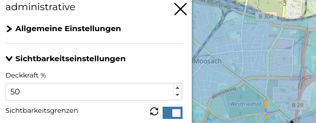

1. Wie bei allen GeoNode Ressourcen können Sie Berechtigungen an die Karte vergeben, um zum Beispiel zu erlauben, dass jemand anders diese Karte mitgestalten kann.

  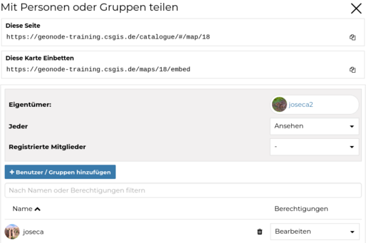

1. Speichern Sie Ihre Karte und lassen Sie eine PDF im A4 Format ausdrucken.

  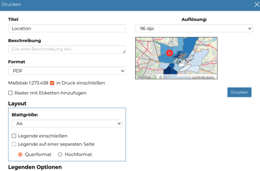
