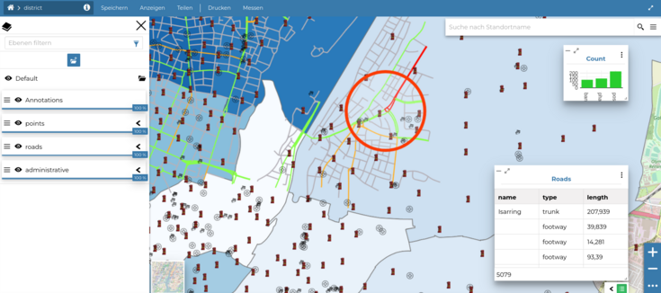
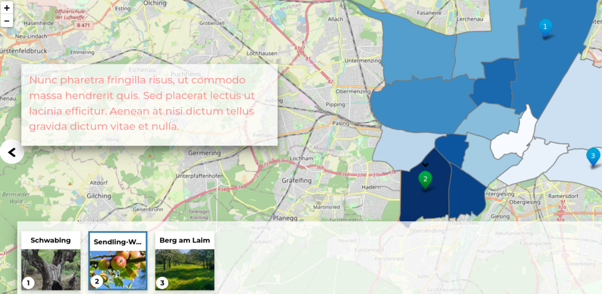
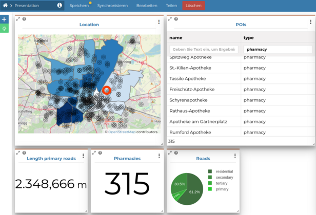
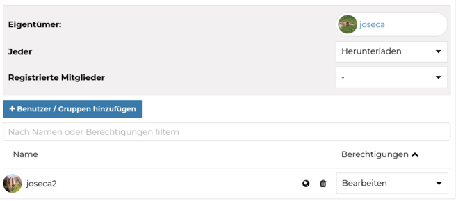
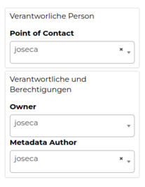
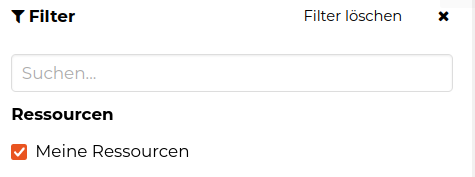

<!-- the Menu -->

<link rel="stylesheet" media="all" href="../styles.css" />

<a href="https://csgis.de">© CSGIS 2022</a>

<!-- the Menu -->

# Publikation von Ressourcen

Folgende Ressourcen können in GeoNode publiziert und bearbeitet werden:

- **DATENSÄTZE** (Vektor, Raster, Remote oder Zeit Serien). Folgende Dateitypen können hochgeladen werden:
  ESRI Shapefile, GeoTIFF, Comma Separated Value (CSV), Zip Archive, XML Metadata File, Styled Layer Descriptor (SLD)

- **DOKUMENTE** ( Bilder, Textdateien, Videos, PDF Dokumente, Tabellen, etc ).
  Diese Dateitypen werden unterstützt:
  .txt, .log, .doc, .docx, .ods, .odt, .sld, .qml, .xls, .xlsx, .xml, .bm, .bmp, .dwg, .dxf, .fif, .gif, .jpg, .jpe, .jpeg, .png, .tif, .tiff, .pbm, .odp, .ppt, .pptx, .pdf, .tar, .tgz, .rar, .gz, .7z, .zip, .aif, .aifc, .aiff, .au, .mp3, .mpga, .wav, .afl, .avi, .avs, .fli, .mp2, .mp4, .mpg, .ogg, .webm, .3gp, .flv, .vdo, .glb, .pcd, .gltf

- **KARTEN** (Publikation von bestehenden GeoNode Datensätzen). Der Anwender kann beliebige Datensätze hinzufügen und eigenständig eine Karte mit den verschiedenen Ebenen erstellen.

- **GEOSTORIES** sind Online Berichte, die man mit  GeoNode hochgeladen oder mit externen Ressourcen (Videos, Webseiten etc.) erstellt werden können.

- **DASHBOARDS** sind Bereiche in GeoNode, in denen der Benutzer zusammenfassende Geoinformationen mit Widgets wie Diagramme, Karten, Tabellen, Texte etc. ( die miteinander interaktiv verbunden sein können) präsentieren kann.

<<<<<<< HEAD:94921f622d08ab26f04c534104a6260ef8bafd78/user/publikationen_ressourcen.md
> - *Alle Ressourcen in GeoNode sind standardmäßig öffentlich. Der Benutzer, der die GeoNode Ressource erstellt hat, kann entscheiden, ob diese Daten für alle oder nur für registrierte Benutzer sichtbar sein sollen*
> 
> - *Nur die Person, der die GeoNode Ressource  gehört (i.d.R. die Person, die die Ressource erzeugt hat), kann die Daten bearbeiten. Diese Person kann aber weitere Berechtigungen hinzufügen und erlauben dass andere Benutzer die Daten **ansehen, herunterladen, bearbeiten** oder **verwalten** können*
> 
> 
> 
> - *Der Besitzer der GeoNode Ressource kann entscheiden, ob einem anderen Benutzer die Daten gehören sollen (siehe optionale Metadaten):*
> 
=======
> - *Alle Ressource in GeoNode sind standardmäßig öffentlich. Der Benutzer, der den GeoNode Ressource erstellt hat, kann entscheiden ob diese Daten für alle oder nur für registrierte Benutzer sichtbar sein sollen*

> - *Nur die Person, die den GeoNode Ressource  gehört (i.d.R. die Person, die den Ressource erzeugt hat) kann die Daten bearbeiten. Diese Person kann aber weitere Berechtigungen hinzufügen und erlauben dass andere Benutzer die Daten **ansehen, herunterladen, bearbeiten** oder **verwalten** können*
> 

> - Der Besitzer des GeoNode Ressources kann entscheiden, ob einen anderen Benutzer die Daten gehören sollen (siehe optionale Metadaten):  
>>>>>>> 0db18eacb2af31f9fb40c7dc681b813eda7837c2:fa156bc2541dd85c6d8f3f6518456047370ff868/user/publikationen_ressourcen.md
> 

## Übung

1. Laden Sie in GeoNode die Shape Dateien places, natural, administrative, railways und roads hoch.
2. Erstellen Sie einen Filter, damit nur Sie Ihre Daten ansehen können.

