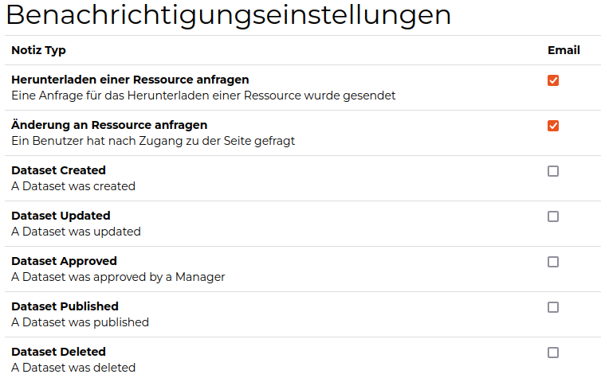
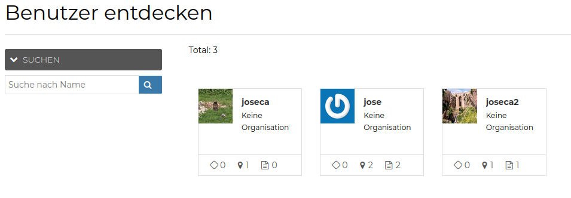

<!-- the Menu -->
<link rel="stylesheet" media="all" href="../styles.css" />

<a href="https://csgis.de">© CSGIS 2022</a>

<!-- the Menu -->

# Registrieren

Im ersten Schritt erfolgt eine Registrierung auf der GeoNode Plattform. Ohne Registrierung können die Daten (Karten, Datensätze, Dokumente etc.) visualisiert und geteilt aber nicht bearbeitet werden.
Nachdem sich der Anwender erfolgreich registriert hat, kann er sich sofort anmelden und GeoNode in vollem Umfang nutzen.

> Die Option zum registrieren kann nach Bedarf ausgeblendet werden sodass einen Admin die Registrierung eigenständig durchführt.
> Standardmäßig läuft die Registrierung automatisch. Man kann aber diese Option ändern sodass einen Admin die Registrierung bestätigten muss

<<<<<<< HEAD:94921f622d08ab26f04c534104a6260ef8bafd78/user/user_profil.md
> Die Option zum Registrieren kann nach Bedarf ausgeblendet werden, sodass ein Admin die Registrierung eigenständig durchführen kann.
> Standardmäßig läuft die Registrierung automatisch. Man kann aber diese Option ändern sodass der Admin die Registrierung bestätigten muss.
=======
>>>>>>> 0db18eacb2af31f9fb40c7dc681b813eda7837c2:fa156bc2541dd85c6d8f3f6518456047370ff868/user/user_profil.md

# User Profil

Im Profil stehen dem User u.a. folgende Funktionen zur Verfügung:

- Andere Anwender kontaktieren und Nachrichten senden
- Emailadresse der Registrierung ändern
- Passwort ändern
- Benachrichtigungseinstellungen
- Andere Anwender einladen, Ihre GeoNode Plattform zu benutzen

<<<<<<< HEAD:94921f622d08ab26f04c534104a6260ef8bafd78/user/user_profil.md
> Es lohnt sich, diese Optionen in Ruhe zu prüfen und zu entscheiden, mit welchen Aktionen dem Anwender eine Email gesendet werden soll (standardmäßig sind alle Optionen ausgewählt.
> 
> Mit einer GeoNode Instance, die von vielen Anwendern aktiv benutzt wird, werden Sie viele Emails erhalten!)
=======
> Es lohnt sich diese Optionen in Ruhe zum lesen und hier entscheiden mit welchen Aktionen eine Email an den Anwender gesendet werden soll (standardmäßig sind alle Optionen ausgewählt.
> Mit einer GeoNode Instance, die von vielen Anwender aktiv benutzt wird, werden Sie dann viele Emails bekommen!)
>>>>>>> 0db18eacb2af31f9fb40c7dc681b813eda7837c2:fa156bc2541dd85c6d8f3f6518456047370ff868/user/user_profil.md

Außerdem können registrierte Benutzer:

- die letzten Aktivitäten von allen Benutzern sehen und auf die Daten zugreifen (Ebenen, Karten, Dokumente, Geostories und Dashboards)
- eine Liste aller favorisierten Inhalte sehen
- die Mailbox abfragen
- das Hilfe-Dokument (mit verlinkten Inhalten) lesen

<<<<<<< HEAD:94921f622d08ab26f04c534104a6260ef8bafd78/user/user_profil.md
> *Weitere empfehlenswerte GeoNode Dokumentationen sind:*
=======
> Weitere empfehlenswert GeoNode Dokumentationen sind:
>>>>>>> 0db18eacb2af31f9fb40c7dc681b813eda7837c2:fa156bc2541dd85c6d8f3f6518456047370ff868/user/user_profil.md
> 
> - [GeoNode Handbuch](https://docs.geonode.org/en/master/usage/index.html)
> - [Mapstore Handbuch](https://mapstore.readthedocs.io/en/latest/user-guide/home-page/)* 
> 
<<<<<<< HEAD:94921f622d08ab26f04c534104a6260ef8bafd78/user/user_profil.md
> Auf der Startseite, im Menü "Über"  kann man visualisieren, filtern und sehen, welche User in GeoNode registriert sind und welche Daten sie  veröffentlicht haben.
=======
> Auf der Startseite, im Menü Über  kann man visualisieren, filtern und sehen welche User im GeoNode registriert sind und welche Daten haben sie   veröffentlicht

>>>>>>> 0db18eacb2af31f9fb40c7dc681b813eda7837c2:fa156bc2541dd85c6d8f3f6518456047370ff868/user/user_profil.md

## Übung

1. Finden Sie die Email, die mit Ihrem Account verknüpft ist.
2. Erstellen Sie die gewünschten Aktionen unter Benachrichtigungen.
